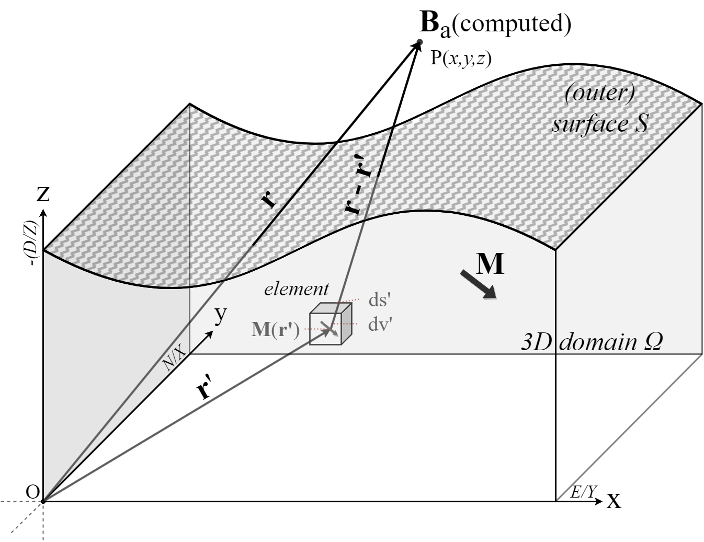

.. _GE:

Governing equations
===================

| Required is the computation of the magnetic field produced by (permanently) magnetized matter outside the source body within an ambient magnetic field.
| The total magnetic field :math:`\mathbf{B_t(r)}` at position :math:`\mathbf{r}` above the surface of magnetized matter consist of contributions from the initial field :math:`\mathbf{B_0}` and the anomalous field :math:`\mathbf{B_a}` produced by the underlying magnetized matter

.. math::
    \begin{equation}
        \mathbf{B_t(r)} =  \mathbf{B_0} + \mathbf{B_a}
        \label{eq:Bsum}
    \end{equation}
    :label: Bsum

| We assume the initial field (:math:`\mathbf{B_0}`) to be solely the Earth's magnetic field, uniform and constant above the surface. Thereby disregarding any contribution of solar-induced fields, as these are considered to be insignificant compared to the topography induced anomalies in regular conditions (i.e. absence of geomagnetic storms, etc.) :cite:`Baag95`.
|
| Additionally, we assume the underlying flows to be uniformly magnetized (:math:`\nabla \cdot \mathbf{M} = 0`).  In doing so, we ignore any mineralogical or spatial variations within the flow. While we acknowledge the potential significance of such variations, as other studies have demonstrated their effect :cite:`Knudsen03`, our current focus is solely on topographical influences. Thus, from now on, any use of the term "magnetization" in this manner will imply "uniform magnetization".
|
| The anomalous field  (:math:`\mathbf{B_a}`) is produced by permanently magnetized matter, in this case the volcanic rock. The igneous rock contains magnetic iron-bearing minerals, which form during solidification. During the cooling of the lava flow certain minerals become magnetic and their moments continually flip among the easy axes with a statistical preference for the applied magnetic field. As the lava cools further and the moments become fixed, a thermal remanence (TRM) parallel to the applied field is preserved :cite:`TAUXE`. If these grains are small and the distance is large (i.e. outside of source), the grains can be considered tiny dipoles with a net alignment along some direction :cite:`REITZ`. Thus, the magnetization (:math:`\mathbf{M}` :math:`[Am^{-1}]`) of a material, is equal to the magnetic dipole moment (:math:`\mathbf{m}`  :math:`[Am^{2}]`) per unit volume :math:`V`

.. math::
    \begin{equation}
        \mathbf{m} = \iiint \mathbf{M} \; dV
    \end{equation}
    :label: Magnetization

| The magnetic field produced by a single dipole outside the magnetized source is :cite:`GRIFFITHS`

.. math::
   \begin{equation}
      {\mathbf {B}_{dip} ({\mathbf {r} })={\frac {\mu _{0}}{4\pi }}\left[{\frac {3\mathbf {r} (\mathbf {m} \cdot \mathbf {r} )}{r^{5}}}-{\frac {\mathbf {m} }{r^{3}}}\right]}
   \end{equation}
   :label: sd

| where :math:`\mathbf{B}` :math:`[T]` is the magnetic induction or magnetic flux density,  :math:`\mu_0` :math:`[NA^{-2}]` is the magnetic permeability of a vacuum, and :math:`\mathbf{r}` is the vector with length :math:`r` :math:`[m]` from the position of the dipole to the observation point. In this study :math:`\mathbf{B}` will be referred to as the *magnetic field strength*, see :doc:`app1` for further information.

.. _figmodel:

   At any given position :math:`\mathbf{r}` the resulting field :math:`\mathbf{B}` are the sum of the contribution of all elements in the object :math:`\Omega`. Axial orientation of model is given, and conventional paleomagnetism orientation is in brackets to visualize the required rotation.

| Following eq. :eq:`Magnetization`, the potential due to a magnetized object can be defined as a summation of the magnetic contribution of the magnetic moments of all volume elements :math:`(dv')` in this object :numref:`figmodel`. So, after substituting :eq:`Magnetization` in eq. :eq:`sd`, see :doc:`app1`, the magnetic induction :math:`\mathbf{B_a(r)}` of a magnetized object can be defined as :cite:`REITZ`

.. math::
    \begin{equation}
          \mathbf{B_a(r)} =  \frac{\mu_{0}}{4\pi}\int_V \frac{(-\nabla'\cdot\mathbf{M(r')})\mathbf{\left(r-r'\right)}}{\left|r-r'\right|^3}dv'
          + \frac{\mu_{0}}{4\pi}\oint_S \frac{\left(\mathbf{M(r')}\cdot\mathbf{\hat{n}}\right)\mathbf{\left(r-r'\right)}}{\left|r-r'\right|^3}ds'
    \end{equation}
    :label: Btrans

| where :math:`\mathbf{\hat{n}}` is the unit vector normal to the surface `S`, :math:`\mathbf{r-r'}` is the distance between the observation point and `ds'` and `dv'` are the surface and volume of the element (:numref:`figmodel`).
| :math:`\nabla \cdot \mathbf{M} = 0` reduces :math:`\mathbf{B}` in eq. :eq:`Btrans` to only the surface integral, the second term of the right hand side :cite:`GRIFFITHS,BLAKELY`.
| Physically this can be viewed as the cancellation of the current of the neighboring atomic dipoles, which happens everywhere inside of uniform magnetized object except on the edges of the body :cite:`GRIFFITHS`.

| Finally, we can define the total magnetic field at a position :math:`\mathbf{r}` above the surface as

.. math::
    \begin{equation}
        \mathbf{B_t(r)} =  \mathbf{B_0} + \frac{\mu_{0}}{4\pi}\oint_S \frac{\left(\mathbf{M(r')}\cdot\mathbf{\hat{n}}\right)\mathbf{\left(r-r'\right)}}{\left|r-r'\right|^3}ds'
    \end{equation}
    :label: Bsumfinal

| where :math:`\mathbf{B_0}` is the reference field outside the body.
