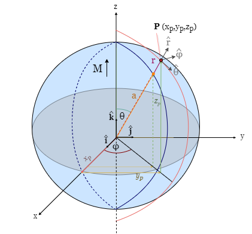

Complete derivation of the equations
====================================
| This is a summary of the complete derivation of the equations used in this study. These closely follow the derivations in :cite:`REITZ, GRIFFITHS,BLAKELY`, amongst other basic electromagnetic theory textbooks. Note that a trivial assumption for these derivations is considering the magnetization to be uniform within the object. From now on any use of the term "magnetization" will mean "uniform magnetization".
| Firstly, we will derive some fundamental principals and equations of magnetostatics required for later derivations. Secondly, the derivation of the the equation for the Magnetic induction field :math:`\mathbf{B}` of a magnetized object. Lastly, we will derive the equation of a magnetized sphere.  
|
| The fundamental equations [SI units] of electromagnetism (Maxwell) state:

.. math::
    \begin{equation}
        \nabla \cdot \mathbf{B}=0
    \end{equation}
    :label: eq.2_2

.. math::
    \begin{equation} 
        \nabla\times\mathbf{H}=\mathbf{J}+\frac{\delta\mathbf{D}}{\delta t}
    \end{equation}
    :label: nablaxH

| where :math:`\mathbf{H}` :math:`[A/m]` is the magnetic field vector, :math:`\mathbf{J}` :math:`[A/m^2]` is the electric current density, :math:`\delta\mathbf{D}/\delta t` the electric displacement current density and :math:`\mathbf{B}` :math:`[T]` is the magnetic induction or magnetic flux density. Eq. :eq:`eq.2_2` invites the introduction of magnetic vector potential :math:`\mathbf{A}` :math:`[Tm]` in magnetostatics, where (Coulomb Gauge used)

.. math::
    \begin{equation}  
        \mathbf{B} = \nabla \times \mathbf{A} 
    \end{equation}
    :label: eq.BA

.. math::
    \begin{equation}  
        \nabla \cdot \mathbf{A} = 0
    \end{equation}
    :label: eq.4_2

| In our situation, a permanent magnet, there is no electric contribution to the magnetic field, therefore

.. math::
    \begin{equation}  
        \mathbf{J} = 0, \; \frac{\delta\mathbf{D}}{\delta t} = 0
    \end{equation}
    :label: eq.5_2

| Reducing :math:`\mathbf{H}` to a irrational and thus conservative vector field. 

.. math::
    \begin{equation} 
        \mathbf{\nabla} \times \mathbf{H} = 0
    \end{equation}
    :label: curlH

| resulting in 

.. math::
    \begin{equation} 
        \mathbf{H} = -\nabla \psi
    \end{equation}
    :label: HU

| where :math:`\psi` is the magnetic scalar potential due to all sources. 
| The relation between the magnetization induced inside a material and the external magnetic field produced are proportional and can now be defined as 

.. math::
    \begin{equation}  
        \mathbf{M}=\chi_{m}\mathbf{H}
    \end{equation}
    :label: eq.7

| where :math:`\chi_{m}` is the magnetic susceptibility of the material. 
| The relationship between :math:`\mathbf{M}`, :math:`\mathbf{B}` and :math:`\mathbf{H}` in this case is

.. math::
    \begin{equation}  
        \mathbf{B}=\mu_{0}(\mathbf{H}+\mathbf{M})
    \end{equation}
    :label: eq.8

| where :math:`\mu_{0}` is the permeability of free space.
|
|
| First, the derivation of the equation for the Magnetic induction field :math:`\mathbf{B}` of a magnetized object.
| :math:`\mathbf{M}` :math:`\mathit[Am^{-1}]`, the magnetization of a material, is equal to the magnetic dipole moment :math:`\mathbf{m}`  per unit volume. This is defined as

.. math::
    \begin{equation}  
        \mathbf{M}(x',y',z')  = \frac{\delta\mathbf{m}}{\delta v'} \hspace{5mm} \textrm{or} \hspace{5mm} \mathbf{m} = \int\int\int \mathbf{M} \; dv'
    \end{equation}
    :label: eq.6_2

| The magnetic vector potential due to a single dipole at large distances, i.e. outside the source and in a macroscopic setting is :cite:`GRIFFITHS`

.. math::
    \begin{equation} 
        \mathbf{A}_{dipole}(r)=\frac{\mu_{0}}{4\pi}\frac{\mathbf{m}\times\mathbf{r}}{r^{3}}
    \end{equation}
    :label: eq.9_2

| Substituting eq. :eq:`eq.6_2` in eq. :eq:`eq.9_2`, where :math:`\mathbf{r}=(x,y,z)` is the vector from the observation point ``P`` to element :math:`dv` of the object (:numref:`figmodel`). 
| To elaborate:

*  :math:`\mathbf{B}` is a function of :math:`(x,y,z)`
*  :math:`\mathbf{M}` is a function of :math:`(x',y',z')`
*  :math:`\mathbf{R}= (x-x')\mathbf{\hat{x}} + (y-y')\mathbf{\hat{y}}+ (z-z')\mathbf{\hat{z}}` 
*  :math:`dv'= dx' dy' dz'` 

| Integration is done over primed coordinates; the divergence and curl are to be taken with respect to unprimed coordinates :cite:`GRIFFITHS`.

.. math::
    \begin{equation}
    \begin{split}
        \mathbf{A(r)}       & = \frac{\mu_{0}}{4\pi}\int_{V}{\frac{\mathbf{M(r')}\times{\mathbf{R}}}{r^{3}}dv'} \\
        & = \frac{\mu_{0}}{4\pi}\int_{V}{\frac{\mathbf{M(r')}\times{[\mathbf{r}-\mathbf{r'}]}}{\mathbf{\left|r-r'\right|}^{3}}dv'} \\
    \end{split}
    \end{equation}
    :label: eq.10_2

| Using the identity 

.. math::
    \begin{equation}
        \nabla' \frac{1}{\mathbf{\left|r-r'\right|}} = \frac{\mathbf{r-r'}}{\mathbf{\left|r-r'\right|}^{3}}
    \end{equation}
    :label: I-1

| Eq. :eq:`eq.10_2` becomes 

.. math::
    \begin{equation}
        \mathbf{A(r)}   = \frac{\mu_{0}}{4\pi}\int_{V}\mathbf{M(r')}\times \nabla'\frac{1}{\mathbf{\left|r-r'\right|}}dv'
    \end{equation}
    :label: eq.10_2cont

| Integration by parts using identity

.. math::
    \begin{equation}
        \nabla \times (\psi\mathbf{a}) = \psi \left(\nabla\times\mathbf{a}\right) + (\nabla\psi)\times\mathbf{a}
    \end{equation}
    :label: ibpid

| results in

.. math::
    \begin{multline}
        \mathbf{A(r)}   = \frac{\mu_{0}}{4\pi}\int_{V}\frac{1}{\mathbf{\left|r-r'\right|}}\nabla'\times \mathbf{M(r')}dv' \\
        - \frac{\mu_{0}}{4\pi}\int_{V}\nabla'\times\frac{ \mathbf{M(r')}}{\mathbf{\left|r-r'\right|}} dv'
    \end{multline}
    :label: eq.intpart

| using the divergence theorem for an arbitrary vector field :math:`\mathbf{v(r)}` and a constant vector :math:`\mathbf{c}`:

.. math::
    \begin{equation}
        \int_{V}\nabla\cdot(\mathbf{v \times c})dv = \oint_{S}(\mathbf{v\times c})\cdot\mathbf{n}da \\
    \end{equation}
    :label: divergence

| where :math:`\mathbf{n}` is the normal to the surface. Using product rules:

.. math::
    \begin{equation}
        \nabla\cdot(\mathbf{v \times c})= \mathbf{c}\cdot(\mathbf{\nabla\times v}) - \mathbf{v}\cdot(\mathbf{\nabla\times c}) = \mathbf{c}\cdot(\mathbf{\nabla\times v})
    \end{equation}
    :label: PR

| and

.. math::
    \begin{equation}
        \mathbf{n}\cdot\left(\mathbf{v \times c}\right)= -\mathbf{c}\cdot\left(\mathbf{v \times n}\right) 
    \end{equation}
    :label: PR2

| Eq. :eq:`divergence` can be written as

.. math::
    \begin{equation}
        \int_{V}\mathbf{c}\cdot\left(\nabla\times\mathbf{v}\right)dv = - \oint_{S}\mathbf{c}\cdot\left(\mathbf{v \times n}\right)da 
    \end{equation}
    :label: div2

| since :math:`\mathbf{c}` is an arbitrary constant, the last equation yields: 

.. math::
    \begin{equation}
        \int_{V}(\nabla\times\mathbf{v})dv = - \oint_{S}(\mathbf{v \times n})da 
    \end{equation}
    :label: div3

| Finally, rewriting eq. :eq:`eq.intpart` as

.. math::
    \begin{equation} 
        \mathbf{A}(\mathbf{r}) =\frac{\mu_{0}}{4\pi}\int_V \frac{\nabla'\times\mathbf{M(r')}}{\mathbf{\left|r-r'\right|}}dv'+ \frac{\mu_{0}}{4\pi}\oint_S\frac{\mathbf{M(r')}\times{\mathbf{\hat{n}'}}}{\mathbf{\left|r-r'\right|}}ds'
    \end{equation}
    :label: Atrans

Using :math:`\mathbf{B}=\nabla\times\mathbf{A}` (eq. :eq:`eq.BA`),  the vector identity in eq. :eq:`I-1` and

.. math::
    \begin{equation}
       \nabla\times\left(\mathbf{u \times v}\right) = \mathbf{u(\nabla\cdot v)} - \mathbf{v(\nabla\cdot u)} + \mathbf{(v\cdot\nabla)u} -  \mathbf{(u\cdot\nabla)v}
    \end{equation}
    :label: identity2

| we come to 

.. math::
    \begin{multline}
       \mathbf{B(r)} =  \frac{\mu_{0}}{4\pi}\int_V \frac{(-\nabla'\cdot\mathbf{M(r')})\mathbf{\left(r-r'\right)}}{\left|r-r'\right|^3}dv' \\
       + \frac{\mu_{0}}{4\pi}\oint_S \frac{\left(\mathbf{M(r')}\cdot\mathbf{\hat{n}}\right)\mathbf{\left(r-r'\right)}}{\left|r-r'\right|^3}ds'
    \end{multline}
    :label: Btrans_2

| Assuming uniform magnetization, :math:`\nabla \cdot \mathbf{M} = 0`, reduces :math:`\mathbf{B}` in  eq. :eq:`Btrans_2` to only the surface integral:

.. math:: 
    \begin{equation} 
        \mathbf{B_a}(r) = \frac{\mu_{0}}{4\pi}\oint_S \frac{\left(\mathbf{M(r')}\cdot\mathbf{\hat{n}}\right)\mathbf{\left(r-r'\right)}}{\left|r-r'\right|^3}ds'
    \end{equation}
    :label: Bafinal

| Finally, we can define the total magnetic field at a position :math:`\mathbf{r}` above the surface as

.. math:: 
    \begin{equation} 
        \mathbf{B_t(r)} =  \mathbf{B_0} + \frac{\mu_{0}}{4\pi}\oint_S \frac{\left(\mathbf{M(r')}\cdot\mathbf{\hat{n}}\right)\mathbf{\left(r-r'\right)}}{\left|r-r'\right|^3}ds'
    \end{equation}
    :label: Bsumfinal_2

Uniformly magnetized sphere
---------------------------

.. _sphere_si:

   The magnetized sphere (blue). :math:`\mathbf{M}` is in the direction of :math:`\mathbf{\hat{k}}`, :math:`r[m]`  is the distance from the center of the sphere to the observation point ``P``, :math:`a [m]` is the radius of the sphere,  :math:`\mathbf{\hat{r}}` is the unit vector in the direction of :math:`r`, :math:`\mathbf{\hat{\theta}}` is the unit vector in the direction of :math:`\theta`, :math:`\theta [^{\circ}]` is the angle between :math:`\mathbf{\hat{r}}`, and :math:`\mathbf{\hat{k}}` increasing clockwise from :math:`\mathbf{\hat{k}}`

| This complete derivation is cited from :cite:`REITZ`.
| For the derivation of the equation of the magnetic field :math:`\mathbf{B}`, outside a sphere of uniformly magnetized material we revisit :math:`\mathbf{H}= -\nabla \psi`, eq. :eq:`HU`. 
| If situated outside of the magnetized sphere, :math:`\mathbf{M}=0`, therefore, equation :eq:`eq.8` becomes :math:`\mathbf{B}=\mu_0\mathbf{H}` outside the sphere.
| The uniform magnetization results in :math:`\nabla\cdot\mathbf{H}=0` and consequently :math:`\nabla^2\psi^2=0` (Laplace's equation). Hence, a solution of Laplace's equation satisfying the boundary conditions is required.
| If the coordinate system is chosen at the centre of the sphere and the direction of :math:`\mathbf{M}` is in the polar direction (z-direction, :math:`\mathbf{\hat{k}}`), the potential can be expanded in zonal harmonics. See :numref:`sphere_si`. Inside the material, :math:`\psi_I`, and outside the material, :math:`\psi_O`, are 

.. math:: 
    \begin{equation} 
    \begin{split}
        &  \psi_O(r,\theta) = \sum_{n=0}^{\infty} C_{1,n}r^{-1(n+1)}P_n(\theta) \\
        & \psi_I(r,\theta) = \sum_{n=0}^{\infty} A_{2,n}r^{n}P_n(\theta) 
    \end{split}
    \end{equation}
    :label: U1U2

| where :math:`C_n` and :math:`A_n` are constants derived from boundary conditions. The boundary conditions are if :math:`r\rightarrow \inf`, :math:`\mathbf{B} \rightarrow \vec{0}`, and at :math:`r=a`,

.. math:: 
    \begin{equation} 
    \begin{split}
        & H_{O\theta} = H_{I\theta} \\
        & B_{Or} = B_{Ir}
    \end{split}
    \end{equation}
    :label: H0B0

| resulting in (for derivation :math:`C_n` and :math:`A_n` see :cite:`REITZ`)

.. math:: 
    \begin{equation}
    \begin{split}
        &  \psi_O(r,\theta) =\frac{1}{3}M\frac{a^3}{r^2}\cos{\theta} \\
        & \psi_I(r,\theta) =\frac{1}{3}Mr\cos{\theta} 
    \end{split}
    \end{equation}
    :label: U1U2_2

| using :math:`\mathbf{B}=\mu_0\mathbf{H}` and :math:`\mathbf{H}= -\nabla \psi`, and we can define :math:`\mathbf{B_a}` and :math:`\mathbf{B_t}` outside a uniformally magnetized sphere as

.. math:: 
    \begin{equation}
        \mathbf{B_a(r)} =  \frac{\mu_{0}}{3}M\left(\frac{a^3}{r^3}\right) \left(2\mathbf{\hat{r}}\cos{\theta}+\mathbf{\hat{\theta}}\sin{\theta}\right)
    \end{equation}
    :label: Basphere_1

| and

.. math:: 
    \begin{equation}
        \mathbf{B_t(r)} =  B_0\mathbf{\hat{k}} + \frac{\mu_{0}}{3}M\left(\frac{a^3}{r^3}\right) \left(2\mathbf{\hat{r}}\cos{\theta}+\mathbf{\hat{\theta}}\sin{\theta}\right)
    \end{equation}
    :label: Bsumsphere_1

| where

.. math:: 
    \begin{equation}
    \begin{split}
        & \mathbf{\hat{r}} = \sin{\theta}\cos{\phi} \mathbf{\hat{i}} + \sin{\theta}\sin{\phi} \mathbf{\hat{j}} + \cos{\theta} \mathbf{\hat{k}} \\
        & \mathbf{\hat{\theta}} = \cos{\theta}\cos{\phi}\mathbf{\hat{i}} + \cos{\theta}\sin{\phi}\mathbf{\hat{j}} - \sin{\theta}\mathbf{\hat{k}} \\
        & \mathbf{\hat{\phi}} = -\sin{\phi}\mathbf{\hat{i}} + \cos{\phi}\mathbf{\hat{j}} \\
    \end{split}
    \end{equation}
    :label: unitv

| for definitions of variables and visualization, see :numref:`sphere_si`.

Multipole expansion
-------------------

We assume that the :math:`\left|\mathbf{r}'\right|` are all small compared to :math:`|\mathbf{r}|` and Taylor expand :math:`\left|\mathbf{r}-\mathbf{r}'\right|^{-1}` in powers of :math:`\mathbf{r}'`,

.. math:: 
    \begin{equation}
    \begin{aligned}
        \frac{1}{\left|\mathbf{r}-\mathbf{r}'\right|}=\frac{1}{r}+\left(-\mathbf{r}'\right) \cdot \nabla \frac{1}{r}+\frac{1}{2 !}\left(-\mathbf{r}'\right)\left(-\mathbf{r}'\right): \nabla \nabla \frac{1}{r} \\
        +\frac{1}{3 !}\left(-\mathbf{r}'\right)\left(-\mathbf{r}'\right)\left(-\mathbf{r}'\right) \vdots \nabla \nabla \nabla \frac{1}{r}+\cdots,
    \end{aligned}
    \end{equation}
    :label: mpE1

.. math:: 
    \begin{equation}
    \begin{aligned}
        A(r)=\frac{I}{c}\left[\frac{1}{r} \oint d \ell+\frac{1}{r^{2}} \oint r^{\prime} \cos \theta d \ell\right.\\
        &+\frac{1}{r^{3}} \oint r^{2}\left(\frac{3}{2} \cos ^{2} \theta-\frac{1}{2}\right) d \ell \\
        &+\frac{1}{r^{4}} \oint r^{3}\left(\frac{5}{2} \cos ^{3} \theta-\frac{3}{2} \cos \theta\right) d \ell \\
        &+\ldots]
    \end{aligned}
    \end{equation}
    :label: mpE2

