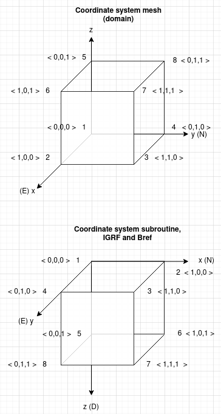

Coordinate systems of different components
==========================================

:numref:`coordinates` illustrates the different coordinate systems within the model. The system used for the domain and all related parameters (i.e. mag, positions) is displayed at the top, at the bottom the orientation system in consistent with the subroutine, but also intentionally the same as IGRF and Bref (field measurements): Northing (``x``), Easting (``y``), Downing (``z``). In hindsight, the same system for the mesh/domain would be desirable. Nonetheless, a simple transformation as included in the code suffices.

.. _coordinates:

   
   Coordinate systems of different components in this study.

