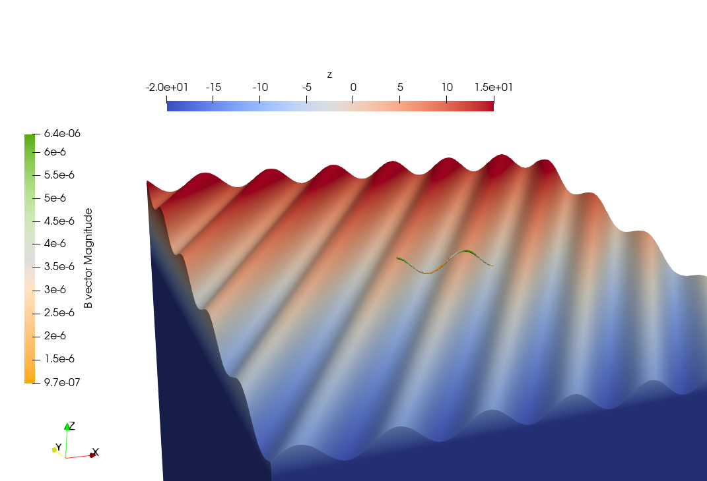

Synthetic topopography: flank simulations
=========================================

Given that the majority of lava flows are located on the flanks of volcanoes, simulating volcanic flanks is a relevant and intuitive starting point for our initial generic modeling setup. While the magnetization direction remains consistent, the dip direction of the surfaces on these flanks varies. To explore the impact of these variances, we established a model setup dedicated to flank simulations, as illustrated in Figure \ref{fig:flanksim}. In our approach, the flank topography is emulated using a sine approximation on a slope, with the sine function capturing the characteristic ridges and gullies of volcanic topography.

In these simulations, a wide range of parameters can be adjusted to investigate their influence on the magnetic field. These include the surface slope, the amplitude and wavelength of the sine function, and the angle between the sine wave's direction and either the x-axis or y-axis—depending on the flank, as depicted in Figure \ref{fig:bdeg}.

For alignment with our case study, parameter estimates aiming to replicate the ridges and gullies of Mount Etna were derived from aerial images and Digital Elevation Models (DEMs). The estimated amplitude, wavelength, and angle for the slope were 8m, 25m, and 6 \degree, respectively. 

Flank simulations were done using a domain of 250x250x20m with 375x375x10 elements (upon careful consideration, see section :doc:`parameters`), with computation done a path of 47 points located one meter above the center of the domain. The sine wave was shifted to create the exact same topography underneath the path at the center of each flanks.

.. _flanksim:
.. figure:: figures/flanks2edit.png
   :class: with-border
   
   Flank simulation on the Etna. (:math:`\mathbf{M}`) = :math:`7.5 [A/m]` (arrows). The slope (:math:`a` in :numref:`flanksim`) is  :math:`6 \degree`. The computations of the magnetic field (:math:`\mathbf{B}`) above the flanks are done at point composing either a path or a plane above each flank. The flanks are labeled as displayed. Please note, for visual purposes, a different extent and resolution of the mesh was chosen for the displayed mesh, not adhering the optimized testing setup outlined before and in section :ref:`parameters`.

.. _bdeg:

   
   Direction on south flank is :math:`-31 ^{\circ}`, an example of a variation possible while doing flank simulations tests.

   .. _flanksim:
.. figure:: figures/dempath.png
   :class: with-border
   
   A topography based on field path of site 3, path 1, iterated 7 times, on the North flank of Mt. Etna. The surface is placed on a slope with :math:`6 ^{\circ}` dipping north.
