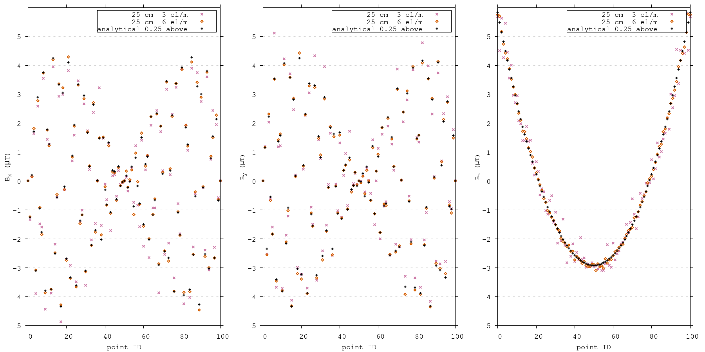
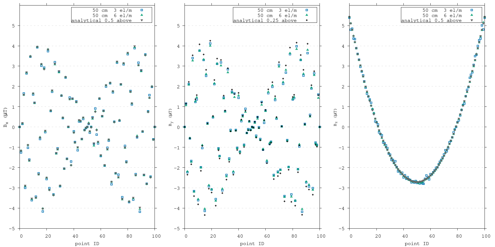

.. _sphere_bench_25:

   Analytical solution and computed values for 100 difference computation points at 0.25m above the surface of a sphere with a resolution of either 3 or 6 el/m.

.. _sphere_bench_50:

   Analytical solution and computed values for 100 difference computation points at 0.50m above the surface of a sphere with a resolution of either 3 or 6 el/m.

