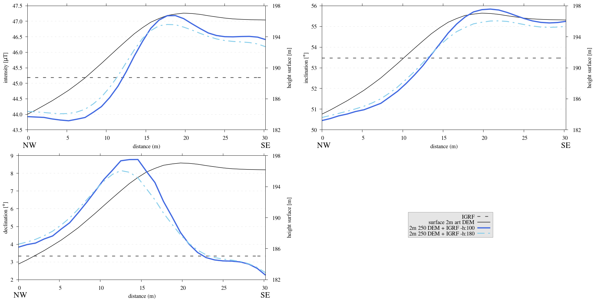
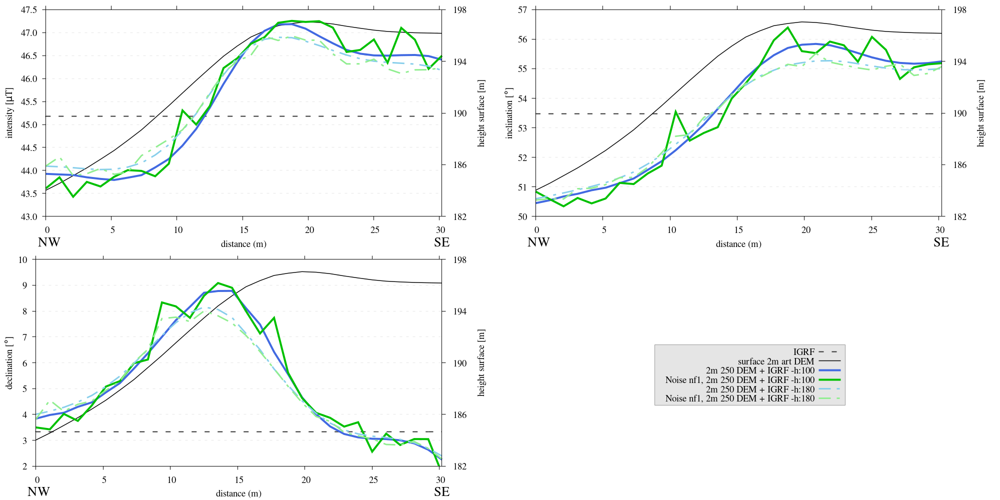

.. _artdem:

Artificial DEM
==============
| This section describes the method of computing values above any Digital Elevation Model (DEM) implementing the MTE code. To circumvent potential copyright concerns, the procedure introduces a feature of the MTE code that creates artificial DEMs. These synthetic models are constructed using (pseudo) fractal algorithms refined with a Gaussian filter, allowing for the simulation of natural terrain variability.

Computational approach
----------------------
| The generation of an artificial DEM is facilitated by the diamond-square algorithm. This algorithm initiates by segmenting the map into a square with predefined corner values and randomly displacing the midpoint within a range determined by the roughness [#]_. Next, these midpoints become the corners of diamond shapes, and their midpoint, too, are adjusted vertically by random amounts proportional to the current level of roughness. This step establishes the foundational relief. With each iteration, the grid is refined by halving the ``stepsize``, effectively quadrupling the number of squares, while concurrently scaling down the roughness factor, which can be moderated linearly or exponentially. This iterative refinement continues until the ``stepsize`` reaches two, at which point the artificial DEM's elevations are fully determined.

| Subsequently, the DEM undergoes a smoothing process via a Gaussian filter. An additional feature implemented in this method allows for the integration of two successive executions of the :func:`art_DEM.generate_fractal_map` function, facilitating the overlay of coarser topographic features with finer details. To mimic the typical slopes found in volcanic regions, a routine has been crafted to impose a incline across the fractal map. Precision within the DEM is optimized by limiting elevation values to two decimal places, which is sufficient for representing the terrain while significantly reducing the DEM's file size. The finalized DEM is then exported to an ASCII file using :func:`art_DEM.write_dem_to_ascii`, including essential metadata in the file header.

| The final step involves plotting a trajectory through the :func:`art_DEM.generate_pathfile` function, which calculates xy-coordinates for a series of observational points situated approximately at the center of the domain.

| It should be noted that the flat bottom method results in varied depths throughout the domain, influenced by the topography's extent and slope. Such variability complicates the subtraction of a zero topography domain, which should ideally have a consistent thickness corresponding to the area beneath the central observation path. In our approach with topography from a DEM, this thickness is computed from the average path height and minimum height of the DEM topography. However, using this technique that may not be universally valid. It is only effective if the observation path is located in the middle of the domain and orientated perpendicular to the slope. Additionally, it presupposes that the area's slope (within the entire spatial extent of the domain) dominates over the local topographical variations along the path.

.. _vis_art_DEM:

   3D visualization of a synthetic DEM showing varied terrain roughness, generated using a fractal-based algorithm to mimic natural topographic features.  In the middle of the domain is an observational path for the computation of the magnetic field **B**.

Model setup
-----------
| The selected domain for the simulation was defined as :math:`252\times252\times20` meters, discretized into :math:`126\times126\times10` elements.  Inclines of :math:`5 ^{\circ}` and :math:`12 ^{\circ}` were applied along the x- and y-direction, respectively, situating the model on what would represent the southwestern slope of Mount Etna. The bottom surface was simulated as a level plane, and the removal of a zero topography domain was executed. The decision was made to synthesize the topography by merging two DEMs with distinct roughness values of :math:`12` and :math:`2`. This approach was intended to create a topographic roughness that exceeds the levels encountered in previous flank simulations. The specific parameters used to generate the artificial DEM are presented in the subsequent steps.

| A uniform remanent magnetization intensity of :math:`7.5` :math:`[A/m]` was assigned to the simulated matter, aligning closely with the thermoremanent magnetization (TRM) observed in lava flow samples from the field, as reported in :cite:`Meyer23`, and with the magnetization intensities noted in prior paleomagnetic research on Etnean lavas by :cite:`Nicolosi14`, which documented a bulk magnetization of :math:`8` :math:`[A/m]`, with a range between :math:`5` and :math:`13` :math:`[A/m]`. However, it is worth noting the broader spectrum of recorded values in other studies, from as low as :math:`0.1-1` :math:`[A/m]` to as high as :math:`20` :math:`[A/m]`, as cited by :cite:`Tanguy04, Speranza06`, indicating the significant variability in magnetization measurements of Etnean lavas. The magnetization inclination applied in this study is :math:`57 ^{\circ}`, estimated from Mount Etna's average latitude based on the Geocentric Axial Dipole model (:math:`\tan{I} = 2\tan({lat})`). A declination of :math:`0 ^{\circ}` was assumed, corresponding to alignment with the present geomagnetic field, allowing for the computation of the magnetization components.

| Similarly to the :ref:`previous section <flanksim>`, the IGRF values used signify an average for Mount Etna, with the respective components being :math:`IGRF_E = 1561.2 nT`, and :math:`IGRF_N = 26850.3 nT`, and :math:`IGRF_D = 36305.7 nT`.

Results
-------

.. _art_DEM:

   Three subplots depicting the intensity [:math:`\mu T`], inclination [:math:`^{\circ}`] and declination [:math:`^{\circ}`] of the computed magnetic field **B** superimposed on the IGRF derived from flank simulations. Simulations were done at both 1 meter and 1.8 meter above the topography.

| The maximum intensity anomaly observed relative to Mount Etna's IGRF intensity, for path above an artificial DEM, is approximately :math:`+2 \mu T` for positive anomalies and :math:`-1.39 \mu T` for negative anomalies. The greatest inclination anomaly recorded reaches about :math:`+2.37 ^{\circ}` in the positive spectrum and :math:`-3.02 ^{\circ}` in the negative. Similarly, the peak declination anomaly is :math:`+5.45 ^{\circ}` for positive deviations and :math:`-1.08 ^{\circ}` for negative deviations.

| Upon comparing these values to the results of the :ref:`flank simulation <flanksim>`, it becomes apparent that the observed anomalies are consistently lower or at most equal in magnitude. Despite the model setup and elevation of the path, see :numref:`art_DEM` indicating more substantial topographical features. This implies that the interplay between adjacent topographical features may exert a more significant influence than the sheer size of any individual topographic characteristic.

| In :numref:`art_DEM`, similar patterns as in the :ref:`previous section <flanksim>` can be observed. The topography exerts a significant influence on the magnetic field measurements at the surface, affecting intensity, inclination, and declination in relation to the terrain's contours. At increased altitudes, the strength of the anomalies diminishes, with positive anomalies decreasing more rapidly than their negative counterparts. Regarding declination, the anomaly peaks premature of the corresponding topographical feature, and this temporal shift becomes more pronounced at higher elevations.

Reproduce
---------
| The ``script_art_DEM.sh`` shell script has been crafted to automate the execution and organization of output data, directing it into the correct subdirectory for a run using the artificial DEM generating module ``art_DEM.py``. Please make sure any modifications of the

.. collapse:: Steps to reproduce the results and figures

   Please note basic setup in :ref:`installation`

   1. In ``MTE.py``, modify benchmark attribution to ``-1``, and make sure the right setup is used:

      .. code-block:: python
         :caption: **/main/MTE.py**
         :linenos:
         :lineno-start: 45
         :emphasize-lines: 1,8,11,24

         benchmark = '-1'

         compute_vi = False  # Possible for all setups apart from DEM (-1).
         if compute_vi:
            nqdim = 6  # Number of quadrature points, see documentation.

         ## ONLY BENCHMARK = -1 (DEM) & BENCHMARK = 5 (FLANKSIM) ##
         flat_bottom = True  # If True, a flat bottom is generated at the lower surface of the domain.
                             # Please see documentation, as the specific setup of this feature is different
                             # for the flank simulations and the DEM test.
         remove_zerotopo = True  # Setup run 2 times: 1st time, zero topography setup: xy coordinates
                                 # of the observation points the same, but zerotopo domain and obs path
                                 # shifted to average height DEM. 2nd time, "regular" run with topography.
                                 # final results are 2nd run - 1 st run values. Run time can be improved,
                                 # if 1st run was done with less el (and cuboid function), yet to be done.

         ## ONLY BENCHMARK = 5 (FLANKSIM) ##
         subbench = 'west'  # 'south', 'east', 'north', 'west', shifts topo features, and obs paths.

         ## ONLY BENCHMARK = -1 (DEM) ##
         add_noise = False  # if True, noise is added to the DEM after loading in from file.
         Nf = 1  # noise amplitude between -Nf and Nf, value added to the z-coor of the middle node
                 # on the top/bottom surface. Only relevant if add_noise = True
         art_DEM = True  # if True, path/topo file (+ header) produced by art_DEM.py read in.
                         # Please note other values specified below for IGRF and magnetization etc.

   2. In ``MTE.py``, fill the required parameters.

      .. code-block:: python
         :caption: **/main/MTE.py**
         :linenos:
         :lineno-start: 294
         :emphasize-lines: 14,15,16,17,18,19,22,26,30,45,46,47,48,49

         if benchmark == '-1':
            # General settings ## DO NOT CHANGE ##
            compute_analytical = False
            compute_vi = False

            if art_DEM:
               # General settings
               do_line_measurements = False
               do_plane_measurements = False
               do_spiral_measurements = False
               do_path_measurements = True

               # Domain settings
               Lz = 20
               nelz = 10
               IGRFx = 26850.3e-9  # Pmag coordinate configuration!
               IGRFy = 1561.2e-9  # Mount Etna (peak)
               IGRFz = 36305.7e-9
               Mx0, My0, Mz0 = 0, 4.085, -6.29

               # Path measurement settings
               pathfile = 'sites/art_path.txt'
               print('reading from art_path.txt')
               with open(pathfile, 'r') as path:
                  npath = len(path.readlines())
               zpath_height = 1  # height above topo
               ho = zpath_height

               # Domain settings from artificial DEM
               topofile = 'DEMS/art_dem.ascii'
               print('reading from art_dem.ascii')
               with open(topofile, 'r') as topo:
                    has_header, header = read_header(topo)

               if has_header:
                  nnx = int(header['ncols'])
                  nny = int(header['nrows'])
                  cellsize = header['cellsize']

                  nelx = nnx - 1
                  nely = nny - 1
                  Lx = nelx * cellsize
                  Ly = nely * cellsize
               else:  # define values here if no header is present in DEM
                  nnx = 31
                  nny = 31
                  cellsize = 2
                  xllcorner = 0
                  yllcorner = 0

                  nelx = nnx - 1
                  nely = nny - 1
                  Lx = nelx * cellsize
                  Ly = nely * cellsize

   3. In ``script_art_DEM.sh``, fill the required parameters.

      .. code-block:: bash
         :caption: **script_art_DEM.sh**
         :linenos:
         :lineno-start: 3
         :emphasize-lines: 1,4,5,6,7,8,9,10,11,13,14,17,18

         generate_DEM=true

         # Domain parameters
         ncol=127  # must be a power of 2 minus 1: 2^n - 1, e.g., 3, 7, 15, 31, 63, 127, 255, 511, 1023 ...
         nrow=127  # amount of rows (must be equal to amount of columns, ncol)
         cellsize=2  # Change this value if you want a different cell size
         afx=5  # angle of flank in x-direction
         afy=12  # angle ""      in y-direction
         xllcorner=50  # x-coordinate of the lower left corner (most south-western node)
         yllcorner=100  # y-coordinate of ""
         sigma=2  # sigma for Gaussian filter

         roughness1=12  # can be adjusted for desired level of detail
         roughness2=2  # can be adjusted for desired level of detail

         # Path parameters
         rough_length=30  # rough length of the path, but due to shifting length might be slighlt more/less
         npath=30  # amount of observation points on path

         size=$(( (ncol - 1) * cellsize ))

         folder_name="${size}_r${roughness1}_r${roughness2}_afx${afx}_afy${afy}_s${sigma}"

   4. Run DEM simulation:

      .. code-block::
         :caption: **/main/** (runtime: ~12 min)

         ./script_art_DEM.sh

   5. Modify for 1.8 meter run:

      .. code-block:: python
         :caption: **/main/MTE.py**
         :linenos:
         :lineno-start: 314
         :emphasize-lines: 6

         # Path measurement settings
         pathfile = 'sites/art_path.txt'
         print('reading from art_path.txt')
         with open(pathfile, 'r') as path:
            npath = len(path.readlines())
         zpath_height = 1.8  # height above topo

      .. code-block:: bash
         :caption: **script_art_DEM.sh**
         :linenos:
         :lineno-start: 3
         :emphasize-lines: 1,22

         generate_DEM=false

         # Domain parameters
         ncol=127  # must be a power of 2 minus 1: 2^n - 1, e.g., 3, 7, 15, 31, 63, 127, 255, 511, 1023 ...
         nrow=127  # amount of rows (must be equal to amount of columns, ncol)
         cellsize=2  # Change this value if you want a different cell size
         afx=5  # angle of flank in x-direction
         afy=12  # angle ""      in y-direction
         xllcorner=50  # x-coordinate of the lower left corner (most south-western node)
         yllcorner=100  # y-coordinate of ""
         sigma=2  # sigma for Gaussian filter

         roughness1=12  # can be adjusted for desired level of detail
         roughness2=2  # can be adjusted for desired level of detail

         # Path parameters
         rough_length=30  # rough length of the path, but due to shifting length might be slighlt more/less
         npath=30  # amount of observation points on path

         size=$(( (ncol - 1) * cellsize ))

         folder_name="${size}_r${roughness1}_r${roughness2}_afx${afx}_afy${afy}_s${sigma}_180"

   6. Run DEM simulation for 1.8 meter:

      .. code-block::
         :caption: **/main/** (runtime: ~12 min)

         ./script_art_DEM.sh

   7. Go to directory and plot:

      .. code-block::
         :caption: **/main/**

         cd path_results/art_DEM/

      .. code-block::
         :caption: **/main/path_results/art_DEM/**

         gnuplot plot_script_art_dem.p

Adding noise to DEM
-------------------
| When the imported DEM lacks sufficient detail and is smoothed excessively, the MTE code has a built-in option to introduce randomness into the terrain. This is achieved by adjusting the midpoint of each element's surface by a random value that is proportionally adjusted by the ``Nf`` parameter. It's important to be aware that this method of noise introduction is quite basic and may lead to some unanticipated outcomes. For example, excessive noise coupled with an observation point situated near an element's midpoint may result in the point being erroneously placed within the magnetization domain. It is advised to be cautious during the setup phase of any experiments using this function to ensure that observation points remain outside the magnetization domain, as there are no corrective measures or tests for this within the system.

Results and analyses
^^^^^^^^^^^^^^^^^^^^
.. _art_DEM_noise:

   Three subplots depicting the intensity [:math:`\mu T`], inclination [:math:`^{\circ}`] and declination [:math:`^{\circ}`] of the computed magnetic field **B** superimposed on the IGRF derived from flank simulations. These simulations were conducted at 1 meter and 1.8 meters above the terrain surface. To add variability, the midpoint of each element's surface was altered by introducing a random noise factor ranging between -1 and 1 meter.

| :numref:`art_DEM_noise` illustrates the successful implementation of the intended feature. The introduction of random noise results in stochastic variations in the magnetic anomalies. With the path's altitude consistently set at least one meter above the terrain, any perturbations introduced are confined to within one meter, and ensuring observation points are never coincident with an element's midpoint as outlined in :doc:`computational_approach`. This precaution verifies that the anomalies detected are genuine effects, not artifacts from the potential misplacement of observation points within the magnetic domain of the underlying flow. Therefore, it can be confidently stated that these rough anomalies are attributed to the proximal, pointed topographic features that may have been smoothed in a DEM representation, but reintroduced using this feature in the MTE code.

| Another pertinent observation is the attenuation of these perturbations with increased altitude. The data computed at 1.8 meters altitude demonstrate a significant reduction in the jagged characteristics that are prominent in the lower-elevated path results, affirming that the influence of topographic noise diminishes as the distance from the surface increases.

Reproduce
^^^^^^^^^

.. collapse:: Steps to reproduce the results and figures

   Please note basic setup in :ref:`installation`

   1. In ``MTE.py``, modify benchmark attribution to ``-1``, and make sure the right setup is used:

      .. code-block:: python
         :caption: **/main/MTE.py**
         :linenos:
         :lineno-start: 45
         :emphasize-lines: 1,8,11,24

         benchmark = '-1'

         compute_vi = False  # Possible for all setups apart from DEM (-1).
         if compute_vi:
            nqdim = 6  # Number of quadrature points, see documentation.

         ## ONLY BENCHMARK = -1 (DEM) & BENCHMARK = 5 (FLANKSIM) ##
         flat_bottom = True  # If True, a flat bottom is generated at the lower surface of the domain.
                             # Please see documentation, as the specific setup of this feature is different
                             # for the flank simulations and the DEM test.
         remove_zerotopo = True  # Setup run 2 times: 1st time, zero topography setup: xy coordinates
                                 # of the observation points the same, but zerotopo domain and obs path
                                 # shifted to average height DEM. 2nd time, "regular" run with topography.
                                 # final results are 2nd run - 1 st run values. Run time can be improved,
                                 # if 1st run was done with less el (and cuboid function), yet to be done.

         ## ONLY BENCHMARK = 5 (FLANKSIM) ##
         subbench = 'west'  # 'south', 'east', 'north', 'west', shifts topo features, and obs paths.

         ## ONLY BENCHMARK = -1 (DEM) ##
         add_noise = True  # if True, noise is added to the DEM after loading in from file.
         Nf = 1  # noise amplitude between -Nf and Nf, value added to the z-coor of the middle node
                 # on the top/bottom surface. Only relevant if add_noise = True
         art_DEM = True  # if True, path/topo file (+ header) produced by art_DEM.py read in.
                         # Please note other values specified below for IGRF and magnetization etc.

   2. In ``MTE.py``, fill the required parameters.

      .. code-block:: python
         :caption: **/main/MTE.py**
         :linenos:
         :lineno-start: 314
         :emphasize-lines: 6

         # Path measurement settings
         pathfile = 'sites/art_path.txt'
         print('reading from art_path.txt')
         with open(pathfile, 'r') as path:
            npath = len(path.readlines())
         zpath_height = 1  # height above topo

   3. In ``script_art_DEM.sh``, fill the required parameters.

      .. code-block:: bash
         :caption: **script_art_DEM.sh**
         :linenos:
         :lineno-start: 3
         :emphasize-lines: 1,22

         generate_DEM=false

         # Domain parameters
         ncol=127  # must be a power of 2 minus 1: 2^n - 1, e.g., 3, 7, 15, 31, 63, 127, 255, 511, 1023 ...
         nrow=127  # amount of rows (must be equal to amount of columns, ncol)
         cellsize=2  # Change this value if you want a different cell size
         afx=5  # angle of flank in x-direction
         afy=12  # angle ""      in y-direction
         xllcorner=50  # x-coordinate of the lower left corner (most south-western node)
         yllcorner=100  # y-coordinate of ""
         sigma=2  # sigma for Gaussian filter

         roughness1=12  # can be adjusted for desired level of detail
         roughness2=2  # can be adjusted for desired level of detail

         # Path parameters
         rough_length=30  # rough length of the path, but due to shifting length might be slighlt more/less
         npath=30  # amount of observation points on path

         size=$(( (ncol - 1) * cellsize ))

         folder_name="${size}_r${roughness1}_r${roughness2}_afx${afx}_afy${afy}_s${sigma}_noise_af1"

   4. Run DEM simulation:

      .. code-block::
         :caption: **/main/** (runtime: ~12 min)

         ./script_art_DEM.sh

   5. Modify for 1.8 meter run:

      .. code-block:: python
         :caption: **/main/MTE.py**
         :linenos:
         :lineno-start: 314
         :emphasize-lines: 6

         # Path measurement settings
         pathfile = 'sites/art_path.txt'
         print('reading from art_path.txt')
         with open(pathfile, 'r') as path:
            npath = len(path.readlines())
         zpath_height = 1.8  # height above topo

      .. code-block:: bash
         :caption: **script_art_DEM.sh**
         :linenos:
         :lineno-start: 24
         :emphasize-lines: 1

         folder_name="${size}_r${roughness1}_r${roughness2}_afx${afx}_afy${afy}_s${sigma}_noise_af1_180"

   6. Run DEM simulation for 1.8 meter:

      .. code-block::
         :caption: **/main/** (runtime: ~12 min)

         ./script_art_DEM.sh

   7. Go to directory and plot:

      .. code-block::
         :caption: **/main/**

         cd path_results/art_DEM/

      .. code-block::
         :caption: **/main/path_results/art_DEM/**

         gnuplot plot_script_art_dem_noise.p

Adding another DEM
------------------
| The outlined procedures detail the integration of an artificial DEM created using the MTE code code, but these instructions are also applicable to any real-world DEM and corresponding field path files. Here are several crucial considerations:

 - Ensure that the file locations and names of the DEM and path file are consistent between the code's main body and the file directory.
 - The DEM ASCII file should adhere to a standard format, with the top-left value (below the header) representing the most northwestern point. If the DEM's structure deviates from this norm, the code segment responsible for parsing DEM values will require modification to accommodate the alternative format.
 - The DEM header must include the following attributes: ``ncol, nrow, xllcorner, yllcorner, cellsize``. The function :func:`support.read_header` will flag an error if the header is incomplete or incorrectly formatted. In the absence of a header, these attributes must be manually set within the ``MTE.py`` script.
 - When incorporating published DEMs and field data, their coordinate systems must be in sync.
 - A common issue is the potential discrepancy between the topography from field data and that of a published DEM, particularly in the vertical dimension due to the known limitations of GPS devices in measuring elevation accurately. To account for any such height discrepancies, a path offset height (``poh``) can be specified (see code snippet below), which is then subtracted from the field elevation measurements for more accurate representation and easier plotting.

   .. code-block:: python
         :caption: **/main/MTE.py**
         :linenos:
         :lineno-start: 1228
         :emphasize-lines: 2

         if art_DEM:
             poh = 0
         elif benchmark == '-1' and rDEM == 2:
            if site == 1 or site == 2 or site == 3 or site == 5:
               poh = 8.5  # offset from height of path to height of DEM
         elif benchmark == '-1' and rDEM == 5:
            if site == 1 or site == 2 or site == 5:
               poh = 7.5
            elif site == 4:
               poh = 3
            elif site == 6:
               poh = 8.5
         else:
            poh = 0

 - It is also possible to encounter slight spatial misalignments between field measurements and the DEM. Such discrepancies are usually localized and should be assessed visually for each path.
 - The use of any external reference field is supported, as the :func:`support.add_referencefield` function is designed to be universal and adaptable to various datasets.

.. rubric:: Footnotes

.. [#] This step is called the diamond step, this might sound counterintuitive, as the midpoint of the **square** is modified. Nonetheless, the rationale behind the nomenclature becomes clear when considering the points that contribute to determining the new value. For a comprehensive explanation and visual representation, refer to the detailed entry on the diamond-square algorithm on  `wikipedia <https://en.wikipedia.org/wiki/Diamond-square_algorithm/>`_.
