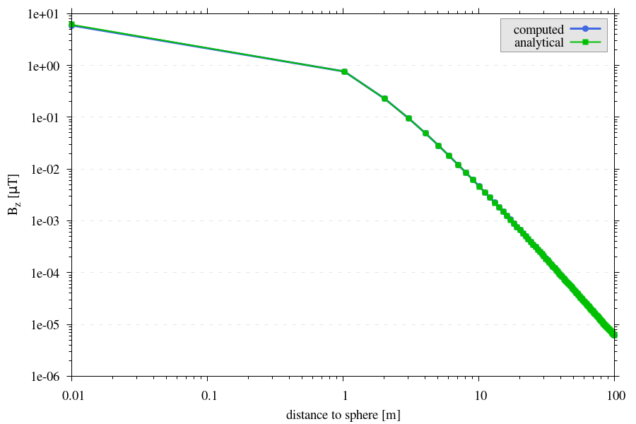

.. _benchmarks:

Benchmarks
==========
| Several different benchmarks are available to verify computed values of MTE code.
|
| Verification aims of the benchmarks:

1. Assumption that the contribution of an element can be represented by a single dipole "far" away from source  (see :doc:`governing_equations`).
2. Shape / orientation of the magnetic field outside source body, verifying rotation of vector components in translation from original ``facmag`` FORTRAN77 subroutine :cite:`BLAKELY`, to current function embedded in MTE.
3. Assumption that volume elements are *small enough* and distance to ``P`` is *large enough* (see :doc:`computational_approach`).
4. Solving spatial problem with introduction of a small distance (:math:`\epsilon`) suffices.

| If the analytical solution takes the form of an equation, its solution will be generated using the function :func:`support.compute_analytical_solution`. All benchmarks outlined here do not require modification of the z-coordinate of nodes on the top and bottom surfaces and, consequently, do not call for a setup with additional triangles (see :doc:`computational_approach`). Therefore, unless otherwise specified, the function :func:`magnetostatics.compute_B_surface_integral_cuboid` computes the contribution of each element to the magnetic field strength :math:`\mathbf{B}` for all benchmarks.

Benchmark 1: a single dipole
----------------------------
Analytical solution
^^^^^^^^^^^^^^^^^^^
| Equation :eq:`sd`, provides us with a solution for the magnetic field produced by a single dipole :cite:`GRIFFITHS,BLAKELY`.
| At very large distances, a sphere of uniform magnetization can be seen as a single dipole of volume :math:`V=\frac{4}{3}\pi r^3`, where :math:`r` is the distance from :math:`\mathbf{P}` to the center of the sphere :math:`z-z_s` :cite:`BLAKELY`.
| If we align the magnetization of the sphere with one of the axes, :math:`\mathbf{M}=(0,0,M_{z0})` and compute values on a line above the center of the sphere, :math:`\mathbf{r}=(0,0,z-z_s), r=z-z_s`,  eq.  :eq:`sd` reduces to

.. math::
   \begin{equation}
      \mathbf{B}_{dip}(\mathbf{r}) = \frac{\mu_0 V}{2\pi} \frac{M_{z0}}{r^3}   \mathbf{e}_z
   \end{equation}
   :label: sds

Model setup
^^^^^^^^^^^

| The model setup was as follows: A spherical inclusion of radius :math:`ds=1m` and :math:`\mathbf{M}= (0,0,7.5)` in a domain of 2x2x2m with a resolution of 100 elements in each direction.
| The magnetic field values were computed along a vertical line positioned directly above the sphere's center, where the distance :math:`r` was progressively increased to exceed :math:`100m`.

Results
^^^^^^^

.. _figureB1:

   Analytical solution for a single dipole and computed values at increasing distance from surface of a sphere.

.. _figureB1zoom:
.. figure:: figures/B1dipole_dif_zoom_withlines.png
   :class: with-border
   :scale: 60%

   Difference between analytical solution for a single dipole and computed values at increasing distance from surface of a sphere.

| As illustrated in :numref:`Figure %s <figureB1>`, the discrepancies between the analytical solution and computed values are minimal.
| Even at a height of, see :numref:`figureB1zoom`, :math:`0.25m`, the smallest height above the topography measured in the Etna case study :cite:`Meyer23`, the error remains approximately :math:`\sim \lvert 0.01 \rvert \mu T` .

Reproduce
^^^^^^^^^
.. collapse:: How to reproduce the results and figures

   Please note basic setup in :ref:`installation`

   1. In ``MTE.py``, modify benchmark attribution to ``1``:

      .. code-block:: python
         :caption: /main/MTE.py
         :linenos:
         :lineno-start: 27
         :emphasize-lines: 1

         benchmark = '1'

   2. Run "zoomed" setup & rename/move files

      .. code-block:: python
         :caption: /main/MTE.py
         :linenos:
         :lineno-start: 65
         :emphasize-lines: 8

         if benchmark == '1':
            do_line_measurements = True
            xstart = Lx / 2
            ystart = Ly / 2
            zstart = 0.01      #slightly above surface
            xend = Lx / 2
            yend = Ly / 2
            zend = 2  # "zoomed"-data (i.e. close to surface)
            #zend = 100  # regular setup
            line_nmeas = 100

      .. code-block::
         :caption: /main/

         python3 -u MTE.py | tee log.txt

      .. code-block::
         :caption: /main/

         mkdir benchmarks/benchmark_1/results_zoom && mv log.txt *.vtu *.ascii benchmarks/benchmark_1/results_zoom

   3. Run regular setup & move files

      .. code-block:: python
         :caption: /main/MTE.py
         :linenos:
         :lineno-start: 65
         :emphasize-lines: 8,9

         if benchmark == '1':
            do_line_measurements = True
            xstart = Lx / 2
            ystart = Ly / 2
            zstart = 0.01      #slightly above surface
            xend = Lx / 2
            yend = Ly / 2
            #zend = 2  # "zoomed"-data (i.e. close to surface)
            zend = 100  # regular setup
            line_nmeas = 100

      .. code-block::
         :caption: /main/

         python3 -u MTE.py | tee log.txt

      .. code-block::
         :caption: /main/

         mv log.txt *.vtu *.ascii benchmarks/benchmark_1/

   4. Go to directory & plot

      .. code-block::
         :caption: /main/

         cd benchmarks/benchmark_1

      +---------------------------------------------+----------------------------------------------+
      |.. code-block::                              |.. code-block::                               |
      |   :caption: /main/benchmarks/benchmark_1/   |   :caption: /main/benchmarks/benchmark_1/    |
      |                                             |                                              |
      |   gnuplot plot_script_B1.p                  |   python3 plot_script_B1.py                  |
      +---------------------------------------------+----------------------------------------------+

.. _B2:

Benchmark 2: internal cancellation
----------------------------------
Analytical solution
^^^^^^^^^^^^^^^^^^^
| According to theory, all internal magnetic forces, or contributions, on the surfaces within the magnetized object should cancel out :cite:`JACKSON`. Hence, regardless of variations on the internal surfaces of elements in our domain, the computed values at any point above the surface should be consistent.

Model setup
^^^^^^^^^^^
.. _deformationsetups:
.. figure:: figures/result_b2_frames_only_3.png
   :class: with-border
   :scale: 50%

   Visualization of different model setups by cross sectional planes trough middle of each mesh, on the left the undeformed base mesh, in the middle deformation setup (1), on the right deformation setup (2).

| To verify this, a domain of 10x10x10m, with an initial element size of 2x2x2m and :math:`\mathbf{M}= (0,0,7.5)`, was deformed in two ways:

1. a random value between :math:`-0.1` and :math:`0.1` was added to the z coordinates of internal nodes
2. situation in (1) was combined with elements of a very high aspect ratio (5x1x0.2m).

| The original domain and results will be referred to as the base setup, see :numref:`deformationsetups` for visualization of the deformation setups.

Results
^^^^^^^
.. _figureB2base:
.. figure:: figures/result_b2_base_lines.png
   :class: with-border
   :scale: 60%

   The magnetic field strength :math:`\mathbf{B}` on a plane :math:`1m` above the surface of a box with a spatial extent that is twice as large as the (undeformed) domain beneath.

.. _figureB2:
.. figure:: figures/result_b2.png
   :scale: 80%

   Difference between :numref:`figureB2base` and results from the deformed domain setups. On the left the difference between deformation setup (1) and the base, on the right the difference between deformation setup (2) and the base. See model setup section.

| As expected and observable in :numref:`figureB2`, the computed values of the magnetic field on the observation plane, located one meter above the domain, remained consistent (up to machine precision) across these scenarios.

Reproduce
^^^^^^^^^
.. collapse:: How to reproduce the results and figures

   Please note basic setup in :ref:`installation`

   1. In ``MTE.py``, modify benchmark attribution to ``2a``:

      .. code-block:: python
         :caption: /main/MTE.py
         :linenos:
         :lineno-start: 27
         :emphasize-lines: 1

         benchmark = '2a'

   2. Run base setup & rename/move files

      .. code-block:: python
         :caption: /main/MTE.py
         :linenos:
         :lineno-start: 89
         :emphasize-lines: 12

         if benchmark == '2a':
            Lx = 10
            Ly = 10
            Lz = 10
            nelx = 5
            nely = 5
            nelz = 5
            Mx0 = 0
            My0 = 0
            Mz0 = 7.5
            nqdim = 6
            dz = 0  # Base setup.
            #dz = 0.1  # Amplitude random.

      .. code-block::
         :caption: /main/

         python3 -u MTE.py | tee log.txt

      .. code-block::
         :caption: /main/

         mkdir benchmarks/benchmark_2/d0 && mv log.txt *.vtu *.ascii benchmarks/benchmark_2/d0

   3. Run deformation setup (1) & move files

      .. code-block:: python
         :caption: /main/MTE.py
         :linenos:
         :lineno-start: 89
         :emphasize-lines: 12,13

         if benchmark == '2a':
            Lx = 10
            Ly = 10
            Lz = 10
            nelx = 5
            nely = 5
            nelz = 5
            Mx0 = 0
            My0 = 0
            Mz0 = 7.5
            nqdim = 6
            #dz = 0  # Base setup.
            dz = 0.1  # Amplitude random.

      .. code-block::
            :caption: /main/

            python3 -u MTE.py | tee log.txt

      .. code-block::
            :caption: /main/

            mkdir benchmarks/benchmark_2/d0_1 && mv log.txt *.vtu *.ascii benchmarks/benchmark_2/d0_1

   4. In ``MTE.py``, modify benchmark attribution to ``2b``:

      .. code-block:: python
         :caption: /main/MTE.py
         :linenos:
         :lineno-start: 27
         :emphasize-lines: 1

         benchmark = '2b'

   5. Run deformation setup (2) & move files

      .. code-block::
         :caption: /main/

         python3 -u MTE.py | tee log.txt

      .. code-block::
         :caption: /main/

         mkdir benchmarks/benchmark_2/d0_1_2_10_50 && mv log.txt *.vtu *.ascii benchmarks/benchmark_2/d0_1_2_10_50

   6. Go to directory & use paraview or plotting to visualize

      .. code-block::
         :caption: /main/

         cd benchmarks/benchmark_2

      .. code-block::
         :caption: /main/benchmarks/benchmark_2/

         paraview --state=plot_result_b2_final.pvsm

      +---------------------------------------------+----------------------------------------------+
      |.. code-block::                              |.. code-block::                               |
      |   :caption: /main/benchmarks/benchmark_2/   |   :caption: /main/benchmarks/benchmark_2/    |
      |                                             |                                              |
      |   gnuplot plot_script_B2.p                  |   python3 plot_script_B2.py                  |
      +---------------------------------------------+----------------------------------------------+

Benchmark 3: a magnetized sphere
--------------------------------
Analytical solution
^^^^^^^^^^^^^^^^^^^
| Using the boundary conditions of a magnetized sphere present in a magnetic field :math:`\mathbf{B_0}`, equation :eq:`Bsumfinal` can be simplified (see appendix :doc:`app1`).
| This is applicable if the sphere is uniformly magnetized with :math:`\mathbf{M}` parallel to :math:`\hat{k}`, the polar direction and if the origin of the coordinate system is placed at the center of the sphere (see :numref:`sphere_si2` in :doc:`app1` for visualization).
| Then, the magnetic field outside this sphere is defined as :cite:`REITZ`

.. math::
   \begin{equation}
       \mathbf{B_t(r)} =  B_0\mathbf{\hat{k}} + \frac{\mu_{0}}{3}M\left(\frac{a^3}{r^3}\right) \left(2\mathbf{\hat{r}}\cos{\theta}+\mathbf{{\hat{\theta}}}\sin{\theta}\right)
   \end{equation}
   :label: Bsumsphere

| where :math:`r` is the distance from the center of the sphere to the observation point, :math:`a` is the radius of the sphere, :math:`\mathbf{\hat{r}}` is the unit vector in the direction of :math:`r`, :math:`\mathbf{\hat{\theta}}` is the unit vector in the direction of :math:`\theta`, :math:`\theta` is the angle between :math:`\mathbf{\hat{r}}` and :math:`\mathbf{\hat{k}}` increasing clockwise from :math:`\mathbf{\hat{k}}` and both :math:`\mathbf{M}` and :math:`\mathbf{B_0}` are in the direction of :math:`\mathbf{\hat{k}}`.

.. _sphere_bench_setup:

   Visualization of the model setup, numbering along Fibonacci spiral for uniform distribution above the tessellated sphere. Numbering of the computation points start at the top of the sphere and circle down in a counterclockwise fashion.

Model setup
^^^^^^^^^^^
| The model setup was as follows, see :numref:`sphere_bench_setup`: A spherical inclusion similar to the first benchmark, but now with a radius of :math:`a=10m` was placed in a domain of 20x20x20m with a magnetization of :math:`\mathbf{M}= (0,0,7.5)` assigned only to elements within the spherical inclusion. Since a sphere is a complex shape to accurately represent using hexahedron elements, a large number of elements were anticipated to be necessary to produce adequate results. A Fibonacci spiral was used to uniformly distribute 101 computation points at :math:`0.25m` and :math:`0.5m` above the surface of a sphere with a domain resolution of either :math:`3` or :math:`6` elements per meter.

Results
^^^^^^^
| The results are shown in the :numref:`sphere_bench`. As expected, closer to the surface the required resolution increases, however, at a distance of :math:`0.5m` above the sphere :math:`3` elements per meter suffices.

.. _sphere_bench:
.. figure:: figures/B3sphere_dif_mp_splitcase_all.png
   :class: with-border
   :scale: 70%

   Difference between analytical solution and computed values for 100 difference computation points at either 0.25 or 0.5m above the surface of a sphere with a resolution of either :math:`3` or :math:`6` :math:`el/m`.

Reproduce
^^^^^^^^^
.. collapse:: How to reproduce the results and figures

   Please note basic setup in :ref:`installation`

   1. In ``MTE.py``, modify benchmark attribution to ``3``:

      .. code-block:: python
         :caption: /main/MTE.py
         :linenos:
         :lineno-start: 27
         :emphasize-lines: 1

         benchmark = '3'

   2. Run 25cm above setup & rename/move files

      .. code-block:: python
         :caption: /main/MTE.py
         :linenos:
         :lineno-start: 160
         :emphasize-lines: 5,18

         if benchmark == '3':
            Lx = 20
            Ly = 20
            Lz = 20
            nelx = 60  # 3 el/m.
            #nelx = 120  # 6 el/m.
            nely = nelx
            nelz = nelx
            Mx0 = 0
            My0 = 0
            Mz0 = 7.5
            sphere_R = 10  # Do not change, or change radius_spiral as well.
            sphere_xc = Lx / 2
            sphere_yc = Ly / 2
            sphere_zc = -Lz / 2
            ## spiral meas ##
            do_spiral_measurements = True
            radius_spiral = 1.025 * sphere_R  # 25 cm above surface sphere.
            #radius_spiral = 1.05 * sphere_R  # 50 cm above surface sphere.
            npts_spiral = 101  # keep odd

      .. code-block::
         :caption: /main/

         python3 -u MTE.py | tee log.txt

      .. code-block::
         :caption: /main/

         mkdir benchmarks/benchmark_3/0_25_above && mv log.txt *.vtu *.ascii benchmarks/benchmark_3/0_25_above

   3. Run 25cm above setup with double amount of elements & rename/move files

      .. code-block:: python
         :caption: /main/MTE.py
         :linenos:
         :lineno-start: 160
         :emphasize-lines: 5,6,18

         if benchmark == '3':
            Lx = 20
            Ly = 20
            Lz = 20
            #nelx = 60  # 3 el/m.
            nelx = 120  # 6 el/m.
            nely = nelx
            nelz = nelx
            Mx0 = 0
            My0 = 0
            Mz0 = 7.5
            sphere_R = 10  # Do not change, or change radius_spiral as well.
            sphere_xc = Lx / 2
            sphere_yc = Ly / 2
            sphere_zc = -Lz / 2
            ## spiral meas ##
            do_spiral_measurements = True
            radius_spiral = 1.025 * sphere_R  # 25 cm above surface sphere.
            #radius_spiral = 1.05 * sphere_R  # 50 cm above surface sphere.
            npts_spiral = 101  # keep odd

      .. code-block::
         :caption: /main/

         python3 -u MTE.py | tee log.txt

      .. code-block::
         :caption: /main/

         mkdir benchmarks/benchmark_3/0_25_2_above && mv log.txt *.vtu *.ascii benchmarks/benchmark_3/0_25_2_above

   4. Run 50cm above setup & rename/move files

      .. code-block:: python
         :caption: /main/MTE.py
         :linenos:
         :lineno-start: 160
         :emphasize-lines: 5,6,18,19

         if benchmark == '3':
            Lx = 20
            Ly = 20
            Lz = 20
            nelx = 60  # 3 el/m.
            #nelx = 120  # 6 el/m.
            nely = nelx
            nelz = nelx
            Mx0 = 0
            My0 = 0
            Mz0 = 7.5
            sphere_R = 10  # Do not change, or change radius_spiral as well.
            sphere_xc = Lx / 2
            sphere_yc = Ly / 2
            sphere_zc = -Lz / 2
            ## spiral meas ##
            do_spiral_measurements = True
            #radius_spiral = 1.025 * sphere_R  # 25 cm above surface sphere.
            radius_spiral = 1.05 * sphere_R  # 50 cm above surface sphere.
            npts_spiral = 101  # keep odd

      .. code-block::
         :caption: /main/

         python3 -u MTE.py | tee log.txt

      .. code-block::
         :caption: /main/

         mkdir benchmarks/benchmark_3/0_5_above && mv log.txt *.vtu *.ascii benchmarks/benchmark_3/0_5_above

   5. Run 50cm above setup with double amount of elements & rename/move files

      .. code-block:: python
         :caption: /main/MTE.py
         :linenos:
         :lineno-start: 160
         :emphasize-lines: 5,6,18,19

         if benchmark == '3':
            Lx = 20
            Ly = 20
            Lz = 20
            #nelx = 60  # 3 el/m.
            nelx = 120  # 6 el/m.
            nely = nelx
            nelz = nelx
            Mx0 = 0
            My0 = 0
            Mz0 = 7.5
            sphere_R = 10  # Do not change, or change radius_spiral as well.
            sphere_xc = Lx / 2
            sphere_yc = Ly / 2
            sphere_zc = -Lz / 2
            ## spiral meas ##
            do_spiral_measurements = True
            #radius_spiral = 1.025 * sphere_R  # 25 cm above surface sphere.
            radius_spiral = 1.05 * sphere_R  # 50 cm above surface sphere.
            npts_spiral = 101  # keep odd

      .. code-block::
         :caption: /main/

         python3 -u MTE.py | tee log.txt

      .. code-block::
         :caption: /main/

         mkdir benchmarks/benchmark_3/0_5_2_above && mv log.txt *.vtu *.ascii benchmarks/benchmark_3/0_5_2_above

   6. Go to directory & plot

      .. code-block::
         :caption: /main/

         cd benchmarks/benchmark_3

      +---------------------------------------------+----------------------------------------------+
      |.. code-block::                              |.. code-block::                               |
      |   :caption: /main/benchmarks/benchmark_3/   |   :caption: /main/benchmarks/benchmark_3/    |
      |                                             |                                              |
      |   gnuplot plot_script_B3.p                  |   python3 plot_script_B3.py                  |
      +---------------------------------------------+----------------------------------------------+
   7. (OPTIONAL) Use paraview to visualize model setups

      .. code-block::
         :caption: /main/benchmarks/benchmark_3/

         tee ./0_5_above/model_setup.pvsm ./0_5_2_above/model_setup.pvsm ./0_25_2_above/model_setup.pvsm ./0_25_above/model_setup.pvsm < ./model_setup.pvsm >/dev/null

      .. code-block::
         :caption: /main/benchmarks/benchmark_3/

         paraview --state=0_5_2_above/model_setup.pvsm

      .. code-block::

         paraview --state=0_5_above/model_setup.pvsm

      .. code-block::

         paraview --state=0_25_above/model_setup.pvsm

      .. code-block::

         paraview --state=0_25_2_above/model_setup.pvsm

Benchmark 4: a prismatic body
-----------------------------

Analytical solution
^^^^^^^^^^^^^^^^^^^
| In this benchmark, rather than relying on theoretically derived analytical solutions for specific scenarios, we will assess our model against the numerical outcomes of another study presenting a (similar) closed-form analytical solution for a homogeneous polyhedral magnetic target :cite:`Ren19`. The findings of this study have been corroborated against :cite:`Heath05` using a prismatic body model setup. It's essential to note that only gradient tensor component results were incorporated in the published findings. However, full access to the code and accompanying datasets was provided, (`github <https://github.com/renzhengyong-geo/Magnetic_homogeneous_polyhedron/tree/master/>`_), enabling us to perform the comparison for this numerical configuration.

Model setup
^^^^^^^^^^^
| Our model setup was designed to mirror the configuration delineated by :cite:`Ren19`. Nevertheless, certain parameters were adjusted to align optimally with our coding framework.
| The evaluations were conducted on an equilateral cuboid with side lengths of :math:`L=10m`, centrally positioned at :math:`(0,0,-5 m)`.  The top face of this cuboid intersects the plane at a height of :math:`z=0m`. Each element within the cuboid was assigned a homogeneous magnetization of :math:`\mathbf{M}= (0,0,200) A/m`. 21 observation points were equally distributed along a line on the top surface of the prism at :math:`z = 0 m`, with an x-coordinate of :math:`x = 6 m` and y-coordinates ranging from :math:`[-25:25] m`.
| :cite:`Ren19`'s model setup section described that the prism was discretized into eight tetrahedral elements. Contrarily, their code stated a division into just six elements. Given this disparity, our modeling approach segmented the domain into ten elements. Nonetheless, theoretical understanding posits that the resolution in this configuration is irrelevant, as shown in the :ref:`parameter section <parameters>`.

| Another key distinction to note: the analytical solution proposed by :cite:`Ren19` was engineered to counteract numerical instabilities occurring when the observation point aligns with an element's edge. Our model does exhibit this instability (see :doc:`computational_approach`). To closely replicate their observation points, minor adjustments to the positioning of our study's observation points were done.

| It should be noted, that while this model setup does not necessitate modifications to the top or bottom surface (absence of topography), employing :func:`magnetostatics.compute_B_surface_integral_cuboid` would suffice. Nonetheless, to validate our proposed solution (see :func:`support.shift_observation_points_edge`) for additional singularities on diagonals of domain elements, function :func:`magnetostatics.compute_B_surface_integral_wtopo` was still utilized.

Results
^^^^^^^
.. _B4:
.. figure:: figures/B4.png
   :scale: 65%

   Comparison of magnetic field components :math:`\mathbf{B_x}`, :math:`\mathbf{B_y}`, :math:`\mathbf{B_z}` for the prismatic body. As observation site location were displaced from :cite:`Ren17`, the x-axis now refers to index relating to the observation point rather than a specific distance.

| :numref:`B4` shows a near-perfect alignment of the two numerical outputs, down to machine precision. This observation underscores that either approach is viable. One can either utilize an analytical solution, acknowledging the instability at the domain edges and minimally adjusting observation points or adopt numerically stable solutions tailored for logarithmic singularities as highlighted in :cite:`Ren17`.

Reproduce
^^^^^^^^^
.. collapse:: How to reproduce the results and figures

   Please note basic setup in :ref:`installation`

   1. In ``MTE.py``, modify benchmark attribution to ``4``:

      .. code-block:: python
         :caption: /main/MTE.py
         :linenos:
         :lineno-start: 27
         :emphasize-lines: 1

         benchmark = '4'

   2. Run setup & rename/move files

      .. code-block::
         :caption: /main/

         python3 -u MTE.py | tee log.txt

      .. code-block::
         :caption: /main/

         mv log.txt *.vtu *.ascii benchmarks/benchmark_4/

   3. Go to directory & plot

      .. code-block::
         :caption: /main/

         cd benchmarks/benchmark_4

      +---------------------------------------------+----------------------------------------------+
      |.. code-block::                              |.. code-block::                               |
      |   :caption: /main/benchmarks/benchmark_4/   |   :caption: /main/benchmarks/benchmark_4/    |
      |                                             |                                              |
      |   gnuplot plot_script_B4.p                  |   python3 plot_script_B4.py                  |
      +---------------------------------------------+----------------------------------------------+

