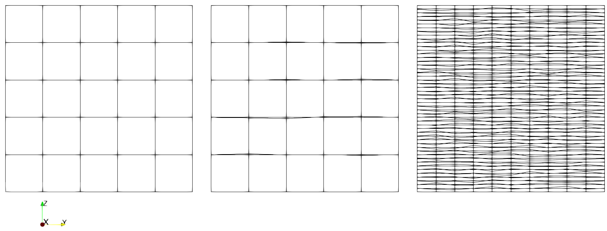
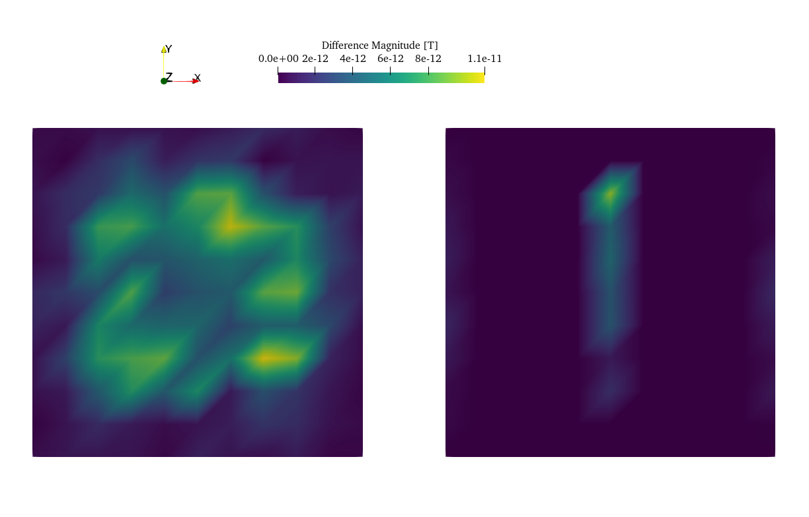

.. _benchmarks:

Benchmarks
==========
| Several different benchmarks are available to verify computed values of MTE code.

| Verification aims of the benchmarks:

1. Assumption that the contribution of an element can be represented by a single dipole "far" away from source  (see :doc:`governing_equations`).
2. Shape / orientation of the magnetic field outside source body, verifying rotation of vector components in translation from original ``facmag`` FORTRAN77 subroutine :cite:`BLAKELY`, to current function embedded in MTE.
3. Assumption that volume elements are *small enough* and distance to ``P`` is *large enough* (see :doc:`computational_approach`).
4. Solving spatial problem with introduction of a small distance (:math:`\epsilon`) suffices.

| If the analytical solution takes the form of an equation, its solution will be generated using the function :func:`support.compute_analytical_solution`. All benchmarks outlined here do not require modification of the z-coordinate of nodes on the top and bottom surfaces and, consequently, do not call for a setup with additional triangles (see :doc:`computational_approach`). Therefore, unless otherwise specified, the function :func:`magnetostatics.compute_B_surface_integral_cuboid` computes the contribution of each element to the magnetic field strength :math:`\mathbf{B}` for all benchmarks.

Benchmark 1: a single dipole
----------------------------
Analytical solution
^^^^^^^^^^^^^^^^^^^
| Equation :eq:`sd`, provides us with a solution for the magnetic field produced by a single dipole :cite:`GRIFFITHS,BLAKELY`.
| At very large distances, a sphere of uniform magnetization can be seen as a single dipole of volume :math:`V=\frac{4}{3}\pi r^3`, where :math:`r` is the distance from :math:`\mathbf{P}` to the center of the sphere :math:`z-z_s` :cite:`BLAKELY`.
| If we align the magnetization of the sphere with one of the axes, :math:`\mathbf{M}=(0,0,M_{z0})` and compute values on a line above the center of the sphere, :math:`\mathbf{r}=(0,0,z-z_s), r=z-z_s`,  eq.  :eq:`sd` reduces to

.. math::
   \begin{equation}
      \mathbf{B}_{dip}(\mathbf{r}) = \frac{\mu_0 V}{2\pi} \frac{M_{z0}}{r^3}   \mathbf{e}_z
   \end{equation}
   :label: sds

Model setup
^^^^^^^^^^^
| The model setup is as follows: A spherical inclusion of radius :math:`ds=1m` and :math:`\mathbf{M}= (0,0,7.5)` in a domain of :math:`2\times2\times2m` with a resolution of :math:`100` elements in each direction.
| The magnetic field values are computed along a vertical line positioned directly above the sphere's center, where the distance :math:`r` is progressively increased to exceed :math:`100m`.

Results
^^^^^^^
.. _figureB1_mp:

   On the left, analytical solution for a single dipole and computed values at increasing distance from surface of a sphere. On the right, the difference between analytical solution for a single dipole and computed values at increasing distance from surface of a sphere. Both show an excellent match of the computed and analytical values, even at close proximity to the surface. At :math:`0.25m` the error remains approximately :math:`\sim \lvert 0.01 \rvert \mu T`.

| As illustrated in :numref:`figureB1_mp`, the discrepancies between the analytical solution and computed values are minimal.
| Even at a height of :math:`0.25m`, the smallest height above the topography measured in the Etna case study :cite:`Meyer23`, the error remains approximately :math:`\sim \lvert 0.01 \rvert \mu T`.

Reproduce
^^^^^^^^^
.. collapse:: Steps to reproduce the results and figures

   Please note basic setup in :ref:`installation`

   1. In ``MTE.py``, modify benchmark attribution to ``1``:

      .. code-block:: python
         :caption: **/main/MTE.py**
         :linenos:
         :lineno-start: 45
         :emphasize-lines: 1

         benchmark = '1'

   2. Run "zoomed" setup & rename/move files

      .. code-block:: python
         :caption: **/main/MTE.py**
         :linenos:
         :lineno-start: 74
         :emphasize-lines: 22,23

         if benchmark == '1':
             # General settings
             remove_zerotopo = False
             compute_analytical = True
             do_spiral_measurements = False
             do_path_measurements = False

             # Domain settings
             Lx, Ly, Lz = 2, 2, 2  # Length of the domain in each direction.
             nelx, nely, nelz = 100, 100, 100  # Amount of elements in each direction.
             Mx0, My0, Mz0 = 0, 0, 7.5  # Magnetization [A/m], do not change Mx0 and My0.

             # Sphere settings
             sphere_R = 1  # Radius of the sphere.
             sphere_xc, sphere_yc, sphere_zc = Lx / 2, Ly / 2, -Lz / 2  # Center position of the sphere.

             # Line measurement settings
             do_line_measurements = True  # Do computations along a observation line (path).
             line_nmeas = 100  # Amount of observation points.
             xstart, xend = Lx / 2, Lx / 2  # x-coordinates of start and end of observation path.
             ystart, yend = Ly / 2, Ly / 2  # y-coordinates "".
             zstart, zend = 0.01, 2 # Zoomed setup.
             #zstart, zend = 0.01, 100  # Non-zoomed setup.

             # Plane measurement settings
             do_plane_measurements = False  # Do computations on a observation plane.
             plane_nnx, plane_nny = 3, 3  # Amount of observation points in each direction.
             plane_x0, plane_y0, plane_z0 = -Lx / 2, -Ly / 2, 1
             plane_Lx, plane_Ly = 2 * Lx, 2 * Ly  # Length of observation plane in each direction.

      .. code-block::
         :caption: **/main/**        (runtime: ~15 min)

         python3 -u MTE.py | tee log.txt

      .. code-block:: bash
         :caption: **/main/**

         mkdir -p benchmarks/benchmark_1/results_zoom && mv log.txt *.vtu *.ascii $_

   3. Run regular setup & move files

      .. code-block:: python
         :caption: **/main/MTE.py**
         :linenos:
         :lineno-start: 90
         :emphasize-lines: 6,7

         # Line measurement settings
         do_line_measurements = True  # Do computations along a observation line (path).
         line_nmeas = 100  # Amount of observation points.
         xstart, xend = Lx / 2, Lx / 2  # x-coordinates of start and end of observation path.
         ystart, yend = Ly / 2, Ly / 2  # y-coordinates "".
         #zstart, zend = 0.01, 2 # Zoomed setup.
         zstart, zend = 0.01, 100  # Non-zoomed setup.

      .. code-block::
         :caption: **/main/**        (runtime: ~15 min)

         python3 -u MTE.py | tee log.txt

      .. code-block::
         :caption: **/main/**

         mv log.txt *.vtu *.ascii benchmarks/benchmark_1/

   4. Go to directory & plot

      .. code-block::
         :caption: **/main/**

         cd benchmarks/benchmark_1

      +----------------------------------------------+----------------------------------------------+
      |.. code-block::                               |.. code-block::                               |
      |   :caption: **/main/benchmarks/benchmark_1/**|   :caption: **/main/benchmarks/benchmark_1/**|
      |                                              |                                              |
      |   gnuplot plot_script_B1.p                   |   python3 plot_script_B1.py                  |
      +----------------------------------------------+----------------------------------------------+

.. _B2:

Benchmark 2: internal cancellation
----------------------------------
Analytical solution
^^^^^^^^^^^^^^^^^^^
| According to theory, all internal magnetic forces, or contributions, on the surfaces within the magnetized object should cancel out :cite:`JACKSON`. Hence, regardless of variations on the internal surfaces of elements in our domain, the computed values at any point above the surface should be consistent.

Model setup
^^^^^^^^^^^
.. _deformationsetups:

   Visualization of different model setups by cross sectional (z-y) planes trough middle of each domain. On the left the undeformed base domain, in the middle deformation setup (1), where perturbations within a range of :math:`[-0.1:0.1m]` are introduced to the z-coordinates of the internal nodes of the domain. On the right deformation setup (2), where the same perturbations are repeated, additionally, the aspect ratio of elements are increased.

| To verify this, a domain of  :math:`10\times10\times10m`, with an initial element size of :math:`2\times2\times2m` and :math:`\mathbf{M}= (0,0,7.5)`, is deformed in two ways:

1. A random value between :math:`-0.1` and :math:`0.1m` is added to the z coordinates of internal nodes.
2. In addition to situation (1), the aspect ratio of elements is significantly increased, with each element's dimension now :math:`5\times1\times0.2m`.

| The original domain and results will be referred to as the base setup, see :numref:`deformationsetups` for visualization of the deformation setups.

Results
^^^^^^^
.. _figureB2base:

   The magnetic field strength :math:`\mathbf{B}` on a plane :math:`1m` above the surface of a box with a spatial extent that is twice as large as the (undeformed) domain beneath. Black lines denote the domain edges, while the grey lines connect the observation points on the plane. The observed pattern reveals the extent of the magnetization of the cuboid domain, rapidly decreasing with distance from the domain. These results provided the base for further testing in this benchmark.

.. _figureB2:

   Difference between :numref:`figureB2base` and results from the deformed domain setups. The left side depicts the variance between deformation setup (1) and the base, while the right side shows the difference of deformation setup (2) relative to the base. Notably, the errors in both deformation setups are minimal.

| As expected and observable in :numref:`figureB2`, the computed values of the magnetic field on the observation plane, located one meter above the domain, remained consistent (up to machine precision) across these scenarios. However, an increased error is noticeable in deformation setup (1). This might be due to the high aspect ratio, which results in fewer observation points corresponding with the domain's spatial instabilities, see :doc:`computational_approach`. However, the errors in both experiments are minimal, indicating that internal modifications, which are theoretically expected to neutralize each other, do not significantly impact the results when employing the MTE code.

Reproduce
^^^^^^^^^
.. collapse:: Steps to reproduce the results and figures

   Please note basic setup in :ref:`installation`

   1. In ``MTE.py``, modify benchmark attribution to ``2a``:

      .. code-block:: python
         :caption: **/main/MTE.py**
         :linenos:
         :lineno-start: 45
         :emphasize-lines: 1

         benchmark = '2a'

   2. Run base setup & rename/move files

      .. code-block:: python
         :caption: **/main/MTE.py**
         :linenos:
         :lineno-start: 106

         if benchmark == '2a':
            # General settings
            remove_zerotopo = False
            compute_analytical = False
            do_spiral_measurements = False
            do_path_measurements = False

            # Domain settings
            Lx, Ly, Lz = 10, 10, 10
            nelx, nely, nelz = 5, 5, 5
            Mx0, My0, Mz0 = 0, 0, 7.5  # Magnetization [A/m].

            # Plane measurement settings
            do_plane_measurements = True
            plane_nnx, plane_nny = 11, 11
            plane_x0, plane_y0, plane_z0 = -Lx / 2, -Ly / 2, 1
            plane_Lx, plane_Ly = 2 * Lx, 2 * Ly

            # Line measurement settings
            do_line_measurements = False
            line_nmeas = 47
            xstart, xend = 0.23 + ((Lx - 50) / 2), 49.19 + ((Ly - 50) / 2)
            ystart, yend = Ly / 2 - 0.221, Ly / 2 - 0.221
            zstart, zend = 1, 1  # 1m above surface.

      .. code-block::
         :caption: **/main/**        (runtime: ~3 s)

         python3 -u MTE.py | tee log.txt

      .. code-block:: bash
         :caption: **/main/**

         mkdir -p benchmarks/benchmark_2/d0 && mv log.txt *.vtu *.ascii $_

   3. In ``MTE.py``, modify benchmark attribution to ``2b``:

      .. code-block:: python
         :caption: **/main/MTE.py**
         :linenos:
         :lineno-start: 45
         :emphasize-lines: 1

         benchmark = '2b'

   4. Run deformation setup (1) & move files

      .. code-block:: python
         :caption: **/main/MTE.py**
         :linenos:
         :lineno-start: 133
         :emphasize-lines: 11,12

         if benchmark == '2b':
            # General settings
            remove_zerotopo = False
            compute_analytical = False
            do_spiral_measurements = False
            do_path_measurements = False
            do_line_measurements = False

            # Domain settings
            Lx, Ly, Lz = 10, 10, 10
            nelx, nely, nelz = 5, 5, 5
            #nelx, nely, nelz = 2, 10, 50
            Mx0, My0, Mz0 = 0, 0, 7.5
            dz = 0.1  # Amplitude random for perturbations in domain.

            # Plane measurement settings
            do_plane_measurements = True
            plane_nnx, plane_nny = 11, 11
            plane_x0, plane_y0, plane_z0 = -Lx / 2, -Ly / 2, 1
            plane_Lx, plane_Ly = 2 * Lx, 2 * Ly

      .. code-block::
         :caption: **/main/**       (runtime: ~5 s)

         python3 -u MTE.py | tee log.txt

      .. code-block:: bash
         :caption: **/main/**

         mkdir -p benchmarks/benchmark_2/d0_1 && mv log.txt *.vtu *.ascii $_

   5. Run deformation setup (2) & move files

      .. code-block:: python
         :caption: **/main/MTE.py**
         :linenos:
         :lineno-start: 141
         :emphasize-lines: 3,4

         # Domain settings
         Lx, Ly, Lz = 10, 10, 10
         #nelx, nely, nelz = 5, 5, 5
         nelx, nely, nelz = 2, 10, 50
         Mx0, My0, Mz0 = 0, 0, 7.5
         dz = 0.1  # Amplitude random for perturbations in domain.

      .. code-block::
         :caption: **/main/**        (runtime: ~5 s)

         python3 -u MTE.py | tee log.txt

      .. code-block:: bash
         :caption: **/main/**

         mkdir -p benchmarks/benchmark_2/d0_1_2_10_50 && mv log.txt *.vtu *.ascii $_

   6. Go to directory & use paraview or plotting to visualize

      .. code-block::
         :caption: **/main/**

         cd benchmarks/benchmark_2

      .. code-block::
         :caption: **/main/benchmarks/benchmark_2/**

         paraview --state=plot_result_b2_final.pvsm

      +----------------------------------------------+----------------------------------------------+
      |.. code-block::                               |.. code-block::                               |
      |   :caption: **/main/benchmarks/benchmark_2/**|   :caption: **/main/benchmarks/benchmark_2/**|
      |                                              |                                              |
      |   gnuplot plot_script_B2.p                   |   python3 plot_script_B2.py                  |
      +----------------------------------------------+----------------------------------------------+

.. _B3:

Benchmark 3: a magnetized sphere
--------------------------------
Analytical solution
^^^^^^^^^^^^^^^^^^^
| Using the boundary conditions of a magnetized sphere present in a magnetic field :math:`\mathbf{B_0}`, equation :eq:`Bsumfinal` can be simplified (see appendix :doc:`app1`).
| This is applicable if the sphere is uniformly magnetized with :math:`\mathbf{M}` parallel to :math:`\hat{k}`, the polar direction and if the origin of the coordinate system is placed at the center of the sphere (see :numref:`sphere_si2` in :doc:`app1` for visualization).
| Then, the magnetic field outside this sphere is defined as :cite:`REITZ`

.. math::
   \begin{equation}
       \mathbf{B_t(r)} =  B_0\mathbf{\hat{k}} + \frac{\mu_{0}}{3}M\left(\frac{a^3}{r^3}\right) \left(2\mathbf{\hat{r}}\cos{\theta}+\mathbf{{\hat{\theta}}}\sin{\theta}\right)
   \end{equation}
   :label: Bsumsphere

| where :math:`r` is the distance from the center of the sphere to the observation point, :math:`a` is the radius of the sphere, :math:`\mathbf{\hat{r}}` is the unit vector in the direction of :math:`r`, :math:`\mathbf{\hat{\theta}}` is the unit vector in the direction of :math:`\theta`, :math:`\theta` is the angle between :math:`\mathbf{\hat{r}}` and :math:`\mathbf{\hat{k}}` increasing clockwise from :math:`\mathbf{\hat{k}}` and both :math:`\mathbf{M}` and :math:`\mathbf{B_0}` are in the direction of :math:`\mathbf{\hat{k}}`.

.. _sphere_bench_setup:
.. figure:: figures/Model_setup.png
   :class: with-border
   :scale: 90%

   Visualization of the model setup with numbering along Fibonacci spiral for uniform distribution above the tessellated sphere. The numbering sequence begins at the top of the sphere and proceeds downward in a counterclockwise spiral. The magnetization is assigned to any elements within the spherical domain, and aligned with the z-axis.

Model setup
^^^^^^^^^^^
| The model setup is as follows, see :numref:`sphere_bench_setup`: A spherical inclusion similar to the first benchmark, but now featuring a radius of :math:`a=10m` is placed in a domain of :math:`20\times20\times20m` with a magnetization of :math:`\mathbf{M}= (0,0,7.5)` assigned exclusively to elements within the spherical inclusion. Given that a sphere is a complex shape to accurately represent using hexahedron elements, a large number of elements are anticipated to be necessary to produce adequate results. A Fibonacci spiral is used to uniformly distribute :math:`101` computation points at :math:`0.25m` and :math:`0.5m` above the surface of a sphere with a domain resolution of either :math:`3` or :math:`6` elements per meter.

Results
^^^^^^^
.. _sphere_bench:

   Comparative analysis of the analytical solution versus computed values at :math:`101` distinct observation points, located either :math:`0.25m` or :math:`0.5m` above a sphere's surface. The resolutions tested are :math:`3` or :math:`6` elements per meter (:math:`el/m``). It is demonstrated that increasing the number of elements substantially reduces the discrepancy between analytical and computed values.

| The results are shown in the :numref:`sphere_bench`. The findings confirm that proximity to the surface necessitates a higher resolution. A notable feature of this relationship is its scalability; for instance, at twice the altitude, the required resolution can be halved while maintaining accuracy.
| At a distance of :math:`0.5m` above the sphere's surface, a resolution of :math:`3` elements per meter is found to be adequate, whilst at a distance of :math:`0.25m`, a resolution of :math:`6` elements per meter is required.

Reproduce
^^^^^^^^^
.. collapse:: Steps to reproduce the results and figures

   Please note basic setup in :ref:`installation`

   1. In ``MTE.py``, modify benchmark attribution to ``3``:

      .. code-block:: python
         :caption: **/main/MTE.py**
         :linenos:
         :lineno-start: 45
         :emphasize-lines: 1

         benchmark = '3'

   2. Run 25cm above setup & rename/move files

      .. code-block:: python
         :caption: **/main/MTE.py**
         :linenos:
         :lineno-start: 156
         :emphasize-lines: 10,11,21,22

         if benchmark == '3':
            # General settings
            remove_zerotopo = False
            compute_analytical = True
            do_line_measurements = False
            do_path_measurements = False

            # Domain settings
            Lx, Ly, Lz = 20, 20, 20
            nelx, nely, nelz = 60, 60, 60  # 3 el/m.
            #nelx, nely, nelz = 120, 120, 120  # 6 el/m.
            Mx0, My0, Mz0 = 0, 0, 7.5

            # Sphere settings
            sphere_R = 10  # Do not change, or change radius_spiral as well.
            sphere_xc, sphere_yc, sphere_zc = Lx / 2, Ly / 2, -Lz / 2

            # Spiral measurement settings
            do_spiral_measurements = True
            npts_spiral = 101  # keep odd
            radius_spiral = 1.025 * sphere_R  # 25 cm above surface sphere.
            #radius_spiral = 1.05 * sphere_R  # 50 cm above surface sphere.

            # Plane measurement settings
            do_plane_measurements = False
            plane_nnx, plane_nny = 30, 30
            plane_x0, plane_y0, plane_z0 = -Lx / 2, -Ly / 2, 0.5
            plane_Lx, plane_Ly = 2 * Lx, 2 * Ly

      .. code-block::
         :caption: **/main/**     (runtime: ~3 min)

         python3 -u MTE.py | tee log.txt

      .. code-block:: bash
         :caption: **/main/**

         mkdir -p benchmarks/benchmark_3/0_25_above && mv log.txt *.vtu *.ascii $_

   3. Run 25cm above setup with double amount of elements & rename/move files

      .. code-block:: python
         :caption: **/main/MTE.py**
         :linenos:
         :lineno-start: 163
         :emphasize-lines: 3,4

         # Domain settings
         Lx, Ly, Lz = 20, 20, 20
         #nelx, nely, nelz = 60, 60, 60  # 3 el/m.
         nelx, nely, nelz = 120, 120, 120  # 6 el/m.
         Mx0, My0, Mz0 = 0, 0, 7.5

         # Sphere settings
         sphere_R = 10  # Do not change, or change radius_spiral as well.
         sphere_xc, sphere_yc, sphere_zc = Lx / 2, Ly / 2, -Lz / 2

         # Spiral measurement settings
         do_spiral_measurements = True
         npts_spiral = 101  # keep odd
         radius_spiral = 1.025 * sphere_R  # 25 cm above surface sphere.
         #radius_spiral = 1.05 * sphere_R  # 50 cm above surface sphere.

      .. code-block::
         :caption: **/main/**     (runtime: ~25 min)

         python3 -u MTE.py | tee log.txt

      .. code-block:: bash
         :caption: **/main/**

         mkdir -p benchmarks/benchmark_3/0_25_2_above && mv log.txt *.vtu *.ascii $_

   4. Run 50cm above setup & rename/move files

      .. code-block:: python
         :caption: **/main/MTE.py**
         :linenos:
         :lineno-start: 163
         :emphasize-lines: 3,4,14,15

         # Domain settings
         Lx, Ly, Lz = 20, 20, 20
         nelx, nely, nelz = 60, 60, 60  # 3 el/m.
         #nelx, nely, nelz = 120, 120, 120  # 6 el/m.
         Mx0, My0, Mz0 = 0, 0, 7.5

         # Sphere settings
         sphere_R = 10  # Do not change, or change radius_spiral as well.
         sphere_xc, sphere_yc, sphere_zc = Lx / 2, Ly / 2, -Lz / 2

         # Spiral measurement settings
         do_spiral_measurements = True
         npts_spiral = 101  # keep odd
         #radius_spiral = 1.025 * sphere_R  # 25 cm above surface sphere.
         radius_spiral = 1.05 * sphere_R  # 50 cm above surface sphere.

      .. code-block::
         :caption: **/main/**     (runtime: ~3 min)

         python3 -u MTE.py | tee log.txt

      .. code-block:: bash
         :caption: **/main/**

         mkdir -p benchmarks/benchmark_3/0_5_above && mv log.txt *.vtu *.ascii $_

   5. Run 50cm above setup with double amount of elements & rename/move files

      .. code-block:: python
         :caption: **/main/MTE.py**
         :linenos:
         :lineno-start: 163
         :emphasize-lines: 3,4

         # Domain settings
         Lx, Ly, Lz = 20, 20, 20
         #nelx, nely, nelz = 60, 60, 60  # 3 el/m.
         nelx, nely, nelz = 120, 120, 120  # 6 el/m.
         Mx0, My0, Mz0 = 0, 0, 7.5

         # Sphere settings
         sphere_R = 10  # Do not change, or change radius_spiral as well.
         sphere_xc, sphere_yc, sphere_zc = Lx / 2, Ly / 2, -Lz / 2

         # Spiral measurement settings
         do_spiral_measurements = True
         npts_spiral = 101  # keep odd
         #radius_spiral = 1.025 * sphere_R  # 25 cm above surface sphere.
         radius_spiral = 1.05 * sphere_R  # 50 cm above surface sphere.

      .. code-block::
         :caption: **/main/**     (runtime: ~25 min)

         python3 -u MTE.py | tee log.txt

      .. code-block:: bash
         :caption: **/main/**

         mkdir -p benchmarks/benchmark_3/0_5_2_above && mv log.txt *.vtu *.ascii $_

   6. Go to directory & plot

      .. code-block::
         :caption: **/main/**

         cd benchmarks/benchmark_3

      +----------------------------------------------+----------------------------------------------+
      |.. code-block::                               |.. code-block::                               |
      |   :caption: **/main/benchmarks/benchmark_3/**|   :caption: **/main/benchmarks/benchmark_3/**|
      |                                              |                                              |
      |   gnuplot plot_script_B3.p                   |   python3 plot_script_B3.py                  |
      +----------------------------------------------+----------------------------------------------+
   7. (OPTIONAL) Use paraview to visualize model setups

      .. code-block::
         :caption: **/main/benchmarks/benchmark_3/**

         tee ./0_5_above/model_setup.pvsm ./0_5_2_above/model_setup.pvsm ./0_25_2_above/model_setup.pvsm ./0_25_above/model_setup.pvsm < ./model_setup.pvsm >/dev/null

      .. code-block::
         :caption: **/main/benchmarks/benchmark_3/**

         paraview --state=0_5_2_above/model_setup.pvsm

      .. code-block::

         paraview --state=0_5_above/model_setup.pvsm

      .. code-block::

         paraview --state=0_25_above/model_setup.pvsm

      .. code-block::

         paraview --state=0_25_2_above/model_setup.pvsm

Benchmark 4: a prismatic body
-----------------------------

Analytical solution
^^^^^^^^^^^^^^^^^^^
| In this benchmark, rather than relying on theoretically derived analytical solutions for specific scenarios, we will assess our model against the numerical outcomes of another study presenting a (similar) closed-form analytical solution for a homogeneous polyhedral magnetic target :cite:`Ren17,Ren19`. The findings of this study have been corroborated against :cite:`Heath05` using a prismatic body model setup. Their paper only presented results for the gradient tensor components. However, it also involved calculations for the magnetic field components.
| Fortunately, full access to the original code and the magnetic field strengths dataset is provided, (`github <https://github.com/renzhengyong-geo/Magnetic_homogeneous_polyhedron/tree/master/>`_), enabling us to perform the comparison for this numerical configuration.

Model setup
^^^^^^^^^^^
| Our model setup is designed to mirror the configuration delineated by :cite:`Ren19`. Nevertheless, certain parameters are adjusted to align optimally with our coding framework.
| The evaluations are conducted on an equilateral cuboid with side lengths of :math:`L=10m`, centrally positioned at :math:`(0,0,-5m)`. The top face of this cuboid intersects the plane at a height of :math:`z=0m`. Each element within the cuboid is assigned a homogeneous magnetization of :math:`\mathbf{M}= (0,0,200) A/m`. :math:`21` observation points are equally distributed along a line on the top surface of the prism at :math:`z = 0m`, with an x-coordinate of :math:`x = 6m` and y-coordinates ranging from :math:`[-25:25m]`.
| :cite:`Ren19`'s model setup section described that the prism is discretized into eight tetrahedral elements. Contrarily, their code stated a division into just six elements. Given this disparity, our modeling approach segmented the domain into ten elements, erring on the side of caution. Nonetheless, theoretical understanding posits that the resolution in this configuration is irrelevant, as shown in the :ref:`parameter section <parameters>`.

| Another key distinction to note: the analytical solution proposed by :cite:`Ren19` is engineered to counteract numerical instabilities occurring when the observation point aligns with an element's edge. Our model does exhibit this instability (see :doc:`computational_approach`). To closely replicate their observation points, minor adjustments to the positioning of our study's observation points are done.

| It should be noted, that while this model setup does not necessitate modifications to the top or bottom surface (absence of topography), employing :func:`magnetostatics.compute_B_surface_integral_cuboid` would suffice. Nonetheless, to validate our proposed solution (see :func:`support.shift_observation_points_edge`) for additional singularities on diagonals of domain elements, function :func:`magnetostatics.compute_B_surface_integral_wtopo` is still utilized.

Results
^^^^^^^
.. _B4:

   Comparison of magnetic field components :math:`\mathbf{B_x}`, :math:`\mathbf{B_y}`, :math:`\mathbf{B_z}` for the prismatic body. As observation site location are displaced from :cite:`Ren17`, the x-axis now refers to index relating to the observation point rather than distance. The computed values of our study match those of :cite:`Ren19`.

| :numref:`B4` shows a near-perfect alignment of the two numerical outputs. This observation underscores that either approach is viable. One can either utilize an analytical solution, acknowledging the instability at the domain edges and minimally adjusting observation points or adopt numerically stable solutions tailored for logarithmic singularities as highlighted in :cite:`Ren17`.

Discussion
^^^^^^^^^^

.. _B4_dif:

   Comparison of magnetic field components :math:`\mathbf{B_x}`, :math:`\mathbf{B_y}`, :math:`\mathbf{B_z}` for the prismatic body. As observation site location are displaced from :cite:`Ren17`, the x-axis now refers to index relating to the observation point rather than distance. The differences are small compared to the absolute values depicted in the previous graph.

| When reproducing the benchmark's results, discrepancies may arise between the computed values from our model and the numerical results from :cite:`Ren19`, as shown in :numref:`B4_dif`. These discrepancies mainly stem from our method of handling observation points at singularities. Our code shifts problematic observation points by introducing a small, random artificial distance to allow computation (see :doc:`computational_approach`). As a result, when observation points fall at these singularities, the comparison between our model's results and Ren's numerical solutions can show notable and variable deviations in each run.

| While such variations might initially seem to indicate instability in our method, it is important to consider the specific aims of Ren's numerical benchmark. Ren's work was specifically designed to test observation points at singularities, presenting a code with significant advancement over previous methods. In the context of our study, however, such singularities are seldom encountered in practice. Our observation points are usually derived from real field measurements or are selected for synthetic topography simulations. Therefore, despite potential variability in these particular cases, our method remains stable and effective for the types of applications and scenarios we focus on.

| Most significantly, it is worth noting that these discrepancies are relatively minor when compared to the absolute values, as can be observed in :numref:`B4`. This underscores the overall reliability and applicability of our approach in a broad range of practical scenarios, despite the occasional variations encountered under specific conditions.

Reproduce
^^^^^^^^^
.. collapse:: Steps to reproduce the results and figures

   Please note basic setup in :ref:`installation`

   1. In ``MTE.py``, modify benchmark attribution to ``4``:

      .. code-block:: python
         :caption: **/main/MTE.py**
         :linenos:
         :lineno-start: 45
         :emphasize-lines: 1

         benchmark = '4'

   2. Run setup & rename/move files

      .. code-block:: python
         :caption: **/main/MTE.py**
         :linenos:
         :lineno-start: 187

         if benchmark == '4':
            # General settings
            remove_zerotopo = False
            compute_analytical = False
            do_plane_measurements = False
            do_spiral_measurements = False
            do_path_measurements = False

            # Domain settings
            Lx, Ly, Lz = 10, 10, 10
            nelx, nely, nelz = int(Lx), int(Ly), 10
            Mx0, My0, Mz0 = 0, 0, 200

            # Line measurement settings
            do_line_measurements = True
            line_nmeas = 21
            xstart, xend = 6, 6
            ystart, yend = -25, 25
            zstart, zend = 0, 0

            # Reading in values from Ren.
            pathfile = 'sites/B.dat'
            with open(pathfile, 'r') as path:
                 lines_path = path.readlines()
            BxB4, ByB4, BzB4  = np.zeros((3, len(lines_path)), dtype=np.float64)  # Bx, By, Bz from Ren.
            data = np.array([list(map(float, line.split())) for line in lines_path])
            BxB4, ByB4, BzB4 = data[:, 0], data[:, 1], data[:, 2]

      .. code-block::
         :caption: **/main/**     (runtime: ~5 s)

         python3 -u MTE.py | tee log.txt

      .. code-block::
         :caption: **/main/**

         mv log.txt *.vtu *.ascii benchmarks/benchmark_4/

   3. Go to directory & plot

      .. code-block::
         :caption: **/main/**

         cd benchmarks/benchmark_4

      +----------------------------------------------+----------------------------------------------+
      |.. code-block::                               |.. code-block::                               |
      |   :caption: **/main/benchmarks/benchmark_4/**|   :caption: **/main/benchmarks/benchmark_4/**|
      |                                              |                                              |
      |   gnuplot plot_script_B4.p                   |   python3 plot_script_B4.py                  |
      +----------------------------------------------+----------------------------------------------+

      .. note::
         If the resulted difference is unsatisfactory, see discussion section and repeat run to randomly generate new observation point for the model.

