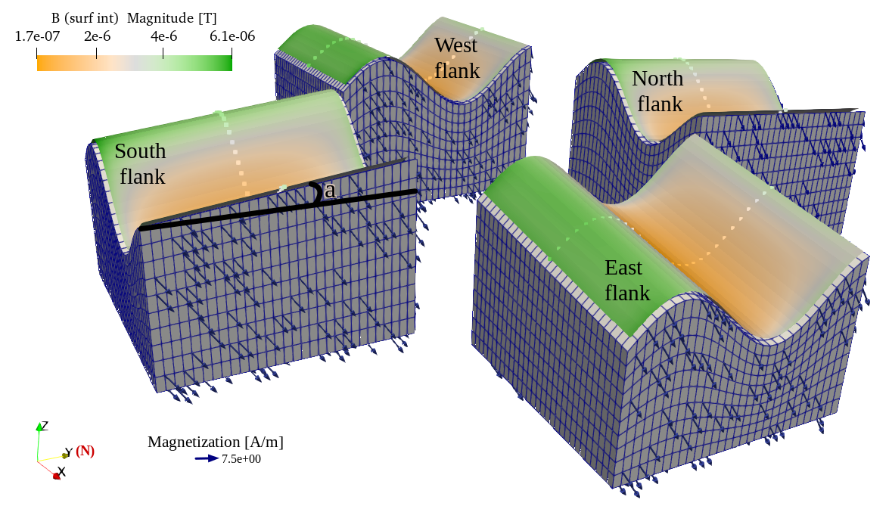
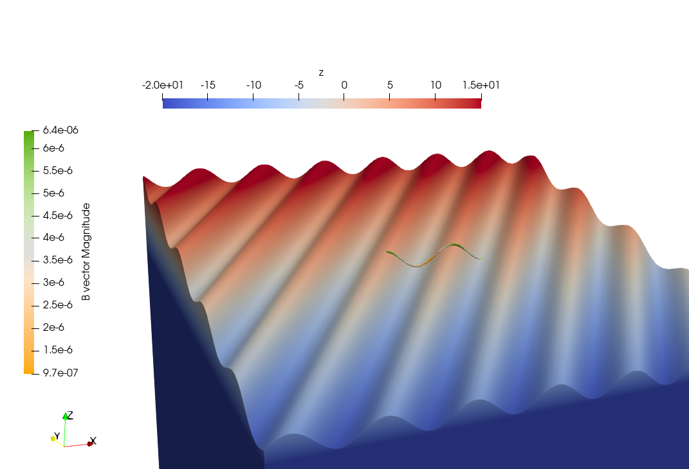

.. _flanksim:

Synthetic topopography: flank simulations
=========================================

.. _fflanksim:

   Flank simulation on the Etna. (:math:`\mathbf{M}`) = :math:`7.5 [A/m]` (arrows). The slope (:math:`a` in :numref:`fflanksim`) is  :math:`6 ^{\circ}`. The computations of the magnetic field (:math:`\mathbf{B}`) above the flanks are done at point composing either a path or a plane above each flank. The flanks are labeled as displayed. Please note, for visual purposes, the extent and resolution of the displayed mesh do not adhere the optimized testing setup outlined before in the :ref:`parameter section <parameters>`.

| Given that the majority of lava flows are located on the flanks of volcanoes, simulating volcanic flanks is a relevant starting point for our initial generic modeling setup. It is expected that each flank produces different anomalies due to the variation in the dip direction of the surfaces, while the magnetization direction remains consistent.

.. _bdeg:

   Direction of wavy pattern on south flank is :math:`-31 ^{\circ}`, an example of a variation possible while doing flank simulations tests.

Model setup
-----------
| To explore the impact of these variances, a specialized model configuration has been devised to conduct flank simulations, as demonstrated in :numref:`fflanksim`. In this model, the undulating nature of flank topography is replicated using a sine function that models the ridges and troughs typical of volcanic landscapes. This wavy pattern, described by :func:`support.topography`, traverses perpendicular across the inclined surface.

| The simulation framework permits the manipulation of several parameters to investigate their effects on the magnetic field above the flank simulations. Key variables include the slope of the surface, the amplitude and wavelength of the sine function, and the orientation of the sine wave's propagation relative to the Cartesian axes (this angle is variable and contingent on the particular flank being simulated), an example is given in :numref:`bdeg`.

| For alignment with the :doc:`etna`, the parameters used to define the synthetic topography aim to replicate the ridges and gullies of Mount Etna. Based on the analysis of aerial imagery and DEMs of the area around the field sites of :cite:`Meyer24`, an amplitude of :math:`4m`, a wavelength of :math:`25m`, and an angle of inclination for the slope of :math:`6 ^{\circ}` were found to be representative values.

| The uniform remanent magnetization intensity chosen is :math:`7.5` :math:`A/m` with a inclination of :math:`57 ^{\circ}` and a declination of :math:`0 ^{\circ}`. For the rationale of chosen magnetization, see :ref:`DEM section <artdem>`. Additionally, the Earth's magnetic field in the flank simulations has been calibrated to the average of the IGRF values specific to Etna's flanks :cite:`IGRF`, with the respective components being :math:`IGRF_E = 1561.2 nT`, and :math:`IGRF_N = 26850.3 nT`, and :math:`IGRF_D = 36305.7 nT`.

| Flank simulations are done using a domain of :math:`250\times250\times20m` discretized with :math:`375\times375\times10` elements, with a level plane as the bottom boundary and removal of the zero topography results, a decision which is justified in the :ref:`parameter section <parameters>`. Computation are conducted along a path comprising 47 points positioned :math:`1m` and :math:`1.8m` above the domain's center, with observation points distributed at approximately one meter intervals. To ensure consistency in the simulation environment, this sinuous topography has been uniformly applied beneath the path at the center of each flank.

| For results and discussion of these results, see original publication. 

Reproduce
---------
| A dedicated module, ``flanksim.py``, has been integrated into the codebase for executing full simulations across all flanks. To activate this module, uncomment the corresponding line in the ``MTE.py`` file (see steps below). Additionally, the ``script_flanksim.sh`` shell script has been crafted to automate the execution and organization of output data, directing it into the correct subdirectory [#]_ for each flank simulation.

.. collapse:: Steps to reproduce the results and figures

   Please note basic setup in :ref:`installation`

   1. In ``MTE.py``, modify benchmark attribution to ``5``, and make sure the right setup is used & MTE.py imports from :func:`flanksim.py`:

      .. code-block:: python
         :caption: **/main/MTE.py**
         :linenos:
         :lineno-start: 49
         :emphasize-lines: 1,9,12,22

         benchmark = '5'

         compute_vi = False  # This includes the volume integral computation by Gaussian quadrature, see
                             # documentation, possible for all setups apart from DEM (-1).
         if compute_vi:
            nqdim = 6  # Number of quadrature points, see documentation.

         ## ONLY BENCHMARK = -1 (DEM) & BENCHMARK = 5 (FLANKSIM) ##
         flat_bottom = True  # If True, a flat bottom is generated at the lower surface of the domain.
                             # Please see documentation, as the specific setup of this feature is different
                             # for the flank simulations and the DEM test.
         remove_zerotopo = True  # Setup run 2 times: 1st time, zero topography setup: xy coordinates
                                 # of the observation points the same, but zerotopo domain and obs path
                                 # shifted to average height DEM. 2nd time, "regular" run with topography.
                                 # final results are 2nd run - 1 st run values. Run time can be improved,
                                 # if 1st run was done with less el (and cuboid function), yet to be done.

         ## ONLY BENCHMARK = 5 (FLANKSIM) ##
         subbench = 'south'  # 'south', 'east', 'north', 'west', input parameters imported from flanksim
                    # have priority over any choice made here. So if this is used, make sure to
                    # comment out the import line in section below!  
         global_run = False

      .. code-block:: python
         :caption: **/main/MTE.py**
         :linenos:
         :lineno-start: 231
         :emphasize-lines: 8,9,32

         if benchmark == '5':
            # General settings
            do_spiral_measurements = False
            do_path_measurements = False
            compute_analytical = False

            # Domain settings
            Lx, Ly, Lz = 250, 250, 20
            nelx, nely, nelz = int(Lx * 1.5), int(Ly * 1.5), 10
            Mx0, My0, Mz0 = 0, 4.085, -6.29
            #Lx, Ly, Lz = 50, 50, 120
            #nelx, nely, nelz = 10, 10, 10

            # Synthetic topography settings
            wavelength = 25
            A = 4
            af = 6

            # Line measurement settings
            do_line_measurements = True
            line_nmeas = 47
            xstart, xend = 0.23 + ((Lx - 50) / 2), 49.19 + ((Ly - 50) / 2)
            ystart, yend = Ly / 2 - 0.221, Ly / 2 - 0.221
            zstart, zend = 1, 1  # 1m above surface.

            # Plane measurement settings
            do_plane_measurements = False
            plane_nnx, plane_nny = 30, 30
            plane_x0, plane_y0, plane_z0 = -Lx / 2, -Ly / 2, 1
            plane_Lx, plane_Ly = 2 * Lx, 2 * Ly

            from flanksim import *

   2. Run flank simulation:

      .. code-block::
         :caption: **/main/** (runtime: ~4 hr)

         ./script_flanksim.sh

   3. Modify for 1.8m height run:

      .. code-block:: python
         :caption: **/main/MTE.py**
         :linenos:
         :lineno-start: 249
         :emphasize-lines: 6

         # Line measurement settings
         do_line_measurements = True
         line_nmeas = 47
         xstart, xend = 0.23 + ((Lx - 50) / 2), 49.19 + ((Ly - 50) / 2)
         ystart, yend = Ly / 2 - 0.221, Ly / 2 - 0.221
         zstart, zend = 1.8, 1.8  # 1m above surface.

      .. code-block:: bash
         :caption: **/main/script_flanksim.sh**
         :linenos:
         :lineno-start: 1
         :emphasize-lines: 4

         #! /bin/bash

         # Define the name of the folder here
         folder_name="250_250_20_fb_180"

   4. Run flank simulation:

      .. code-block::
         :caption: **/main/** (runtime: ~4 hr)

         ./script_flanksim.sh

   5. Go to directory and plot:

      .. code-block::
         :caption: **/main/**

         cd flanksim_parameters

      .. code-block::
         :caption: **/main/flanksim_parameters/**

         gnuplot plot_script_flanksim_zt.p

Global flank simulations
------------------------

| In the original study, we also included an estimation of the global bias due to MTE in volcanic paleomagnetic data. During these simulations, we essentially moved the flank simulations of Mt. Etna to various latitudes and computed the anomalies on every flank. 
| The longitude was kept consistent with Mt. Etna (14.955:math:`^\circ`E). The magnetization was also kept consistent (:math:`7.5` :math:`A/m`), but the inclination of the magnetization was changed as function of latitude, assuming a geocentric axial dipole (GAD). The computation of individual magnetization components is performed by :func:`support.compute_magnetization`. Ideally, the magnetization would also decrease closer to the equator, as the Earth's magnetic field that induces this magnetization also becomes weaker. However, for simplicity, this was not taken into account. :func:`support.get_IGRF` determines the IGRF-13 reference values at every simulation site. Since we used a GAD to determine the inclination, and did not scale magnetization to the IGRF, this may induce large anomalies in declination near the poles, where the true magnetic pole and rotation pole are offset. In future studies, this could be addressed by allowing the IGRF values to also determine the magnetization assigned to the simulations. 

Reproduce
---------
| The ``script_flanksim_global.sh`` shell script has been crafted to automate the execution and organization of output data, directing it into the correct subdirectory for each global flank simulation at various latitudes. If possible, it is recommended to run these simulations in parallel (i.e. multiple latitudes at the same time), since the sequential computation time is extensive. 

.. collapse:: Steps to reproduce the results and figures

   Please note basic setup in :ref:`installation`

   1. In ``MTE.py``, modify benchmark attribution to ``5``, and make sure the right setup is used & MTE.py imports from :func:`flanksim.py`:

      .. code-block:: python
         :caption: **/main/MTE.py**
         :linenos:
         :lineno-start: 49
         :emphasize-lines: 1,9,12,22

         benchmark = '5'

         compute_vi = False  # This includes the volume integral computation by Gaussian quadrature, see
                              # documentation, possible for all setups apart from DEM (-1).
         if compute_vi:
            nqdim = 6  # Number of quadrature points, see documentation.

         ## ONLY BENCHMARK = -1 (DEM) & BENCHMARK = 5 (FLANKSIM) ##
         flat_bottom = True  # If True, a flat bottom is generated at the lower surface of the domain.
                             # Please see documentation, as the specific setup of this feature is different
                             # for the flank simulations and the DEM test.
         remove_zerotopo = True  # Setup run 2 times: 1st time, zero topography setup: xy coordinates
                                 # of the observation points the same, but zerotopo domain and obs path
                                 # shifted to average height DEM. 2nd time, "regular" run with topography.
                                 # final results are 2nd run - 1 st run values. Run time can be improved,
                                 # if 1st run was done with less el (and cuboid function), yet to be done.

         ## ONLY BENCHMARK = 5 (FLANKSIM) ##
         subbench = 'south'  # 'south', 'east', 'north', 'west', input parameters imported from flanksim
                    # have priority over any choice made here. So if this is used, make sure to
                    # comment out the import line in section below!         
         global_run = True

      .. code-block:: python
         :caption: **/main/MTE.py**
         :linenos:
         :lineno-start: 231
         :emphasize-lines: 8,9,24,32

         if benchmark == '5':
            # General settings ## DO NOT CHANGE ##
            do_spiral_measurements = False
            do_path_measurements = False
            compute_analytical = False

            # Domain settings
            Lx, Ly, Lz = 250, 250, 20
            nelx, nely, nelz = int(Lx * 1.5), int(Ly * 1.5), 10
            Mx0, My0, Mz0 = 0, 4.085, -6.29 # model configuration
            #Lx, Ly, Lz = 50, 50, 120
            #nelx, nely, nelz = 10, 10, 10

            # Synthetic topography settings
            wavelength = 25
            A = 4
            af = 6

            # Line measurement settings
            do_line_measurements = True
            line_nmeas = 47
            xstart, xend = 0.23 + ((Lx - 50) / 2), 49.19 + ((Ly - 50) / 2)
            ystart, yend = Ly / 2 - 0.221, Ly / 2 - 0.221
            zstart, zend = 1, 1  # 1m above surface.

            # Plane measurement settings
            do_plane_measurements = False
            plane_nnx, plane_nny = 30, 30
            plane_x0, plane_y0, plane_z0 = -Lx / 2, -Ly / 2, 1
            plane_Lx, plane_Ly = 2 * Lx, 2 * Ly

            from flanksim import *

   2. Run global flank simulation:

      .. code-block::
         :caption: **/main/** (runtime: ~52 hr)

         ./script_flanksim_global.sh

   3. Go to directory and plot:

      .. code-block::
         :caption: **/main/**

         cd global_flanksim

      .. code-block::
         :caption: **/main/global_flanksim/**

         python3 global_stats_and_plot.py

.. rubric:: Footnotes

.. [#] Following any changes made to the main code, it's essential to update this script accordingly to guarantee that output files are directed to the appropriate or newly specified directory.
