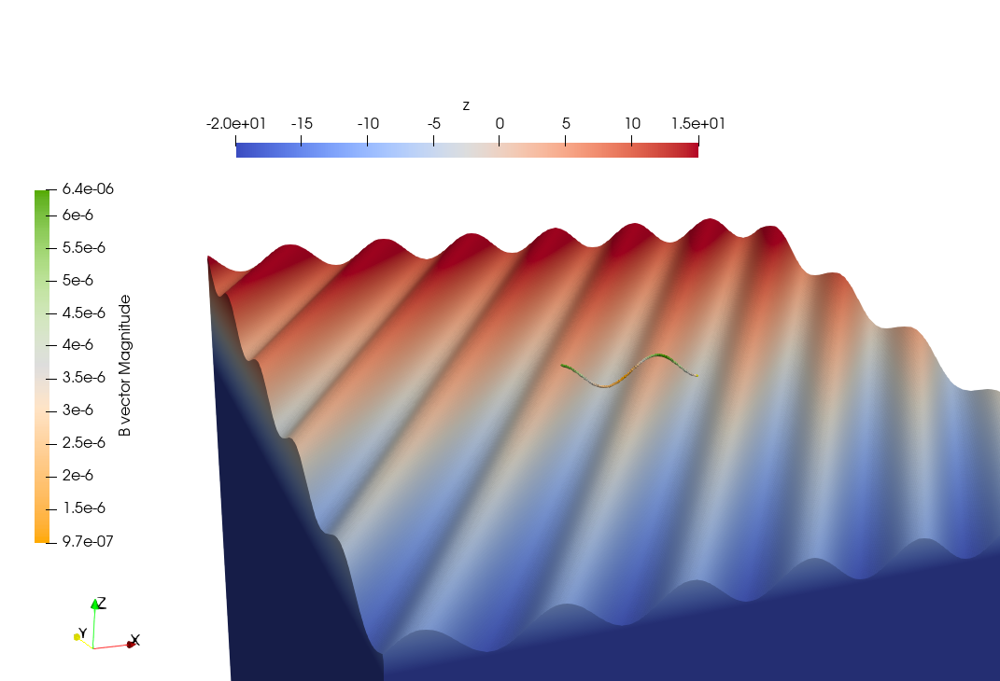
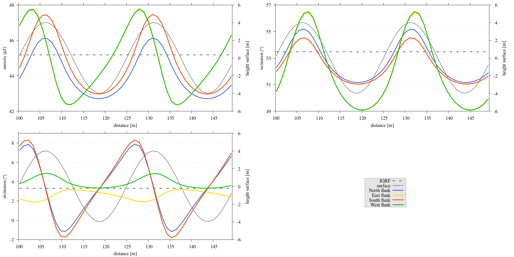
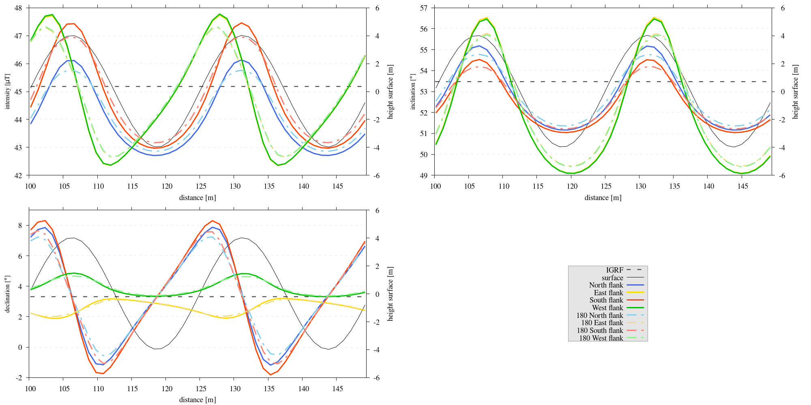
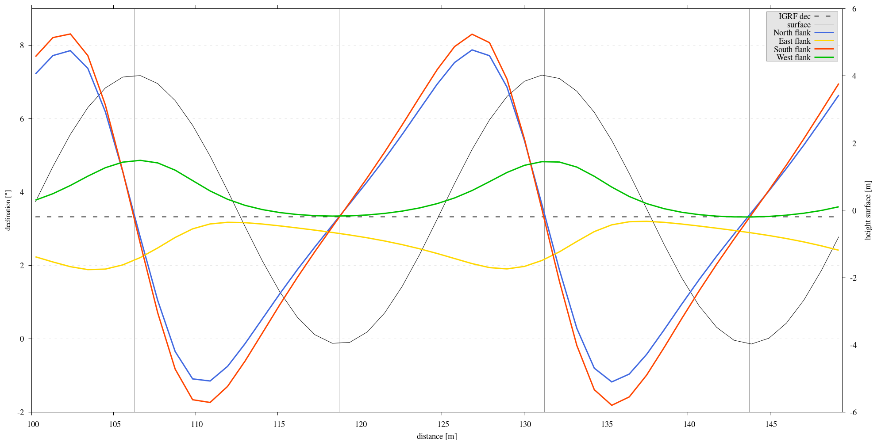

.. _flanksim:

Synthetic topopography: flank simulations
=========================================

.. _fflanksim:

   Flank simulation on the Etna. (:math:`\mathbf{M}`) = :math:`7.5 [A/m]` (arrows). The slope (:math:`a` in :numref:`fflanksim`) is  :math:`6 ^{\circ}`. The computations of the magnetic field (:math:`\mathbf{B}`) above the flanks are done at point composing either a path or a plane above each flank. The flanks are labeled as displayed. Please note, for visual purposes, the extent and resolution of the displayed mesh do not adhere the optimized testing setup outlined before in the :ref:`parameter section <parameters>`.

| Given that the majority of lava flows are located on the flanks of volcanoes, simulating volcanic flanks is a relevant starting point for our initial generic modeling setup. It is expected that each flank produces different anomalies due to the variation in the dip direction of the surfaces, while the magnetization direction remains consistent.

.. _bdeg:

   Direction of wavy pattern on south flank is :math:`-31 ^{\circ}`, an example of a variation possible while doing flank simulations tests.

Model setup
-----------
| To explore the impact of these variances, a specialized model configuration was devised to conduct flank simulations, as demonstrated in :numref:`fflanksim`. In this model, the undulating nature of flank topography is replicated using a sine function that models the ridges and troughs typical of volcanic landscapes. This wavy pattern, described by :func:`support.topography`, traverses perpendicular across the inclined surface.

| The simulation framework permits the manipulation of several parameters to investigate their effects on the magnetic field above the flank simulations. Key variables include the slope of the surface, the amplitude and wavelength of the sine function, and the orientation of the sine wave's propagation relative to the Cartesian axes (this angle is variable and contingent on the particular flank being simulated), an example is given in :numref:`bdeg`.

| For alignment with the :doc:`etna`, the parameters used to define the synthetic topography aim to replicate the ridges and gullies of Mount Etna. Based on the analysis of aerial imagery and DEMs of the area around the field sites of :cite:`Meyer23`, an amplitude of :math:`4m`, a wavelength of :math:`25m`, and an angle of inclination for the slope of :math:`6 ^{\circ}` were found to be representative values.

| The uniform remanent magnetization intensity chosen was :math:`7.5` :math:`A/m` with a inclination of :math:`57 ^{\circ}` and a declination of :math:`0 ^{\circ}`. For the rationale of chosen magnetization, see :ref:`DEM section <artdem>`. Additionally, the Earth's magnetic field in the flank simulations was calibrated to the average of the IGRF values specific to Etna's flanks :cite:`IGRF`, with the respective components being :math:`IGRF_E = 1561.2 nT`, and :math:`IGRF_N = 26850.3 nT`, and :math:`IGRF_D = 36305.7 nT`.

| Flank simulations were done using a domain of :math:`250\times250\times20m` discretized with :math:`375\times375\times10` elements, with a level plane as the bottom boundary and removal of the zero topography results, a decision which is justified in the :ref:`parameter section <parameters>`. Computation were conducted along a path comprising 47 points positioned :math:`1m` and :math:`1.8m` above the domain's center, with observation points distributed at approximately one meter intervals. To ensure consistency in the simulation environment, this sinuous topography was uniformly applied beneath the path at the center of each flank.

Results
-------

.. _flanksim_plot:

   Three subplots depicting the intensity [:math:`\mu T`], inclination [:math:`^{\circ}`] and declination [:math:`^{\circ}`] of the computed magnetic field **B** superimposed on the IGRF derived from flank simulations.

| In Figure :numref:`flanksim_plot` the results of the flank simulations done for Mt. Etna are presented, where each flank reveals a unique pattern. Despite these differences, there is a notable similarity in the trends of flanks that are geographically opposite, such as the north and south flanks. The north flank, characterized by a slope that descends in the same direction as the magnetization inclination, exhibits significantly larger anomalies in comparison to the south flank, where the slope direction differs. Conversely, the differences between the east and west flanks are minimal.

| Notably, for the north and south flanks, there exists an inverse relationship between inclination and intensity deviations, a phenomenon absent in east-west comparisons. However, for the east and west flanks peaks appear misaligned, either "lagged" in inclination or "premature" in intensity relative to their north-south counterparts and the topography. For the east and west flanks, declination deviations are not only contrasting in sign, which seems intuitively accurate given the major magnetized body alignment due to the slope, but also exhibit a temporal shift.

| Another striking observation lies in the differential shapes of intensity and inclination deviations for both the positive and negative domains across all flanks. Regions with positive deviations generally span a more confined area, presenting as narrower. In contrast, negative deviations extend over a broader expanse, stretching further from the topographic landmarks.

| The maximum intensity anomaly observed relative to Mount Etna's IGRF intensity, across all simulated topographies of the volcano's flanks, is approximately :math:`+2.6 \mu T` for positive anomalies and :math:`-2.83 \mu T` for negative anomalies. The greatest inclination anomaly recorded reaches about :math:`+3.07 ^{\circ}` in the positive spectrum and :math:`-4.39 ^{\circ}` in the negative. Similarly, the peak declination anomaly is :math:`+4.98 ^{\circ}` for positive deviations and :math:`-5.14 ^{\circ}` for negative deviations.

.. _flanksim_plot_180:

   Three subplots depicting the intensity [:math:`\mu T`], inclination [:math:`^{\circ}`] and declination [:math:`^{\circ}`] of the computed magnetic field **B** superimposed on the IGRF derived from flank simulations, with the observation path at a height of :math:`1.8m` above the topography.

| At first glance, the curves computed at a higher altitude, see :numref:`flanksim_plot_180`, seem logically consistent. The deviations at this higher elevation present with reduced magnitudes when compared to those derived at closer proximity to the topography. This attenuation of anomaly strength with altitude aligns with magnetic principles, where field variations diminish in intensity as the distance from their source increases :cite:`REITZ`.
| Notably, a distinct pattern emerges where, at higher altitudes, the minimum and maximum of the curves do not consistently align with those observed at lower elevations. This discrepancy is most apparent for measurements on the east and west flanks across all parameters, and for the on the north and south flanks only in declination. It is also observed that peaks and troughs that appear "lagged" or "premature" at a lower level are accentuated in their displacement at higher altitude. Furthermore, the negative anomalies display greater persistence at elevated altitudes, exhibiting a less pronounced reduction in magnitude with height than the positive anomalies.
| These phenomena suggest a complex interplay between topographic influence and the geomagnetic field.

.. _flanksim_comp:
.. figure:: figures/flanksim_comp_mp_zt.png
   :scale: 50%

   Three subplots depicting the components of the computed magnetic field **B** [:math:`\mu T`] superimposed on the IGRF derived from flank simulations.

| Diving deeper into individual magnetic field components reveals more nuances. For the :math:`B_x` and  :math:`B_y` components, :numref:`flanksim_comp` indicates that the largest deviations are situated on flanks where topographic ridges and gullies align parallel to the component.

Discussion
----------
.. _flanksim_dec_lines:

   Declination of the flank simulation, the vertical grey lines signify points where most of the declination deflection should cancel out.

| To elucidate the trends observed in magnetic anomalies, let us attempt to correlate them with topographic features. We have opted to focus on the declination data because they are the most straightforward to interpret.

| Consider a simplification of the flank simulation, where a flank is represented solely by its slope, omitting the sine function that represents ridges and gullies. It is still assumed TRM of the lava flow aligns with the current magnetic field. In a theoretical 2D scenario, there would be no declination deflection on terrain with an east-west (E-W) orientation, while the maximum deflection would occur on terrain with a north-south (N-S) orientation. This would result in a negative declination deflection on the eastern flank of a volcano and a positive deflection on the western flank :cite:`Baag95`.

| Reintroducing the sine function into the simulation setup (emulating ridges and gullies running perpendicular to the slope) it becomes apparent that in a 2D framework, the wave's influence would be null on the eastern and western flanks, and any declination changes would stem only from the slope (negative on the east and positive on the west). Conversely, on the northern and southern sides, the slope’s impact would be negligible, leaving the sine function as the primary cause for any declination deflection. However, the model extends beyond two dimensions, preventing a complete dismissal of the sine function's effect on the eastern and western flanks or the slope's effect on the southern and northern flanks. This adjacent terrain would contribute to deviations. Nonetheless, given the magnetic field's inverse-square law relation to distance :cite:`BLAKELY`, combined with the relatively gentle slope and elongated wavelength, these effects anticipated to be less substantial.

| Examining the results from the declination deviation simulations on the flanks, as seen in :numref:`flanksim_dec_lines`, the expected trends manifest: a negative deflection on the eastern flank with minimal sine influence, and a positive deflection on the western flank with similarly minor sine impact. For the southern and northern flanks, the sine function emerges as the primary declination variance factor.
| A crest of a sine wave, akin to a ridge, would display an eastern and western side, each inducing a respective negative and positive deflection. When positioned at the peak of a ridge or in the trough between two ridges, the scenario approximates a theoretical 2D case, shown by the vertical lines in :numref:`flanksim_dec_lines`. Here, the 'balancing' of the magnetic effects from equal volumes on each side would theoretically nullify the declination deviation from the IGRF.
| If one were to traverse eastward from a ridge's summit on the southern flank, an initial dominant negative (eastern) deflection would be encountered, gradually shifting to a balanced state as the influence of the positive (western) flank of the next ridge starts to predominate. This transition continues until reaching a point where the positive effect becomes more influential, illustrating a wave-like pattern in declination deflection across the ridges and troughs.

| The influence of actual 3D topography introduces additional nuances to these trends, which must be accounted for when interpreting the declination patterns observed in :numref:`flanksim_dec_lines`. It should be noted that the inclination on the east and west flanks exhibits a pattern similar to that of the declination, as detailed in :numref:`flanksim_plot`. However, visualizing the direction of inclination deviation is less straightforward. For inclination deviations to be neutralized, there must be an equilibrium of magnetized material in the vertical dimension.

| This interpretative process describes the 'physical' relationships between anomalies and their topographic influences, enhancing our understanding of the observed trends. Moreover, it serves as an intrinsic verification of the flank simulation results, reinforcing their validity.

Reproduce
---------
| A dedicated module, ``flanksim.py``, has been integrated into the codebase for executing full simulations across all flanks. To activate this module, uncomment the corresponding line in the ``MTE.py`` file (see steps below). Additionally, the ``script_flanksim.sh`` shell script has been crafted to automate the execution and organization of output data, directing it into the correct subdirectory [#]_ for each flank simulation.

.. collapse:: Steps to reproduce the results and figures

   Please note basic setup in :ref:`installation`

   1. In ``MTE.py``, modify benchmark attribution to ``5``, and make sure the right setup is used & MTE.py imports from :func:`flanksim.py`:

      .. code-block:: python
         :caption: **/main/MTE.py**
         :linenos:
         :lineno-start: 45
         :emphasize-lines: 1,8,11

         benchmark = '5'

         compute_vi = False  # Possible for all setups apart from DEM (-1).
         if compute_vi:
            nqdim = 6  # Number of quadrature points, see documentation.

         ## ONLY BENCHMARK = -1 (DEM) & BENCHMARK = 5 (FLANKSIM) ##
         flat_bottom = True  # If True, a flat bottom is generated at the lower surface of the domain.
                             # Please see documentation, as the specific setup of this feature is different
                             # for the flank simulations and the DEM test.
         remove_zerotopo = True  # Setup run 2 times: 1st time, zero topography setup: xy coordinates
                                 # of the observation points the same, but zerotopo domain and obs path
                                 # shifted to average height DEM. 2nd time, "regular" run with topography.
                                 # final results are 2nd run - 1 st run values. Run time can be improved,
                                 # if 1st run was done with less el (and cuboid function), yet to be done.

         ## ONLY BENCHMARK = 5 (FLANKSIM) ##
         subbench = 'south'  # 'south', 'east', 'north', 'west', shifts topo features, and obs paths.

      .. code-block:: python
         :caption: **/main/MTE.py**
         :linenos:
         :lineno-start: 217
         :emphasize-lines: 8,9,32

         if benchmark == '5':
            # General settings
            do_spiral_measurements = False
            do_path_measurements = False
            compute_analytical = False

            # Domain settings
            Lx, Ly, Lz = 250, 250, 20
            nelx, nely, nelz = int(Lx * 1.5), int(Ly * 1.5), 10
            Mx0, My0, Mz0 = 0, 4.085, -6.29
            #Lx, Ly, Lz = 50, 50, 120
            #nelx, nely, nelz = 10, 10, 10

            # Synthetic topography settings
            wavelength = 25
            A = 4
            af = 6

            # Line measurement settings
            do_line_measurements = True
            line_nmeas = 47
            xstart, xend = 0.23 + ((Lx - 50) / 2), 49.19 + ((Ly - 50) / 2)
            ystart, yend = Ly / 2 - 0.221, Ly / 2 - 0.221
            zstart, zend = 1, 1  # 1m above surface.

            # Plane measurement settings
            do_plane_measurements = False
            plane_nnx, plane_nny = 30, 30
            plane_x0, plane_y0, plane_z0 = -Lx / 2, -Ly / 2, 1
            plane_Lx, plane_Ly = 2 * Lx, 2 * Ly

            from flanksim import *

   2. Run flank simulation:

      .. code-block::
         :caption: **/main/** (runtime: ~4 hr)

         ./script_flanksim.sh

   3. Modify for 1.8m height run:

      .. code-block:: python
         :caption: **/main/MTE.py**
         :linenos:
         :lineno-start: 235
         :emphasize-lines: 6

         # Line measurement settings
         do_line_measurements = True
         line_nmeas = 47
         xstart, xend = 0.23 + ((Lx - 50) / 2), 49.19 + ((Ly - 50) / 2)
         ystart, yend = Ly / 2 - 0.221, Ly / 2 - 0.221
         zstart, zend = 1.8, 1.8  # 1m above surface.

      .. code-block:: bash
         :caption: **/main/script_flanksim.sh**
         :linenos:
         :lineno-start: 1
         :emphasize-lines: 4

         #! /bin/bash

         # Define the name of the folder here
         folder_name="250_250_20_fb_180"

   4. Run flank simulation:

      .. code-block::
         :caption: **/main/** (runtime: ~4 hr)

         ./script_flanksim.sh

   5. Go to directory and plot:

      .. code-block::
         :caption: **/main/**

         cd flanksim_parameters

      .. code-block::
         :caption: **/main/flanksim_parameters/**

         gnuplot plot_script_flanksim_zt.p

.. rubric:: Footnotes

.. [#] Following any changes made to the main code, it's essential to update this script accordingly to guarantee that output files are directed to the appropriate or newly specified directory.
