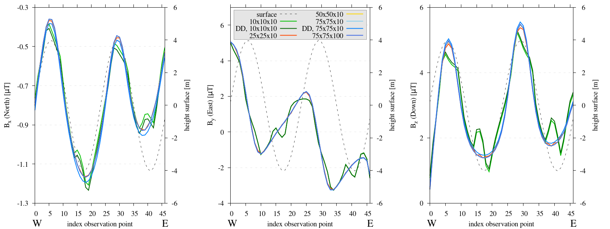
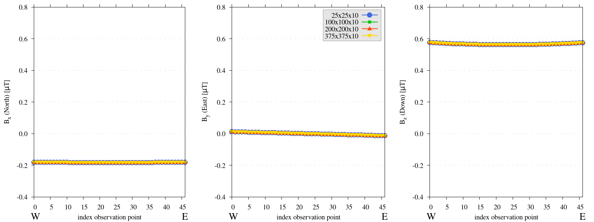
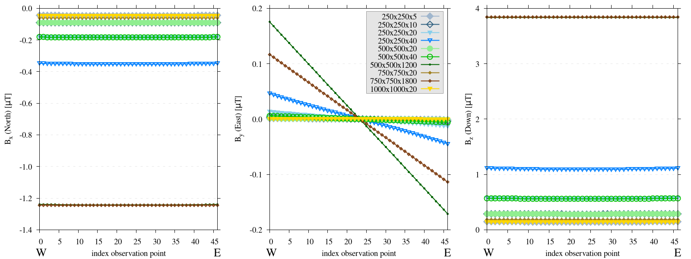
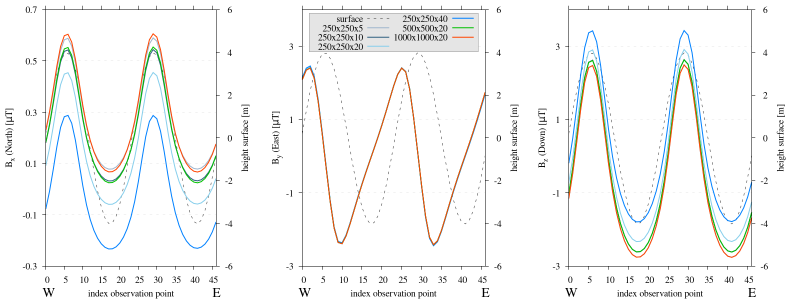
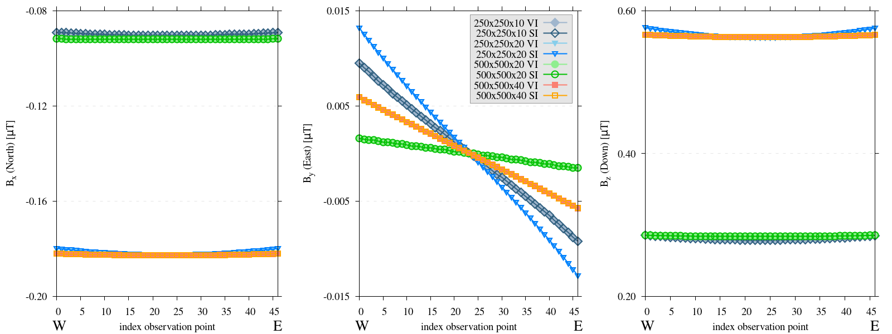
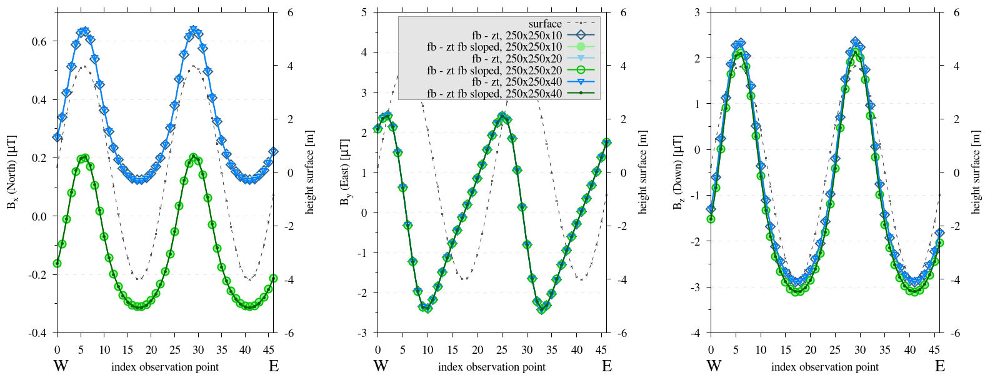
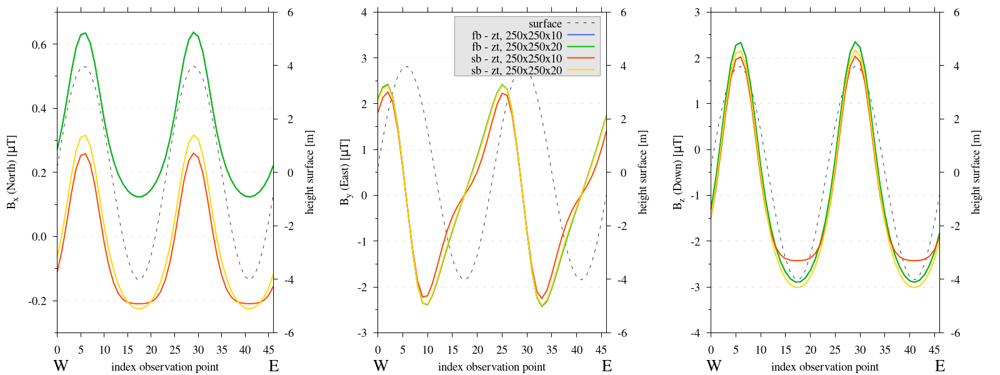

.. _parameters:

Parameters
==========

| Replicating shapes in a discretized domain comes with inherent limitations that can potentially lead to inaccuracies in the computed values.
| Following :ref:`benchmarking <benchmarks>`, the next key step in the model validation process of any geodynamic model is to investigate the effect of model setup parameters and initial (boundary) conditions on the final results.
| For precise and optimal anomaly computations over varied topographies, it is crucial to identify the minimum quantity of elements necessary for a accurate representation of volcanic terrain, and determining the minimal domain size to mitigate the impact of the edge effect.
| This edge effect, which occurs at the boundaries of the simulated domain, emerges from the cutoff at the outer boundary of the domain, generating its own unique magnetic anomaly. Our goal is to minimize the edge effect while also managing the absolute dimensions and resolution of the domain to ensure computational efficiency and reduce the time and effort required. Furthermore, the effect of the topography of the bottom boundary of the domain will be investigated.

| These parameters were determined using a domain with synthetic topography, the southern flank setup as outlined in the section :ref:`flank simulations <flanksim>`. Furthermore, the test were repeated for a zero topography setup (:ref:`benchmark 2a <B2>` ). The experiments were conducted along a path elevated 1 meter above the ground, representing the minimum elevation level for most field sites with observation points approximately 1 meter apart. Since the lowest elevation necessitates the largest resolutions and domain size, this setup will establish the threshold.

| It remains unclear whether the parameters defined through these tests can be directly correlated with the thresholds needed for calculations over topographies derived from a DEM. The real topographical variations on any volcano are anticipated to encompass larger and more intricate structures. Larger structures could potentially induce greater anomalies, which might extend farther, given that the magnitude of a magnetic anomaly generated by an entity is directly proportional to its physical properties (volume or weight) and is moderated by the distance, as noted in :cite:`GRIFFITHS`. Consequently, a reevaluation of these parameters will be essential in upcoming DEM examinations.

| Please note that the illustrations displayed here showcase only a fraction of the numerous tests executed to ascertain the necessary parameters and highlight significant discoveries. Furthermore, while these tests were specifically conducted for our case study on Mount Etna, most results are generally applicable. However, we still suggest exercising caution and recommend conducting repeated tests for future studies to ensure validity and accuracy in different contexts.

Resolution
----------
| The resolution experiments will initiate at a high resolution, gradually reducing the number of elements. We anticipate identifying a threshold where any further reduction would lead to incorrect values. Understanding the manifestation of these errors is instrumental in identifying them in other intricate setups, particularly when using the Digital Elevation Model (DEM).

Model setup
^^^^^^^^^^^
| All these tests maintained a consistent domain size of :math:`50\times50\times120m` for the synthetic topography setup. The expanded depth range was selected to minimize the interference from the bottom surface. To analyze this effect, some tests were conducted with a doubled domain depth of 240 meters, marked as "DD" configurations.
| Variations in the number of elements were explored in both the x and y directions, fluctuating within a range of 10 to 75 elements.

| It is expected that adjusting the number of elements in the depth dimension would not impact the outcome. As, theoretically, all internal forces should negate each other, meaning that increasing this quantity would only extend the computation time.
| The tests were repeated for the setup of a zero topography, however, the effect of resolution variations are expected to be redundant, as subdividing a flat surface into multiple surfaces yields no benefit, but rather will only increase computation time.
| Nonetheless, these hypotheses were examined through experiments.

Results
^^^^^^^
.. _restestcomp:

   Three subplots depicting the components of the computed magnetic field **B** for the resolution experiments. The initial domain size is :math:`50\times50\times120m`, ``DD`` relates to extended domain depth to 240 meter, the numbers in the key relate to the amount of elements in each direction. Please note, the y-axis varies between each subplot.

.. _restestzt:

   Three subplots depicting the components of the computed magnetic field **B** for the resolution experiments. The initial domain size is :math:`250\times250\times20m`, the numbers in the key relate to the amount of elements in each direction.

| :numref:`restestcomp` presents the findings of the resolution tests for the synthetic topography. As predicted by theory, the amount of elements in the z-direction does not affect the outcomes. For all subsequent tests, **the amount of elements in the z-direction will be maintained at 10**.
| In the xy-directions, allocating half an element per meter proves to be marginally adequate, with only minor deviations noted for the synthetic topography results. When the resolution is reduced further, a distinctive pattern emerges; the computed values first exhibit instability at the highest slope, indicated by abrupt fluctuations in what was previously a smooth progression. Future tests will aim to maintain a standard of **1.5 elements per meter in the spatial direction**, wherever feasible, while staying observant of these distinctive errors.
| Furthermore, :numref:`restestcomp` indicates that the depth extent of the domain does not alter the observed trends stemming from insufficient resolution, but instead generates a shift in the magnetic field strength.
| It should be noted that a curved surface is particularly hard to accurately represent with hexahedron elements, hence, another arbitrary shape might require much less resolution to produce adequate results.

Reproduce [#]_
^^^^^^^^^^^^^^
.. collapse:: How to reproduce the results and figures for zero topography

   Please note basic setup in :ref:`installation`.

   1. In ``MTE.py``, modify benchmark attribution to ``2a``:

      .. code-block:: python
         :caption: **/main/MTE.py**
         :linenos:
         :lineno-start: 45
         :emphasize-lines: 1

         benchmark = '2a'

   2. Run first setup & move files

      .. code-block:: python
         :caption: **/main/MTE.py**
         :linenos:
         :lineno-start: 106
         :emphasize-lines: 9,10,11,14,20

         if benchmark == '2a':
            # General settings
            remove_zerotopo = False
            compute_analytical = False
            do_spiral_measurements = False
            do_path_measurements = False

            # Domain settings
            Lx, Ly, Lz = 250, 250, 20
            nelx, nely, nelz = 25, 25, 10
            Mx0, My0, Mz0 = 0, 4.085, -6.29  # Magnetization [A/m].

            # Plane measurement settings
            do_plane_measurements = False
            plane_nnx, plane_nny = 11, 11
            plane_x0, plane_y0, plane_z0 = -Lx / 2, -Ly / 2, 1
            plane_Lx, plane_Ly = 2 * Lx, 2 * Ly

            # Line measurement settings
            do_line_measurements = True
            line_nmeas = 47
            xstart, xend = 0.23 + ((Lx - 50) / 2), 49.19 + ((Ly - 50) / 2)
            ystart, yend = Ly / 2 - 0.221, Ly / 2 - 0.221
            zstart, zend = 1, 1  # 1m above surface.

      .. code-block::
         :caption: **/main/**     (runtime: ~7 s)

         python3 -u MTE.py | tee log.txt

      .. code-block::
         :caption: **/main/**

         mkdir -p zero_topo/restest/25_25_10 && mv log.txt *.vtu *.ascii $_

   3. Run extra setup & move files (3)

      +-----------------------------------+-----------------------------------+-----------------------------------+
      |.. code-block:: python             |.. code-block:: python             |.. code-block:: python             |
      |   :caption: **/main/MTE.py**      |   :caption: **/main/MTE.py**      |   :caption: **/main/MTE.py**      |
      |   :linenos:                       |   :linenos:                       |   :linenos:                       |
      |   :lineno-start: 113              |   :lineno-start: 113              |   :lineno-start: 113              |
      |   :emphasize-lines: 3             |   :emphasize-lines: 3             |   :emphasize-lines: 3             |
      |                                   |                                   |                                   |
      |   # Domain settings               |   # Domain settings               |   # Domain settings               |
      |   Lx, Ly, Lz = 250, 250, 20       |   Lx, Ly, Lz = 250, 250, 20       |   Lx, Ly, Lz = 250, 250, 20       |
      |   nelx, nely, nelz = 100, 100, 10 |   nelx, nely, nelz = 200, 200, 10 |   nelx, nely, nelz = 375, 375, 10 |
      |   Mx0, My0, Mz0 = 0, 4.085, -6.29 |   Mx0, My0, Mz0 = 0, 4.085, -6.29 |   Mx0, My0, Mz0 = 0, 4.085, -6.29 |
      +-----------------------------------+-----------------------------------+-----------------------------------+

      .. code-block::
         :caption: **/main/**     (runtime: ~1 min, ~4 min, ~16 min)

         python3 -u MTE.py | tee log.txt

      +------------------------------------------------------------------------+------------------------------------------------------------------------+------------------------------------------------------------------------+
      |.. code-block::                                                         |.. code-block::                                                         |.. code-block::                                                         |
      |   :caption: **/main/**                                                 |   :caption: **/main/**                                                 |   :caption: **/main/**                                                 |
      |                                                                        |                                                                        |                                                                        |
      |   mkdir -p zero_topo/restest/200_200_10 && mv log.txt *.vtu *.ascii $_ |   mkdir -p zero_topo/restest/375_375_10 && mv log.txt *.vtu *.ascii $_ |   mkdir -p zero_topo/restest/100_100_10 && mv log.txt *.vtu *.ascii $_ |
      +------------------------------------------------------------------------+------------------------------------------------------------------------+------------------------------------------------------------------------+

   4. Go to directory & plot to visualize

      .. code-block::
         :caption: **/main/**

         cd zero_topo/

      .. code-block::
         :caption: **/main/zero_topo/**

         gnuplot plot_script_restest.p

.. collapse:: How to reproduce the results and figures for synthetic topography

   Please note basic setup in :ref:`installation`.

   1. In ``MTE.py``, modify benchmark attribution to ``5``, and make sure the right setup is used:

      .. code-block:: python
         :caption: **/main/MTE.py**
         :linenos:
         :lineno-start: 45
         :emphasize-lines: 1,8,11,18

         benchmark = '5'

         compute_vi = False  # Possible for all setups apart from DEM (-1).
         if compute_vi:
            nqdim = 6  # Number of quadrature points, see documentation.

         ## ONLY BENCHMARK = -1 (DEM) & BENCHMARK = 5 (FLANKSIM) ##
         flat_bottom = True  # If True, a flat bottom is generated at the lower surface of the domain.
                             # Please see documentation, as the specific setup of this feature is different
                             # for the flank simulations and the DEM test.
         remove_zerotopo = False  # Setup run 2 times: 1st time, zero topography setup: xy coordinates
                                 # of the observation points the same, but zerotopo domain and obs path
                                 # shifted to average height DEM. 2nd time, "regular" run with topography.
                                 # final results are 2nd run - 1 st run values. Run time can be improved,
                                 # if 1st run was done with less el (and cuboid function), yet to be done.

         ## ONLY BENCHMARK = 5 (FLANKSIM) ##
         subbench = 'south'  # 'south', 'east', 'north', 'west', shifts topo features, and obs paths.

   2. Run first setup & move files

      .. code-block:: python
         :caption: **/main/MTE.py**
         :linenos:
         :lineno-start: 217
         :emphasize-lines: 8,9

         if benchmark == '5':
            # General settings
            do_spiral_measurements = False
            do_path_measurements = False
            compute_analytical = False

            # Domain settings
            Lx, Ly, Lz = 50, 50, 120
            nelx, nely, nelz = 10, 10, 10
            Mx0, My0, Mz0 = 0, 4.085, -6.29
            #Lx, Ly, Lz = 250, 250, 20
            #nelx, nely, nelz = int(Lx * 1.5), int(Ly * 1.5), 10

            # Synthetic topography settings
            wavelength = 25
            A = 4
            af = 6

            # Line measurement settings
            do_line_measurements = True
            line_nmeas = 47
            xstart, xend = 0.23 + ((Lx - 50) / 2), 49.19 + ((Ly - 50) / 2)
            ystart, yend = Ly / 2 - 0.221, Ly / 2 - 0.221
            zstart, zend = 1, 1  # 1m above surface.

            # Plane measurement settings
            do_plane_measurements = False
            plane_nnx, plane_nny = 30, 30
            plane_x0, plane_y0, plane_z0 = -Lx / 2, -Ly / 2, 1
            plane_Lx, plane_Ly = 2 * Lx, 2 * Ly

      .. code-block::
         :caption: **/main/**     (runtime: ~6 s)

         python3 -u MTE.py | tee log.txt

      .. code-block::
         :caption: **/main/**

         mkdir -p flanksim_parameters/south/restest/10_10_10 && mv log.txt *.vtu *.ascii $_

   3. Run extra setups & move files (6)

      +----------------------------------+----------------------------------+----------------------------------+----------------------------------+----------------------------------+----------------------------------+
      |.. code-block:: python            |.. code-block:: python            |.. code-block:: python            |.. code-block:: python            |.. code-block:: python            |.. code-block:: python            |
      |   :caption: **/main/MTE.py**     |   :caption: **/main/MTE.py**     |   :caption: **/main/MTE.py**     |   :caption: **/main/MTE.py**     |   :caption: **/main/MTE.py**     |   :caption: **/main/MTE.py**     |
      |   :linenos:                      |   :linenos:                      |   :linenos:                      |   :linenos:                      |   :linenos:                      |   :linenos:                      |
      |   :lineno-start: 223             |   :lineno-start: 223             |   :lineno-start: 223             |   :lineno-start: 223             |   :lineno-start: 223             |   :lineno-start: 223             |
      |   :emphasize-lines: 2,3          |   :emphasize-lines: 3            |   :emphasize-lines: 3            |   :emphasize-lines: 3            |   :emphasize-lines: 3            |   :emphasize-lines: 2,3          |
      |                                  |                                  |                                  |                                  |                                  |                                  |
      |   # Domain settings              |   # Domain settings              |   # Domain settings              |   # Domain settings              |   # Domain settings              |   # Domain settings              |
      |   Lx, Ly, Lz = 50, 50, 240       |   Lx, Ly, Lz = 50, 50, 120       |   Lx, Ly, Lz = 50, 50, 120       |   Lx, Ly, Lz = 50, 50, 120       |   Lx, Ly, Lz = 50, 50, 120       |   Lx, Ly, Lz = 50, 50, 240       |
      |   nelx, nely, nelz = 10, 10, 10  |   nelx, nely, nelz = 25, 25, 10  |   nelx, nely, nelz = 50, 50, 10  |   nelx, nely, nelz = 75, 75, 10  |   nelx, nely, nelz = 75, 75, 100 |   nelx, nely, nelz = 75, 75, 10  |
      |   Mx0, My0, Mz0 = 0, 4.085, -6.29|   Mx0, My0, Mz0 = 0, 4.085, -6.29|   Mx0, My0, Mz0 = 0, 4.085, -6.29|   Mx0, My0, Mz0 = 0, 4.085, -6.29|   Mx0, My0, Mz0 = 0, 4.085, -6.29|   Mx0, My0, Mz0 = 0, 4.085, -6.29|
      +----------------------------------+----------------------------------+----------------------------------+----------------------------------+----------------------------------+----------------------------------+

      .. code-block::
            :caption: **/main/**     (runtime: ~6 s, ~12 s, ~35 s, ~1 min, ~12 min, ~1 min)

            python3 -u MTE.py | tee log.txt

      +-----------------------------------------------------------------------------------------+-----------------------------------------------------------------------------------------+-----------------------------------------------------------------------------------------+-----------------------------------------------------------------------------------------+-----------------------------------------------------------------------------------------+-----------------------------------------------------------------------------------------+
      |.. code-block::                                                                          |.. code-block::                                                                          |.. code-block::                                                                          |.. code-block::                                                                          |.. code-block::                                                                          |.. code-block::                                                                          |
      |   :caption: **/main/**                                                                  |   :caption: **/main/**                                                                  |   :caption: **/main/**                                                                  |   :caption: **/main/**                                                                  |   :caption: **/main/**                                                                  |   :caption: **/main/**                                                                  |
      |                                                                                         |                                                                                         |                                                                                         |                                                                                         |                                                                                         |                                                                                         |
      |   mkdir -p flanksim_parameters/south/restest/10_10_10_DD && mv log.txt *.vtu *.ascii $_ |   mkdir -p flanksim_parameters/south/restest/25_25_10 && mv log.txt *.vtu *.ascii $_    |   mkdir -p flanksim_parameters/south/restest/50_50_10 && mv log.txt *.vtu *.ascii $_    |   mkdir -p flanksim_parameters/south/restest/75_75_10 && mv log.txt *.vtu *.ascii $_    |   mkdir -p flanksim_parameters/south/restest/75_75_100 && mv log.txt *.vtu *.ascii $_   |   mkdir -p flanksim_parameters/south/restest/75_75_10_DD && mv log.txt *.vtu *.ascii $_ |
      +-----------------------------------------------------------------------------------------+-----------------------------------------------------------------------------------------+-----------------------------------------------------------------------------------------+-----------------------------------------------------------------------------------------+-----------------------------------------------------------------------------------------+-----------------------------------------------------------------------------------------+

   4. Go to directory & plot to visualize

      .. code-block::
         :caption: **/main/**

         cd flanksim_parameters/

      .. code-block::
         :caption: **/main/flanksim_parameters/**

         gnuplot plot_script_restest.p

Size
----
| The size experiments will commence with a more compact domain and progressively expand it until the computed magnetic field at a point above the domain center stabilizes. The outcomes of changes in both the depth extent (z-direction) and spatial extent (xy-direction) will be analyzed.

| However, upon adapting domain depth, a complication arises: the exact nature of the magnetization in the underlying flows and deeper is unknown. Nonetheless, a uniform magnetization is continuously assumed. This assumption now expands deeper, eventually stretching to the full pile of volcanic flows of Mount Etna. To validate this assumption for our case study, we refer to the geomagnetic history of Mount Etna. The last reversal of Earth's magnetic field was dated around :math:`\sim795` ka ago :cite:`Singer19` and the first volcanic activity of Mount Etna was dated around :math:`\sim500` ka ago :cite:`Branca08`.
| Therefore, no reversals are anticipated within the accumulated layers, allowing us to extend the depth for experimental purposes without restrictions. Nonetheless, as the directly underlying flow is deemed to exert the most substantial influence, expanding the depth beyond a singular flow might be redundant. The thickness of the flows underneath the field sites mentioned in :cite:`Meyer23` fluctuate between 5-15 meter :cite:`Andro05, Mur00`.

Model setup
^^^^^^^^^^^
| Consequently, our tests explore domain depth ranging from 5 to 1800 meter, and a spatial extent from 50 to 1000 meters. The experiments will be done maintaining element resolution consistent with the previously established threshold at observation points along a path 1 meter above the surface.

Results and analysis
^^^^^^^^^^^^^^^^^^^^
.. _zt_low:

   Three subplots depicting the components of the computed magnetic field **B** for the size experiments. The numbers in the key relate to the length of each side of the domain (Lx_Ly_Lz). Please note, the y-axis varies between each subplot. For domains with spatial extent below 250x250 meter an edge effect is observed.

| In the investigations presented in :numref:`zt_low`, spatial extents below 250x250 meters prominently display edge effects. This is particularly evident for the :math:`B_y` component, which should ideally measure zero in the absence of topography or declination in magnetization. A uniform value across the observation path indicates the absence of edge effects, whereas variable values correlate with proximity to the domain edge.

.. _zt_high_dif:

   Three subplots depicting the components of the computed magnetic field **B** for the size experiments. The numbers in the key relate to the length of each side of the domain (Lx_Ly_Lz). Please note, the y-axis varies between each subplot.

| Our data reveals a nuanced relationship between the depth extent of the domain and the anomaly's intensity, as evident in both :numref:`zt_low` and :numref:`zt_high_dif`. Notably, for components :math:`B_x` and :math:`B_z`, magnitude increases with depth in a non-linear fashion. An initial increase in depth (10 to 600 meters) yields a significant change in component values, but a subsequent increase from 600 to 1200 meters sees marginal differences. This relationship also depends on spatial extent. For instance, 500x500x40 and 250x250x20 meter configurations produce identical :math:`B_x` and :math:`B_z` values. Observations unveil three distinct patterns, see :numref:`zt_high_dif`:

1. Identical values arise when both depth and spatial extent increase equivalently (e.g., :math:`250\times250\times20` and :math:`500\times500\times40` meters).
2. Increasing spatial extent alone reduces the magnitude proportionally (e.g., :math:`250\times250\times20` and :math:`500\times500\times20` meters).
3. Increasing depth alone enhances the magnitude proportionally (e.g., :math:`500\times500\times20` and :math:`500\times500\times40` meters).

| It is important to highlight that the inclination values are consistent across different setups, given that the modulating factor for both :math:`B_x` and :math:`B_z` remains identical.

.. _extest_comp_mp_high:

   Three subplots depicting the components of the computed magnetic field **B** for the depth experiments. Size and depth of the domain were varied, the resolution and relative location (centered in the domain) of the observation path were constant. Components were rotated to align with Pmag coordinate system. The numbers in the key relate to the length of each side of the domain (Lx_Ly_Lz). Please note, the y-axis varies between each subplot.

| :numref:`extest_comp_mp_high` display the outcomes from testing the domain size constraints on a simulation with topography, and displays similar trends with respect to required spatial extent and relationship between spatial dimension and magnitude of components. Extending the depth and spatial extent has a proportional impact on the magnitude of the :math:`B_z` and :math:`B_x` components.

Reproduce
"""""""""
.. collapse:: How to reproduce the results and figures for zero topography

   Please note basic setup in :ref:`installation`.

   1. In ``MTE.py``, modify benchmark attribution to ``2a``:

      .. code-block:: python
         :caption: **/main/MTE.py**
         :linenos:
         :lineno-start: 45
         :emphasize-lines: 1

         benchmark = '2a'

   2. Run first setup & move files

      .. code-block:: python
         :caption: **/main/MTE.py**
         :linenos:
         :lineno-start: 106
         :emphasize-lines: 9,10,11,14,20

         if benchmark == '2a':
            # General settings
            remove_zerotopo = False
            compute_analytical = False
            do_spiral_measurements = False
            do_path_measurements = False

            # Domain settings
            Lx, Ly, Lz = 50, 50, 20
            nelx, nely, nelz = int(Lx), int(Ly), 10
            Mx0, My0, Mz0 = 0, 4.085, -6.29  # Magnetization [A/m].

            # Plane measurement settings
            do_plane_measurements = False
            plane_nnx, plane_nny = 11, 11
            plane_x0, plane_y0, plane_z0 = -Lx / 2, -Ly / 2, 1
            plane_Lx, plane_Ly = 2 * Lx, 2 * Ly

            # Line measurement settings
            do_line_measurements = True
            line_nmeas = 47
            xstart, xend = 0.23 + ((Lx - 50) / 2), 49.19 + ((Ly - 50) / 2)
            ystart, yend = Ly / 2 - 0.221, Ly / 2 - 0.221
            zstart, zend = 1, 1  # 1m above surface.

      .. code-block::
         :caption: **/main/**     (runtime: ~20 s)

         python3 -u MTE.py | tee log.txt

      .. code-block::
         :caption: **/main/**

         mkdir -p zero_topo/50_50_20 && mv log.txt *.vtu *.ascii $_

   3. Run extra setups & move files (16)

      +-------------------------------------------+-------------------------------------------+-------------------------------------------+-------------------------------------------+-------------------------------------------+-------------------------------------------+-------------------------------------------+-------------------------------------------+-------------------------------------------+-------------------------------------------+-------------------------------------------+-------------------------------------------+-------------------------------------------+-------------------------------------------+-------------------------------------------+-------------------------------------------+
      |.. code-block:: python                     |.. code-block:: python                     |.. code-block:: python                     |.. code-block:: python                     |.. code-block:: python                     |.. code-block:: python                     |.. code-block:: python                     |.. code-block:: python                     |.. code-block:: python                     |.. code-block:: python                     |.. code-block:: python                     |.. code-block:: python                     |.. code-block:: python                     |.. code-block:: python                     |.. code-block:: python                     |.. code-block:: python                     |
      |   :caption: **/main/MTE.py**              |   :caption: **/main/MTE.py**              |   :caption: **/main/MTE.py**              |   :caption: **/main/MTE.py**              |   :caption: **/main/MTE.py**              |   :caption: **/main/MTE.py**              |   :caption: **/main/MTE.py**              |   :caption: **/main/MTE.py**              |   :caption: **/main/MTE.py**              |   :caption: **/main/MTE.py**              |   :caption: **/main/MTE.py**              |   :caption: **/main/MTE.py**              |   :caption: **/main/MTE.py**              |   :caption: **/main/MTE.py**              |   :caption: **/main/MTE.py**              |   :caption: **/main/MTE.py**              |
      |   :linenos:                               |   :linenos:                               |   :linenos:                               |   :linenos:                               |   :linenos:                               |   :linenos:                               |   :linenos:                               |   :linenos:                               |   :linenos:                               |   :linenos:                               |   :linenos:                               |   :linenos:                               |   :linenos:                               |   :linenos:                               |   :linenos:                               |   :linenos:                               |
      |   :lineno-start: 113                      |   :lineno-start: 113                      |   :lineno-start: 113                      |   :lineno-start: 113                      |   :lineno-start: 113                      |   :lineno-start: 113                      |   :lineno-start: 113                      |   :lineno-start: 113                      |   :lineno-start: 113                      |   :lineno-start: 113                      |   :lineno-start: 113                      |   :lineno-start: 113                      |   :lineno-start: 113                      |   :lineno-start: 113                      |   :lineno-start: 113                      |   :lineno-start: 113                      |
      |   :emphasize-lines: 2                     |   :emphasize-lines: 2                     |   :emphasize-lines: 2                     |   :emphasize-lines: 2                     |   :emphasize-lines: 2                     |   :emphasize-lines: 2                     |   :emphasize-lines: 2                     |   :emphasize-lines: 2                     |   :emphasize-lines: 2                     |   :emphasize-lines: 2                     |   :emphasize-lines: 2                     |   :emphasize-lines: 2                     |   :emphasize-lines: 2                     |   :emphasize-lines: 2                     |   :emphasize-lines: 2                     |   :emphasize-lines: 2                     |
      |                                           |                                           |                                           |                                           |                                           |                                           |                                           |                                           |                                           |                                           |                                           |                                           |                                           |                                           |                                           |                                           |
      |   # Domain settings                       |   # Domain settings                       |   # Domain settings                       |   # Domain settings                       |   # Domain settings                       |   # Domain settings                       |   # Domain settings                       |   # Domain settings                       |   # Domain settings                       |   # Domain settings                       |   # Domain settings                       |   # Domain settings                       |   # Domain settings                       |   # Domain settings                       |   # Domain settings                       |   # Domain settings                       |
      |   Lx, Ly, Lz = 50, 50, 120                |   Lx, Ly, Lz = 100, 100, 20               |   Lx, Ly, Lz = 100, 100, 120              |   Lx, Ly, Lz = 100, 100, 240              |   Lx, Ly, Lz = 250, 250, 5                |   Lx, Ly, Lz = 250, 250, 10               |   Lx, Ly, Lz = 250, 250, 20               |   Lx, Ly, Lz = 250, 250, 40               |   Lx, Ly, Lz = 250, 250, 600              |   Lx, Ly, Lz = 250, 250, 1200             |   Lx, Ly, Lz = 500, 500, 20               |   Lx, Ly, Lz = 500, 500, 40               |   Lx, Ly, Lz = 500, 500, 1200             |   Lx, Ly, Lz = 750, 750, 20               |   Lx, Ly, Lz = 750, 750, 1800             |   Lx, Ly, Lz = 1000, 1000, 20             |
      |   nelx, nely, nelz = int(Lx), int(Ly), 10 |   nelx, nely, nelz = int(Lx), int(Ly), 10 |   nelx, nely, nelz = int(Lx), int(Ly), 10 |   nelx, nely, nelz = int(Lx), int(Ly), 10 |   nelx, nely, nelz = int(Lx), int(Ly), 10 |   nelx, nely, nelz = int(Lx), int(Ly), 10 |   nelx, nely, nelz = int(Lx), int(Ly), 10 |   nelx, nely, nelz = int(Lx), int(Ly), 10 |   nelx, nely, nelz = int(Lx), int(Ly), 10 |   nelx, nely, nelz = int(Lx), int(Ly), 10 |   nelx, nely, nelz = int(Lx), int(Ly), 10 |   nelx, nely, nelz = int(Lx), int(Ly), 10 |   nelx, nely, nelz = int(Lx), int(Ly), 10 |   nelx, nely, nelz = int(Lx), int(Ly), 10 |   nelx, nely, nelz = int(Lx), int(Ly), 10 |   nelx, nely, nelz = int(Lx), int(Ly), 10 |
      |   Mx0, My0, Mz0 = 0, 4.085, -6.29         |   Mx0, My0, Mz0 = 0, 4.085, -6.29         |   Mx0, My0, Mz0 = 0, 4.085, -6.29         |   Mx0, My0, Mz0 = 0, 4.085, -6.29         |   Mx0, My0, Mz0 = 0, 4.085, -6.29         |   Mx0, My0, Mz0 = 0, 4.085, -6.29         |   Mx0, My0, Mz0 = 0, 4.085, -6.29         |   Mx0, My0, Mz0 = 0, 4.085, -6.29         |   Mx0, My0, Mz0 = 0, 4.085, -6.29         |   Mx0, My0, Mz0 = 0, 4.085, -6.29         |   Mx0, My0, Mz0 = 0, 4.085, -6.29         |   Mx0, My0, Mz0 = 0, 4.085, -6.29         |   Mx0, My0, Mz0 = 0, 4.085, -6.29         |   Mx0, My0, Mz0 = 0, 4.085, -6.29         |   Mx0, My0, Mz0 = 0, 4.085, -6.29         |   Mx0, My0, Mz0 = 0, 4.085, -6.29         |
      +-------------------------------------------+-------------------------------------------+-------------------------------------------+-------------------------------------------+-------------------------------------------+-------------------------------------------+-------------------------------------------+-------------------------------------------+-------------------------------------------+-------------------------------------------+-------------------------------------------+-------------------------------------------+-------------------------------------------+-------------------------------------------+-------------------------------------------+-------------------------------------------+

      .. code-block::
            :caption: **/main/** (runtime: ~20 s, ~1 min, ~1 min, ~1 min, ~7 min, ~7 min, ~7 min, ~7 min, ~7 min, ~7 min, ~30 min, ~30 min, ~30 min, ~1 hr, ~1 hr, ~2 hr)

            python3 -u MTE.py | tee log.txt

      +--------------------------------------------------------------------+--------------------------------------------------------------------+--------------------------------------------------------------------+--------------------------------------------------------------------+--------------------------------------------------------------------+--------------------------------------------------------------------+--------------------------------------------------------------------+--------------------------------------------------------------------+--------------------------------------------------------------------+--------------------------------------------------------------------+--------------------------------------------------------------------+--------------------------------------------------------------------+--------------------------------------------------------------------+--------------------------------------------------------------------+--------------------------------------------------------------------+--------------------------------------------------------------------+
      |.. code-block::                                                     |.. code-block::                                                     |.. code-block::                                                     |.. code-block::                                                     |.. code-block::                                                     |.. code-block::                                                     |.. code-block::                                                     |.. code-block::                                                     |.. code-block::                                                     |.. code-block::                                                     |.. code-block::                                                     |.. code-block::                                                     |.. code-block::                                                     |.. code-block::                                                     |.. code-block::                                                     |.. code-block::                                                     |
      |   :caption: **/main/**                                             |   :caption: **/main/**                                             |   :caption: **/main/**                                             |   :caption: **/main/**                                             |   :caption: **/main/**                                             |   :caption: **/main/**                                             |   :caption: **/main/**                                             |   :caption: **/main/**                                             |   :caption: **/main/**                                             |   :caption: **/main/**                                             |   :caption: **/main/**                                             |   :caption: **/main/**                                             |   :caption: **/main/**                                             |   :caption: **/main/**                                             |   :caption: **/main/**                                             |   :caption: **/main/**                                             |
      |                                                                    |                                                                    |                                                                    |                                                                    |                                                                    |                                                                    |                                                                    |                                                                    |                                                                    |                                                                    |                                                                    |                                                                    |                                                                    |                                                                    |                                                                    |                                                                    |
      |   mkdir -p zero_topo/50_50_120 && mv log.txt *.vtu *.ascii $_      |   mkdir -p zero_topo/100_100_20 && mv log.txt *.vtu *.ascii $_     |   mkdir -p zero_topo/100_100_120 && mv log.txt *.vtu *.ascii $_    |   mkdir -p zero_topo/100_100_240 && mv log.txt *.vtu *.ascii $_    |   mkdir -p zero_topo/250_250_5 && mv log.txt *.vtu *.ascii $_      |   mkdir -p zero_topo/250_250_10 && mv log.txt *.vtu *.ascii $_     |   mkdir -p zero_topo/250_250_20 && mv log.txt *.vtu *.ascii $_     |   mkdir -p zero_topo/250_250_40 && mv log.txt *.vtu *.ascii $_     |   mkdir -p zero_topo/250_250_600 && mv log.txt *.vtu *.ascii $_    |   mkdir -p zero_topo/250_250_1200 && mv log.txt *.vtu *.ascii $_   |   mkdir -p zero_topo/500_500_20 && mv log.txt *.vtu *.ascii $_     |   mkdir -p zero_topo/500_500_40 && mv log.txt *.vtu *.ascii $_     |   mkdir -p zero_topo/500_500_1200 && mv log.txt *.vtu *.ascii $_   |   mkdir -p zero_topo/500_500_1200 && mv log.txt *.vtu *.ascii $_   |   mkdir -p zero_topo/750_750_1800 && mv log.txt *.vtu *.ascii $_   |   mkdir -p zero_topo/1000_1000_20 && mv log.txt *.vtu *.ascii $_   |
      +--------------------------------------------------------------------+--------------------------------------------------------------------+--------------------------------------------------------------------+--------------------------------------------------------------------+--------------------------------------------------------------------+--------------------------------------------------------------------+--------------------------------------------------------------------+--------------------------------------------------------------------+--------------------------------------------------------------------+--------------------------------------------------------------------+--------------------------------------------------------------------+--------------------------------------------------------------------+--------------------------------------------------------------------+--------------------------------------------------------------------+--------------------------------------------------------------------+--------------------------------------------------------------------+

   4. Go to directory & plot to visualize

      .. code-block::
         :caption: **/main/**

         cd zero_topo/

      .. code-block::
         :caption: **/main/zero_topo/**

         gnuplot plot_script_extest.p

.. collapse:: How to reproduce the results and figures for synthetic topography

   Please note basic setup in :ref:`installation`.

   1. In ``MTE.py``, modify benchmark attribution to ``5``, and make sure the right setup is used:

      .. code-block:: python
         :caption: **/main/MTE.py**
         :linenos:
         :lineno-start: 45
         :emphasize-lines: 1,8,11,18

         benchmark = '5'

         compute_vi = False  # Possible for all setups apart from DEM (-1).
         if compute_vi:
            nqdim = 6  # Number of quadrature points, see documentation.

         ## ONLY BENCHMARK = -1 (DEM) & BENCHMARK = 5 (FLANKSIM) ##
         flat_bottom = True  # If True, a flat bottom is generated at the lower surface of the domain.
                             # Please see documentation, as the specific setup of this feature is different
                             # for the flank simulations and the DEM test.
         remove_zerotopo = False  # Setup run 2 times: 1st time, zero topography setup: xy coordinates
                                 # of the observation points the same, but zerotopo domain and obs path
                                 # shifted to average height DEM. 2nd time, "regular" run with topography.
                                 # final results are 2nd run - 1 st run values. Run time can be improved,
                                 # if 1st run was done with less el (and cuboid function), yet to be done.

         ## ONLY BENCHMARK = 5 (FLANKSIM) ##
         subbench = 'south'  # 'south', 'east', 'north', 'west', shifts topo features, and obs paths.

   2. Run first setup & move files

      .. code-block:: python
         :caption: **/main/MTE.py**
         :linenos:
         :lineno-start: 217
         :emphasize-lines: 8,9,11,12

         if benchmark == '5':
            # General settings
            do_spiral_measurements = False
            do_path_measurements = False
            compute_analytical = False

            # Domain settings
            Lx, Ly, Lz = 250, 250, 5
            nelx, nely, nelz = int(Lx * 1.5), int(Ly * 1.5), 10
            Mx0, My0, Mz0 = 0, 4.085, -6.29
            #Lx, Ly, Lz = 50, 50, 120
            #nelx, nely, nelz = 10, 10, 10

            # Synthetic topography settings
            wavelength = 25
            A = 4
            af = 6

            # Line measurement settings
            do_line_measurements = True
            line_nmeas = 47
            xstart, xend = 0.23 + ((Lx - 50) / 2), 49.19 + ((Ly - 50) / 2)
            ystart, yend = Ly / 2 - 0.221, Ly / 2 - 0.221
            zstart, zend = 1, 1  # 1m above surface.

            # Plane measurement settings
            do_plane_measurements = False
            plane_nnx, plane_nny = 30, 30
            plane_x0, plane_y0, plane_z0 = -Lx / 2, -Ly / 2, 1
            plane_Lx, plane_Ly = 2 * Lx, 2 * Ly

      .. code-block::
         :caption: **/main/** (runtime: ~30 min)

         python3 -u MTE.py | tee log.txt

      .. code-block::
         :caption: **/main/**

         mkdir -p flanksim_parameters/south/extest/250_250_5 && mv log.txt *.vtu *.ascii $_

   3. Run extra setups & move files (5)

      +--------------------------------+--------------------------------+--------------------------------+--------------------------------+--------------------------------+
      |.. code-block:: python          |.. code-block:: python          |.. code-block:: python          |.. code-block:: python          |.. code-block:: python          |
      |   :caption: **/main/MTE.py**   |   :caption: **/main/MTE.py**   |   :caption: **/main/MTE.py**   |   :caption: **/main/MTE.py**   |   :caption: **/main/MTE.py**   |
      |   :linenos:                    |   :linenos:                    |   :linenos:                    |   :linenos:                    |   :linenos:                    |
      |   :lineno-start: 223           |   :lineno-start: 223           |   :lineno-start: 223           |   :lineno-start: 223           |   :lineno-start: 223           |
      |   :emphasize-lines: 2          |   :emphasize-lines: 2          |   :emphasize-lines: 2          |   :emphasize-lines: 2          |   :emphasize-lines: 2          |
      |                                |                                |                                |                                |                                |
      |   # Domain settings            |   # Domain settings            |   # Domain settings            |   # Domain settings            |   # Domain settings            |
      |   Lx, Ly, Lz = 250, 250, 10    |   Lx, Ly, Lz = 250, 250, 20    |   Lx, Ly, Lz = 250, 250, 40    |   Lx, Ly, Lz = 500, 500, 20    |   Lx, Ly, Lz = 1000, 1000, 20  |
      +--------------------------------+--------------------------------+--------------------------------+--------------------------------+--------------------------------+

      .. code-block::
         :caption: **/main/** (runtime: ~30 min, ~30 min, ~30 min, ~2 hr, ~8 hr)

         python3 -u MTE.py | tee log.txt

      +-------------------------------------------------------------------------------------------+-------------------------------------------------------------------------------------------+-------------------------------------------------------------------------------------------+-------------------------------------------------------------------------------------------+-------------------------------------------------------------------------------------------+
      |.. code-block::                                                                            |.. code-block::                                                                            |.. code-block::                                                                            |.. code-block::                                                                            |.. code-block::                                                                            |
      |   :caption: **/main/**                                                                    |   :caption: **/main/**                                                                    |   :caption: **/main/**                                                                    |   :caption: **/main/**                                                                    |   :caption: **/main/**                                                                    |
      |                                                                                           |                                                                                           |                                                                                           |                                                                                           |                                                                                           |
      |   mkdir -p flanksim_parameters/south/extest/250_250_10 && mv log.txt *.vtu *.ascii $_     |   mkdir -p flanksim_parameters/south/extest/250_250_20 && mv log.txt *.vtu *.ascii $_     |   mkdir -p flanksim_parameters/south/extest/250_250_40 && mv log.txt *.vtu *.ascii $_     |   mkdir -p flanksim_parameters/south/extest/500_500_20 && mv log.txt *.vtu *.ascii $_     |   mkdir -p flanksim_parameters/south/extest/1000_1000_20 && mv log.txt *.vtu *.ascii $_   |
      +-------------------------------------------------------------------------------------------+-------------------------------------------------------------------------------------------+-------------------------------------------------------------------------------------------+-------------------------------------------------------------------------------------------+-------------------------------------------------------------------------------------------+

   4. Go to directory & plot to visualize

      .. code-block::
         :caption: **/main/**

         cd flanksim_parameters/

      .. code-block::
         :caption: **/main/flanksim_parameters/**

         gnuplot plot_script_extest.p

Verification
^^^^^^^^^^^^
.. _zt_sivi:

   Three subplots depicting the components of the computed magnetic field **B** for flat-terrain experiments. The spatial extent of the domain is varies, while adhering the threshold resolution. The numbers in the key relate to the length of each side of the domain (Lx_Ly_Lz). Results annotated with VI were computed using the volume integral, those with SI were computed using the surface integral. Please note, the y-axis varies between each subplot.

| 3D Gauss-Legendre quadrature rules were adopted to numerically determine the volume integral (see equation :eq:`eq.10_2`). This methodology served as a reference due to the absence of published benchmarks. Remarkably, our essentially analytical solutions align closely with the numerical approximations, see :numref:`zt_sivi`, which suggests that the observed trends are not computational but more theoretical in nature.

Reproduce
"""""""""
.. collapse:: How to reproduce the results and figures for zero topography

   Please note basic setup in :ref:`installation`.

   1. In ``MTE.py``, modify benchmark attribution to ``2a``:

      .. code-block:: python
         :caption: **/main/MTE.py**
         :linenos:
         :lineno-start: 45
         :emphasize-lines: 1,3,5

         benchmark = '2a'

         compute_vi = True  # Possible for all setups apart from DEM (-1).
         if compute_vi:
            nqdim = 6  # Number of quadrature points, see documentation.

   2. Run first setup & move files

      .. code-block:: python
         :caption: **/main/MTE.py**
         :linenos:
         :lineno-start: 106
         :emphasize-lines: 9,10,11,14,20

         if benchmark == '2a':
            # General settings
            remove_zerotopo = False
            compute_analytical = False
            do_spiral_measurements = False
            do_path_measurements = False

            # Domain settings
            Lx, Ly, Lz = 250, 250, 10
            nelx, nely, nelz = int(Lx), int(Ly), 10
            Mx0, My0, Mz0 = 0, 4.085, -6.29  # Magnetization [A/m].

            # Plane measurement settings
            do_plane_measurements = False
            plane_nnx, plane_nny = 11, 11
            plane_x0, plane_y0, plane_z0 = -Lx / 2, -Ly / 2, 1
            plane_Lx, plane_Ly = 2 * Lx, 2 * Ly

            # Line measurement settings
            do_line_measurements = True
            line_nmeas = 47
            xstart, xend = 0.23 + ((Lx - 50) / 2), 49.19 + ((Ly - 50) / 2)
            ystart, yend = Ly / 2 - 0.221, Ly / 2 - 0.221
            zstart, zend = 1, 1  # 1m above surface.

      .. code-block::
         :caption: **/main/** (runtime: ~2.5 hr)

         python3 -u MTE.py | tee log.txt

      .. code-block::
         :caption: **/main/**

         mkdir -p zero_topo/250_250_10_wvi && mv log.txt *.vtu *.ascii $_

   3. Run extra setups & move files (3)

      +-------------------------------------------+-------------------------------------------+-------------------------------------------+
      |.. code-block:: python                     |.. code-block:: python                     |.. code-block:: python                     |
      |   :caption: **/main/MTE.py**              |   :caption: **/main/MTE.py**              |   :caption: **/main/MTE.py**              |
      |   :linenos:                               |   :linenos:                               |   :linenos:                               |
      |   :lineno-start: 113                      |   :lineno-start: 113                      |   :lineno-start: 113                      |
      |   :emphasize-lines: 2                     |   :emphasize-lines: 2                     |   :emphasize-lines: 2                     |
      |                                           |                                           |                                           |
      |   # Domain settings                       |   # Domain settings                       |   # Domain settings                       |
      |   Lx, Ly, Lz = 250, 250, 20               |   Lx, Ly, Lz = 500, 500, 20               |   Lx, Ly, Lz = 500, 500, 40               |
      |   nelx, nely, nelz = int(Lx), int(Ly), 10 |   nelx, nely, nelz = int(Lx), int(Ly), 10 |   nelx, nely, nelz = int(Lx), int(Ly), 10 |
      |   Mx0, My0, Mz0 = 0, 4.085, -6.29         |   Mx0, My0, Mz0 = 0, 4.085, -6.29         |   Mx0, My0, Mz0 = 0, 4.085, -6.29         |
      +-------------------------------------------+-------------------------------------------+-------------------------------------------+

      .. code-block::
            :caption: **/main/** (runtime: ~2.5 hr, ~10 hr, ~10 hr)

            python3 -u MTE.py | tee log.txt

      +--------------------------------------------------------------------+--------------------------------------------------------------------+--------------------------------------------------------------------+
      |.. code-block::                                                     |.. code-block::                                                     |.. code-block::                                                     |
      |   :caption: **/main/**                                             |   :caption: **/main/**                                             |   :caption: **/main/**                                             |
      |                                                                    |                                                                    |                                                                    |
      |   mkdir -p zero_topo/250_250_20_wvi && mv log.txt *.vtu *.ascii $_ |   mkdir -p zero_topo/500_500_20_wvi && mv log.txt *.vtu *.ascii $_ |   mkdir -p zero_topo/500_500_40_wvi && mv log.txt *.vtu *.ascii $_ |
      +--------------------------------------------------------------------+--------------------------------------------------------------------+--------------------------------------------------------------------+

   4. Go to directory & plot to visualize

      .. code-block::
         :caption: **/main/**

         cd zero_topo/

      .. code-block::
         :caption: **/main/zero_topo/**

         gnuplot plot_script_visi.p

Challenges in Setup Optimization
^^^^^^^^^^^^^^^^^^^^^^^^^^^^^^^^
| Determining the optimal setup for the size of the domain now poses challenges. While increasing domain size might intuitively stabilize computed values, :numref:`extest_comp_mp_high`, :numref:`zt_low` and :numref:`zt_high_dif` contradict this presumption. While consistent depth expansion appears to eventually plateau the results, increasing depth continues to influence the magnitudes of the :math:`B_x` and :math:`B_z` components, as illustrated in various depth configurations with a spatial layout of 250x250 in :numref:`zt_low`. Moreover, when comparing deeper configurations like :math:`500\times500\times1800` with :math:`500\times500\times20` meters in :numref:`zt_low`, a pronounced amplification of edge effects for the :math:`B_y` component is evident. This observation aligns with recommendations from the foundational study by :cite:`Bott63`, suggesting that optimal results emerge when the depth is substantially less than the areal extent.

| Nevertheless, this observation does not offer clarity in distinguishing between configurations of shallower depths but varied spatial dimensions, such as :math:`250\times250\times10`, :math:`250\times250\times20`, :math:`500\times500\times20`, :math:`500\times500\times40` meters. Still, by examining :numref:`extest_comp_mp_high`, it becomes apparent that magnitude differences for these setups are minimal when juxtaposed with anomalies caused by topography.

.. _topo_zt_fb_comp:

   Three subplots depicting the components of the computed magnetic field **B** for the depth experiments. The numbers in the key relate to the length of each side of the domain (Lx_Ly_Lz). Please note, the y-axis varies between each subplot. Adjusting the computed values with a zero topography run removes most domain related variations, irrelevant of size and depth.

.. _vis_flanksim_zt:

   Visualization of Southern flank and flat-terrain model setup. The flat-terrain setup is set to a lower opacity, to show the intersection between the two domains. The observation points for both setups are at the same xy-coordinates, only the z-coordinate differs. Furthermore, the thickness of the flat-terrain domain is equal to the depth of the topography setup underneath the observation path.

| Furthermore, by adjusting the computed values at the observation points for the topographic model with computed values for a flat-terrain model with matching dimensions, the discrepancies nearly converge into a single solution, as illustrated in :numref:`topo_zt_fb_comp`. The residual minor fluctuations in the :math:`B_x` components across various domain sizes may stem from the incline of the topographic model. In consideration that this method essentially involves subtracting a rectangular prism from the simulation of the southern slope, which ascends northward, see :numref:`vis_flanksim_zt`. It is important to note that the flat-terrain domain, chosen for subtraction, was configured with a vertical span equal to the depth of the domain underneath the observation path, aligning with elements that most significantly affect the final calculations.

.. _topo_zt_fb_sloped:

   Three subplots depicting the components of the computed magnetic field **B** for the depth experiments. The numbers in the key relate to the length of each side of the domain (Lx_Ly_Lz). Please note, the y-axis varies between each subplot. Subtracting a sloped zero-topography instead of a regular flat zero-topography domain results in the :math:`B_x` components to fully match. However, it is evident that the effect of the slope is also removed, as the results are approximately :math:`0.5 \mu T` lower than in previous tests.

| As evidenced in :numref:`topo_zt_fb_sloped`, removing a sloped "flat"-terrain model from the calculations causes the solutions for all domain sizes to merge into a single solution, which also, unfortunately, removes the slope's effect from the output. This removal is counterproductive since lava flows frequently are deposited on volcanic slopes.

| Therefore, and again highlighting that these anomalies are small compared to the topographic anomalies being studies, it is recommended for more complex domain configurations to remove flat-terrain model's results to cancel out any effects of the domain size on the findings. Future investigation should also meticulously evaluate the role of both the depth and the spatial extent of the domain.

| This study's focal point is the influence of topography on magnetic field readings above a flow, thus, this subtraction technique is adequate for alleviating complications linked to domain size and the magnitude of the resultant anomaly. A key takeaway is that maintaining **a spatial size above or equal to 250x250 meter**, where the depth is considerably less than the spatial dimension, is crucial.

Reproduce
"""""""""
.. collapse:: How to reproduce the results and figures for synthetic topography

   Please note basic setup in :ref:`installation`.

   1. In ``MTE.py``, modify benchmark attribution to ``5``, and make sure the right setup is used:

      .. code-block:: python
         :caption: **/main/MTE.py**
         :linenos:
         :lineno-start: 45
         :emphasize-lines: 1,3,8,11,18

         benchmark = '5'

         compute_vi = False  # Possible for all setups apart from DEM (-1).
         if compute_vi:
            nqdim = 6  # Number of quadrature points, see documentation.

         ## ONLY BENCHMARK = -1 (DEM) & BENCHMARK = 5 (FLANKSIM) ##
         flat_bottom = True  # If True, a flat bottom is generated at the lower surface of the domain.
                             # Please see documentation, as the specific setup of this feature is different
                             # for the flank simulations and the DEM test.
         remove_zerotopo = True  # Setup run 2 times: 1st time, zero topography setup: xy coordinates
                                 # of the observation points the same, but zerotopo domain and obs path
                                 # shifted to average height DEM. 2nd time, "regular" run with topography.
                                 # final results are 2nd run - 1 st run values. Run time can be improved,
                                 # if 1st run was done with less el (and cuboid function), yet to be done.

         ## ONLY BENCHMARK = 5 (FLANKSIM) ##
         subbench = 'south'  # 'south', 'east', 'north', 'west', shifts topo features, and obs paths.

   2. Run first setup & move files

      .. code-block:: python
         :caption: **/main/MTE.py**
         :linenos:
         :lineno-start: 217
         :emphasize-lines: 8,9

         if benchmark == '5':
            # General settings
            do_spiral_measurements = False
            do_path_measurements = False
            compute_analytical = False

            # Domain settings
            Lx, Ly, Lz = 250, 250, 5
            nelx, nely, nelz = int(Lx * 1.5), int(Ly * 1.5), 10
            Mx0, My0, Mz0 = 0, 4.085, -6.29
            #Lx, Ly, Lz = 50, 50, 120
            #nelx, nely, nelz = 10, 10, 10

            # Synthetic topography settings
            wavelength = 25
            A = 4
            af = 6

            # Line measurement settings
            do_line_measurements = True
            line_nmeas = 47
            xstart, xend = 0.23 + ((Lx - 50) / 2), 49.19 + ((Ly - 50) / 2)
            ystart, yend = Ly / 2 - 0.221, Ly / 2 - 0.221
            zstart, zend = 1, 1  # 1m above surface.

            # Plane measurement settings
            do_plane_measurements = False
            plane_nnx, plane_nny = 30, 30
            plane_x0, plane_y0, plane_z0 = -Lx / 2, -Ly / 2, 1
            plane_Lx, plane_Ly = 2 * Lx, 2 * Ly

      .. code-block::
         :caption: **/main/**

         python3 -u MTE.py | tee log.txt

      .. code-block::
         :caption: **/main/**

         mkdir -p flanksim_parameters/south/ztr/250_250_5 && mv log.txt *.vtu *.ascii $_

   3. Run extra setups & move files (5)

      +--------------------------------+--------------------------------+--------------------------------+--------------------------------+--------------------------------+
      |.. code-block:: python          |.. code-block:: python          |.. code-block:: python          |.. code-block:: python          |.. code-block:: python          |
      |   :caption: **/main/MTE.py**   |   :caption: **/main/MTE.py**   |   :caption: **/main/MTE.py**   |   :caption: **/main/MTE.py**   |   :caption: **/main/MTE.py**   |
      |   :linenos:                    |   :linenos:                    |   :linenos:                    |   :linenos:                    |   :linenos:                    |
      |   :lineno-start: 223           |   :lineno-start: 223           |   :lineno-start: 223           |   :lineno-start: 223           |   :lineno-start: 223           |
      |   :emphasize-lines: 2          |   :emphasize-lines: 2          |   :emphasize-lines: 2          |   :emphasize-lines: 2          |   :emphasize-lines: 2          |
      |                                |                                |                                |                                |                                |
      |   # Domain settings            |   # Domain settings            |   # Domain settings            |   # Domain settings            |   # Domain settings            |
      |   Lx, Ly, Lz = 250, 250, 10    |   Lx, Ly, Lz = 250, 250, 20    |   Lx, Ly, Lz = 250, 250, 40    |   Lx, Ly, Lz = 500, 500, 20    |   Lx, Ly, Lz = 1000, 1000, 20  |
      +--------------------------------+--------------------------------+--------------------------------+--------------------------------+--------------------------------+

      .. code-block::
         :caption: **/main/** (runtime: ~1 hr, ~1 hr, ~1 hr, ~4 hr, ~16 hr)

         python3 -u MTE.py | tee log.txt

      +----------------------------------------------------------------------------------------+----------------------------------------------------------------------------------------+----------------------------------------------------------------------------------------+----------------------------------------------------------------------------------------+--------------------------------------------------------------------------------------+
      |.. code-block::                                                                         |.. code-block::                                                                         |.. code-block::                                                                         |.. code-block::                                                                         |.. code-block::                                                                       |
      |   :caption: **/main/**                                                                 |   :caption: **/main/**                                                                 |   :caption: **/main/**                                                                 |   :caption: **/main/**                                                                 |   :caption: **/main/**                                                               |
      |                                                                                        |                                                                                        |                                                                                        |                                                                                        |                                                                                      |
      |   mkdir -p flanksim_parameters/south/ztr/250_250_10 && mv log.txt *.vtu *.ascii $_     |   mkdir -p flanksim_parameters/south/ztr/250_250_20 && mv log.txt *.vtu *.ascii $_     |   mkdir -p flanksim_parameters/south/ztr/250_250_40 && mv log.txt *.vtu *.ascii $_     |   mkdir -p flanksim_parameters/south/ztr/500_500_20 && mv log.txt *.vtu *.ascii $_     |   mkdir -p flanksim_parameters/south/ztr/1000_1000_20 && mv log.txt *.vtu *.ascii $_ |
      +----------------------------------------------------------------------------------------+----------------------------------------------------------------------------------------+----------------------------------------------------------------------------------------+----------------------------------------------------------------------------------------+--------------------------------------------------------------------------------------+

   4. Run three sloped zero topography setups & move files

      .. code-block:: python
         :caption: **/main/MTE.py**
         :linenos:
         :lineno-start: 45
         :emphasize-lines: 11

         benchmark = '5'

         compute_vi = False  # Possible for all setups apart from DEM (-1).
         if compute_vi:
            nqdim = 6  # Number of quadrature points, see documentation.

         ## ONLY BENCHMARK = -1 (DEM) & BENCHMARK = 5 (FLANKSIM) ##
         flat_bottom = True  # If True, a flat bottom is generated at the lower surface of the domain.
                             # Please see documentation, as the specific setup of this feature is different
                             # for the flank simulations and the DEM test.
         remove_zerotopo = False  # Setup run 2 times: 1st time, zero topography setup: xy coordinates
                                 # of the observation points the same, but zerotopo domain and obs path
                                 # shifted to average height DEM. 2nd time, "regular" run with topography.
                                 # final results are 2nd run - 1 st run values. Run time can be improved,
                                 # if 1st run was done with less el (and cuboid function), yet to be done.

         ## ONLY BENCHMARK = 5 (FLANKSIM) ##
         subbench = 'south'  # 'south', 'east', 'north', 'west', shifts topo features, and obs paths.

      +-------------------------------------------------------+-------------------------------------------------------+-------------------------------------------------------+
      |.. code-block:: python                                 |.. code-block:: python                                 |.. code-block:: python                                 |
      |   :caption: **/main/MTE.py**                          |   :caption: **/main/MTE.py**                          |   :caption: **/main/MTE.py**                          |
      |   :linenos:                                           |   :linenos:                                           |   :linenos:                                           |
      |   :lineno-start: 223                                  |   :lineno-start: 223                                  |   :lineno-start: 223                                  |
      |   :emphasize-lines: 2,9,10                            |   :emphasize-lines: 2                                 |   :emphasize-lines: 2                                 |
      |                                                       |                                                       |                                                       |
      |   # Domain settings                                   |   # Domain settings                                   |   # Domain settings                                   |
      |   Lx, Ly, Lz = 250, 250, 10                           |   Lx, Ly, Lz = 250, 250, 20                           |   Lx, Ly, Lz = 250, 250, 40                           |
      |   nelx, nely, nelz = int(Lx * 1.5), int(Ly * 1.5), 10 |   nelx, nely, nelz = int(Lx * 1.5), int(Ly * 1.5), 10 |   nelx, nely, nelz = int(Lx * 1.5), int(Ly * 1.5), 10 |
      |   Mx0, My0, Mz0 = 0, 4.085, -6.29                     |   Mx0, My0, Mz0 = 0, 4.085, -6.29                     |   Mx0, My0, Mz0 = 0, 4.085, -6.29                     |
      |   #Lx, Ly, Lz = 50, 50, 120                           |   #Lx, Ly, Lz = 50, 50, 120                           |   #Lx, Ly, Lz = 50, 50, 120                           |
      |   #nelx, nely, nelz = 10, 10, 10                      |   #nelx, nely, nelz = 10, 10, 10                      |   #nelx, nely, nelz = 10, 10, 10                      |
      |                                                       |                                                       |                                                       |
      |   # Synthetic topography settings                     |   # Synthetic topography settings                     |   # Synthetic topography settings                     |
      |   wavelength = 0                                      |   wavelength = 0                                      |   wavelength = 0                                      |
      |   A = 0                                               |   A = 0                                               |   A = 0                                               |
      |   af = 6                                              |   af = 6                                              |   af = 6                                              |
      +-------------------------------------------------------+-------------------------------------------------------+-------------------------------------------------------+

      .. code-block::
         :caption: **/main/** (runtime: ~30 min, ~30 min, ~30 min)

         python3 -u MTE.py | tee log.txt

      +---------------------------------------------------------------------------------------+---------------------------------------------------------------------------------------+---------------------------------------------------------------------------------------+
      |.. code-block::                                                                        |.. code-block::                                                                        |.. code-block::                                                                        |
      |   :caption: **/main/**                                                                |   :caption: **/main/**                                                                |   :caption: **/main/**                                                                |
      |                                                                                       |                                                                                       |                                                                                       |
      |   mkdir -p flanksim_parameters/south/ztr/250_250_10_ss && mv log.txt *.vtu *.ascii $_ |   mkdir -p flanksim_parameters/south/ztr/250_250_20_ss && mv log.txt *.vtu *.ascii $_ |   mkdir -p flanksim_parameters/south/ztr/250_250_40_ss && mv log.txt *.vtu *.ascii $_ |
      +---------------------------------------------------------------------------------------+---------------------------------------------------------------------------------------+---------------------------------------------------------------------------------------+

   5. Go to directory & plot to visualize

      .. code-block::
         :caption: **/main/**

         cd flanksim_parameters/

      .. code-block::
         :caption: **/main/flanksim_parameters/**

         gnuplot plot_script_ztr.p

Bottom boundary
---------------
| One last issue to contemplate, is the shape of the bottom of the mesh. The topography on the bottom can be simulated in two ways:

1. use the same topography as the top surface at Lx below the topography.
2. produce a level plane at Lz below the lowest point of the topography.

.. _sb_fb:

   The resulting mesh using either the same topography as the top surface (on the right) or a flat bottom (on the left) for the setup as outlined in :ref:`flank simulations <flanksim>`.

| See :numref:`sb_fb` for the visualization of the different options.

| As our computational solution is a surface integral and the interior contributions should cancel out, we can understand the possible repercussion of this predicament. Neither is an accurate representation of reality and from theory we know the effect could be significant. Therefore, the differences need to be investigated and both methods will be used and compared.

Model setup
^^^^^^^^^^^
To compare the two methods, similar model setups as before are used. Again, testing incorporates the subtraction of a flat-terrain domain from the final results. Tests were done on domains with sizes of :math:`250\times250\times10` and :math:`250\times250\times20` meter, adhering previously establish tresholds for the amount of elements.

Results
^^^^^^^
.. _topo_zt_fb_sb:

   Three subplots depicting the components of the computed magnetic field **B** for the depth experiments. The numbers in the key relate to the length of each side of the domain (Lx_Ly_Lz). Please note, the y-axis varies between each subplot.

In :numref:`topo_zt_fb_sb`, we observe that the solution of subtraction a zero topography method does not produce adequate results if the same topography is used at the bottom, which was to be expected, as in this setup the bottom surface for the zero topography domain and regular run are not identical.

Reproduce
"""""""""
.. collapse:: How to reproduce the results and figures for synthetic topography

   Please note basic setup in :ref:`installation`.

   1. In ``MTE.py``, modify benchmark attribution to ``5``, and make sure the right setup is used:

      .. code-block:: python
         :caption: **/main/MTE.py**
         :linenos:
         :lineno-start: 45
         :emphasize-lines: 1,8,11,18

         benchmark = '5'

         compute_vi = False  # Possible for all setups apart from DEM (-1).
         if compute_vi:
            nqdim = 6  # Number of quadrature points, see documentation.

         ## ONLY BENCHMARK = -1 (DEM) & BENCHMARK = 5 (FLANKSIM) ##
         flat_bottom = False  # If True, a flat bottom is generated at the lower surface of the domain.
                             # Please see documentation, as the specific setup of this feature is different
                             # for the flank simulations and the DEM test.
         remove_zerotopo = True  # Setup run 2 times: 1st time, zero topography setup: xy coordinates
                                 # of the observation points the same, but zerotopo domain and obs path
                                 # shifted to average height DEM. 2nd time, "regular" run with topography.
                                 # final results are 2nd run - 1 st run values. Run time can be improved,
                                 # if 1st run was done with less el (and cuboid function), yet to be done.

         ## ONLY BENCHMARK = 5 (FLANKSIM) ##
         subbench = 'south'  # 'south', 'east', 'north', 'west', shifts topo features, and obs paths.

   2. Run two same bottom setups & move files (not included lines same as before)

      +-------------------------------------------------------+-------------------------------------------------------+
      |.. code-block:: python                                 |.. code-block:: python                                 |
      |   :caption: **/main/MTE.py**                          |   :caption: **/main/MTE.py**                          |
      |   :linenos:                                           |   :linenos:                                           |
      |   :lineno-start: 223                                  |   :lineno-start: 223                                  |
      |   :emphasize-lines: 2,9,10                            |   :emphasize-lines: 2                                 |
      |                                                       |                                                       |
      |   # Domain settings                                   |   # Domain settings                                   |
      |   Lx, Ly, Lz = 250, 250, 10                           |   Lx, Ly, Lz = 250, 250, 20                           |
      |   nelx, nely, nelz = int(Lx * 1.5), int(Ly * 1.5), 10 |   nelx, nely, nelz = int(Lx * 1.5), int(Ly * 1.5), 10 |
      |   Mx0, My0, Mz0 = 0, 4.085, -6.29                     |   Mx0, My0, Mz0 = 0, 4.085, -6.29                     |
      |   #Lx, Ly, Lz = 50, 50, 120                           |   #Lx, Ly, Lz = 50, 50, 120                           |
      |   #nelx, nely, nelz = 10, 10, 10                      |   #nelx, nely, nelz = 10, 10, 10                      |
      |                                                       |                                                       |
      |   # Synthetic topography settings                     |   # Synthetic topography settings                     |
      |   wavelength = 25                                     |   wavelength = 25                                     |
      |   A = 6                                               |   A = 6                                               |
      |   af = 6                                              |   af = 6                                              |
      +-------------------------------------------------------+-------------------------------------------------------+

      .. code-block::
         :caption: **/main/**  (runtime: ~1 hr, ~1 hr)

         python3 -u MTE.py | tee log.txt

      +---------------------------------------------------------------------------------------+---------------------------------------------------------------------------------------+
      |.. code-block::                                                                        |.. code-block::                                                                        |
      |   :caption: **/main/**                                                                |   :caption: **/main/**                                                                |
      |                                                                                       |                                                                                       |
      |   mkdir -p flanksim_parameters/south/ztr/250_250_10_sb && mv log.txt *.vtu *.ascii $_ |   mkdir -p flanksim_parameters/south/ztr/250_250_20_sb && mv log.txt *.vtu *.ascii $_ |
      +---------------------------------------------------------------------------------------+---------------------------------------------------------------------------------------+

   3. Go to directory & plot to visualize

      .. code-block::
         :caption: **/main/**

         cd flanksim_parameters/

      .. code-block::
         :caption: **/main/flanksim_parameters/**

         gnuplot plot_script_sb.p

Conclusions
-----------
| The results from the parameter tests as desciribed above, allow for establishment of several tresholds for optimized model setups:

1. The amount of elements in the z-direction is irrelevant and will be maintained at ten.
2. The amount of elements in the xy-direction for synthetic topography should be at least 1.5 elements per meter (at a height of 1 meter above the surface).
3. The spatial extent of the domain needs to be at least 250x250 meter to avoid a significant edge effect on a central measurement path (of ~50 meter).
4. Extending the depth and spatial extent has a proportional impact on the magnitude of the :math:`B_z` and :math:`B_x` components.
    - Increasing the depth for a domain leads to enlargement of the edge effect, so the depth of the domain should remain considerably less than the spatial dimension.
    - To remove the domain related variations, one can subtract the values computed over a flat topography domain from the observed results. We recommend implementing a flat boundary surface at a consistent depth beneath the lowest topographical point within the domain. The thickness of this "zero topography" domain should be calibrated to match that beneath the observation path within the topographic domain.

.. rubric:: Footnotes

.. [#]   To avoid redundancy, in this section we outline one setup for each of tests done, if repeated tests are done with different setups, the rest of the model setups are located in side by side code snippets. To be able to fully reproduce the figures, all these setups are required.

