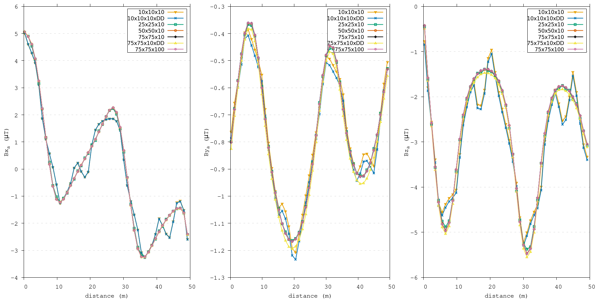
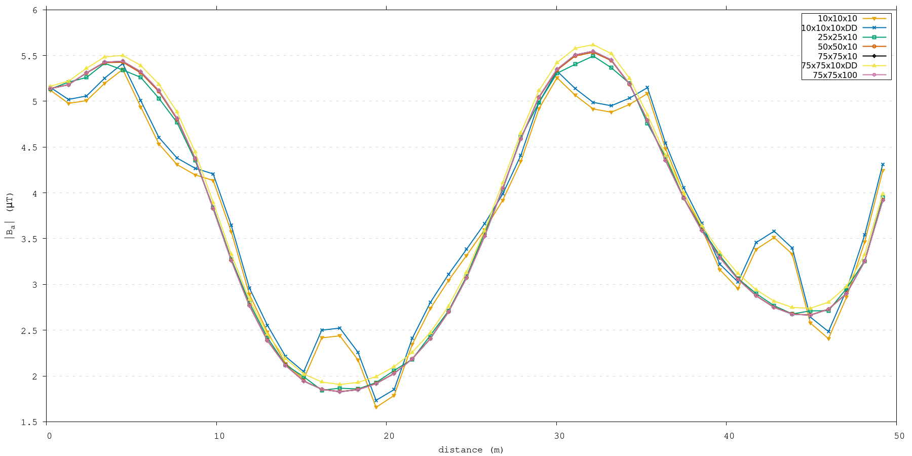
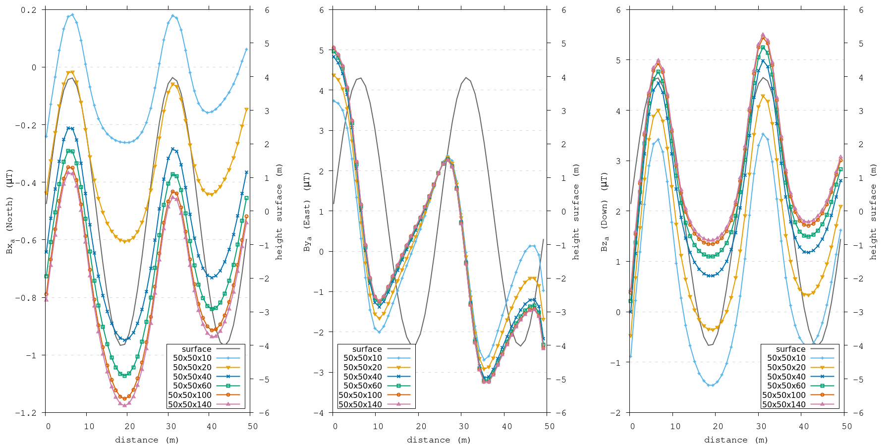
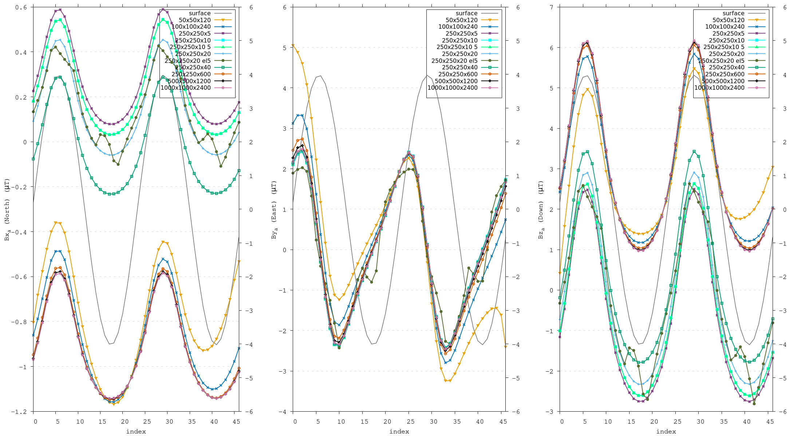
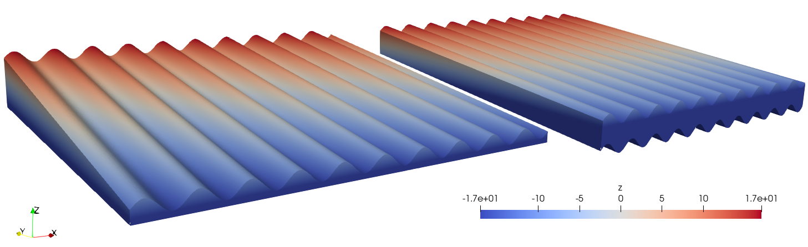

Parameters
==========

| Certain limitations are present when attempting to replicate any shape through a discretized domain, which can potentially lead to inaccuracies in the computed values. For precise and optimal anomaly computations over varied topographies, it is crucial to initially establish certain domain parameters. These include identifying the minimum quantity of elements necessary for a accurate representation of volcanic terrain, and determining the minimal domain size to mitigate the impact of the edge effect. 
| This edge effect, which occurs at the boundaries of the simulated domain, emerges from the cutoff at the periphery, generating its own unique magnetic anomaly. Our goal is to minimize this edge effect while also managing the absolute dimensions and resolution of the domain to ensure computational efficiency and reduce the time and effort required. 
| These parameters were determined using a domain with synthetic topography, the southern flank setup as outlined in the section :ref:`flank simulations <flanksim>`, because employing a DEM limits certain parameters. The experiments were conducted along a path elevated 1 meter above the ground, representing the minimum elevation level for most field sites. Since the lowest elevation necessitates the largest resolutions and domain size, this setup will establish the threshold. 
|
| It remains unclear whether the parameters defined through these tests can be directly correlated with the thresholds needed for calculations over topographies derived from a DEM. The real topographical variations on Mount Etna are anticipated to encompass larger and more intricate structures. Larger structures could potentially induce greater anomalies, which might extend farther, given that the magnitude of a magnetic anomaly generated by an entity is directly proportional to its physical properties (volume or weight) and is moderated by the distance, as noted in :cite:`GRIFFITHS`. Consequently, a reevaluation of these parameters will be essential in upcoming DEM examinations.
| 
| Please note that the illustrations displayed here showcase only a fraction of the numerous tests executed to ascertain the necessary parameters and highlight significant discoveries.

Resolution
----------
| The resolution experiments will initiate at a high resolution, gradually reducing the number of elements. We anticipate identifying a threshold where any further reduction would lead to incorrect values. Understanding the manifestation of these errors is instrumental in identifying them in other intricate setups, particularly when using the Digital Elevation Model (DEM). 
|
| All these tests maintained a consistent domain size of 50x50x120 meters. The expanded depth range was selected to minimize the interference from the bottom surface. To analyze its effect, some tests were conducted with a doubled domain depth of 240 meters, marked as "DD" configurations.
| Variations in the number of elements were explored in both the x and y directions, fluctuating within a range of 10 to 75 elements. The two lowest resolutions examined generate elements that are identical in size to those used in the DEM tests.
| Regarding the adjustments in the number of elements in the depth dimension, it is expected that this would not impact the outcomes. Theoretically, all internal forces should negate each other, meaning that increasing this quantity would primarily extend the computation duration. Nonetheless, this hypothesis was examined through repeated experiments.

Results
^^^^^^^
.. _restestcomp:

   
   Three subplots containing the components of the computed magnetic field **B** for the resolution experiments. The initial domain size is 50x50x120 meter, ``DD`` relates to extended domain depth to 240 meter, the numbers in the key relate to the amount of elements in each direction. Please note, the y-axis varies between each subplot. 

.. _restestmag:

   
    The magnitude of the computed magnetic field **B** for the resolution experiments. The initial domain size is 50x50x120 meter, ``DD`` relates to extended domain depth to 240 meter, the numbers in the key relate to the amount of elements in each direction.

| :numref:`restestmag` presents the findings of the resolution tests, whereas :numref:`restestcomp` illustrates that the trends observed in the magnitude closely resemble the trends found in individual components.  
| As predicted by theory, the amount of elements in the z-direction does not affect the outcomes. For all subsequent tests, the amount of elements in the z-direction will be maintained at 10. 
| In the xy-directions, allocating half an element per meter proves to be marginally adequate, with only minor deviations noted. When the resolution is reduced further, a distinctive pattern emerges; the computed values first exhibit instability at the highest slope, indicated by abrupt fluctuations in what was previously a smooth progression. Future tests will aim to maintain a standard of 1.5 elements per meter, wherever feasible, while staying observant of these distinctive errors. 
| Furthermore, :numref:`restestmag` indicates that the depth extent of the domain does not alter the observed trends stemming from insufficient resolution, but instead generates a shift in the magnetic field strength.
| It should be noted that a curved surface is particularly hard to accurately represent with hexahedron elements, hence, another arbitrary shape might require much less resolution to produce adequate results.

Reproduce
^^^^^^^^^

Size 
----
| The size experiments will commence with a more compact domain and progressively expand it until the computed magnetic field at a point above the domain center stabilizes. The outcomes of changes in both the depth extent (z-direction) and spatial extent (xy-direction) will be analyzed, maintaining element resolution consistent with the previously established threshold. 
|
| However, a complication surfaces: the exact nature of the magnetization in the underlying flows and deeper is unknown. Nonetheless, we continue to assume a uniform magnetization. This assumption now expands deeper, eventually stretching to the full pile of volcanic flows of Mount Etna. To validate this assumption, we refer to the geomagnetic history of Mount Etna. The last reversal of Earth's magnetic field was dated around :math:`\sim795` ka ago :cite:`Singer19` and the first volcanic activity of Mount Etna was dated around :math:`\sim500` ka ago :cite:`Branca08`. 
| Therefore, no reversals are anticipated within the accumulated layers, allowing us to extend the depth for experimental purposes without restrictions. Nonetheless, as the directly underlying flow is deemed to exert the most substantial influence, expanding the depth beyond a singular flow might be redundant. The thickness of the flows underneath the field sites mentioned in :cite:`Meyer23` fluctuate between 5-15 meter :cite:`Andro05, Mur00`. 
| Consequently, our tests explore domain depth ranging from 10 to 140 meter. When it comes to spatial extent, no additional consideration are necessary, and so our experiments span a spatial extent from 50 to 1000 meters. 

Results
^^^^^^^
.. _deptestcomp:

   
   Three subplots containing the components of the computed magnetic field **B** for the depth experiments. The spatial extent of the domain is 50x50 meter. The numbers in the key relate to the length of each side of the domain (Lx_Ly_Lz). Please note, the y-axis varies between each subplot. 

.. _deptestmag:
.. figure:: figures/deptest.png
   :class: with-border
   
    The magnitude of the computed magnetic field **B** for the depth experiments. The initial domain size is 50x50 meter. The numbers in the key relate to the length of each side of the domain (Lx_Ly_Lz).

.. _extestcomp:

   
   Three subplots containing the components of the computed magnetic field **B** for the depth experiments. The spatial extent of the domain is 50x50 meter. The numbers in the key relate to the length of each side of the domain (Lx_Ly_Lz). Please note, the y-axis varies between each subplot. 

.. _extestmag:
.. figure:: figures/extest.png
   :class: with-border
   
    The magnitude of the computed magnetic field **B** for the depth experiments. The initial domain size is 50x50 meter. The numbers in the key relate to the length of each side of the domain (Lx_Ly_Lz).

From :numref:`deptestmag`, it becomes evident that a thickness of 10 meters in insufficient, at the lowest points along the observation line significant deviations are visible. Likely due to the impact of the bottom surface on the computations, so thickness should be at least 20 meters. 

Another interesting observation from :numref:`deptestmag` is that expanding the domain in depth results in a shift of magnetic field strength, that stabilizes around 120 meter. This seems inconsistent with theory (magnetic field produced by an object decreases with distance cubed) and evidence  :cite:`Speranza06,Tanguy04`. Futhermore, in :numref:`deptestcomp` a downward trend for :math:`B_y` is observed at shallower depths, however, increasing depth does not produce a similar shift as we see in :math:`B_x`, :math:`B_z` and the magnitude. :numref:`extestcomp` shows that these trends persist for spatial extents up to 250x250 meter. Beyond this dimension, even minimal depths do not reproduce similar patterns, suggesting the observed trends may be attributed to the inadequate spatial domain size. Interestingly, these smaller thickness tests do not show the deviations at the lowest elevation points, suggesting if the domain extent is adequate the depth extent can be less. Henceforth, tests will maintain a minimum spatial extent of 250x250m. However, 
shows that this is likely an edge effect due to insufficient spatial extent as it is no longer observed at a larger spatial extent of 250x250 meter. 

Figure \ref{res:xy} shows that these trends persist for spatial extents up to 250x250m. at any spatial extent less than 250x250m. Beyond this dimension, even minimal depths do not reproduce similar patterns, suggesting the observed trends may be attributed to the inadequate domain size. Henceforth, tests will maintain a minimum spatial extent of 250x250m. \par
Another salient observation pertains to the offset induced by depth variations. Irrespective of spatial extent, any increase of depth results in an offset for the $B_x$ and $B_z$ components. No equilibrium of this value was discernible even upon increasing depth in larger domains (details not shown in Figure \ref{res:xy}). Hereby insinuating that a mere expansion of the domain size to achieve stability in computed values might not be the optimal approach to identify the ideal parameters. Consequently, depth extent warrants reconsideration in subsequent tests, which can be confidently conducted as long as the spatial extent remains at or exceeds 250x250m. \par
Furthermore, Figure \ref{res:xy} also presents repeated tests evaluating the number of elements across both spatial extents and depths, echoing the consistent findings mentioned above.

Suggesting that might be an edge effect due to insufficient spatial extent. 

Reproduce
^^^^^^^^^

Depth 
-----
However, some repeated tests for resolution and depth were 

Results
^^^^^^^

Reproduce
^^^^^^^^^

Bottom boundary
---------------
| One last issue to contemplate, is the shape of the bottom of the mesh. The topography on the bottom can be simulated in two ways: 

1. use the same topography as the top surface
2. produce a flat bottom. 

.. _sb_fb:

   The resulting mesh using either the same topography as the top surface (on the right) or a flat bottom (on the left) for the setup as outlined in :ref:`flank simulations <flanksim>`.

| See :numref:`sb_fb` for the visualization of the different options. 

| 
| As our computational solution is a surface integral and the interior contributions should cancel out, we can understand the possible repercussion of this predicament. Neither is an accurate representation of reality and from theory we know the effect could be significant. Therefore, the differences need to be investigated and both methods will be used and compared.  
| 

| It should be noted that the flat bottom setup of the :ref:`flank simulations <flanksim>` is different from the :doc:`etna`. For :ref:`flank simulations <flanksim>` the input value for depth of the domain is added in the middle of the domain (exactly below the observation path) to the topography simulated by the slope and sine wave (see :py:func:`support.topography`). In this fashion, when testing using a flat bottom, the chosen depth value actually relates to the depth value underneath the path regardless of other parameters of the domain (desirable for parameter testing). However, as the slope and wave topography is also anchored in the middle of the domain, it is possible to create a setup where the base of the flat bottom intersects with the surface topography. An example: run base setup for flank simulations with domain size of 250x250x10m. Even though this intersection happens at a significant distance from the path, the results are not tested or verified and this situation should be avoided. 
| To avoid this situation, in :doc:`etna`, the depth of the domain is added to the lowest value of the surface topography from the DEM. However, this does result in varying depth extent underneath the path depending on the spatial extent of the section of the DEM used. 

Results
^^^^^^^

Reproduce
^^^^^^^^^

